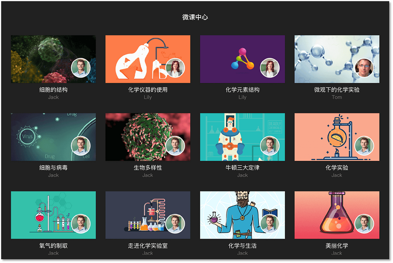

# 摘要：

<bro/><bro/>

** 1. 上架五本数字教学参考书电子版；**

** 2. 八个学科共开发素材4750个，开发量为2017年的3倍；**

** 3. PC端实现微课录制功能，火花学院微课中心建立；**

** 4. 编辑器新增多套主题课件模板，方便用户制作火花课件；**

** 5. 官网改版上线，新增专题版块及相关推荐内容；**

** 6. 跨9省支持公开课98次，获特等奖及一等奖共22次；**

** 7. 微信公众号改版，新增AR体验功能；**

** 8. 火花学院小程序上线，火花微课为首个上线小程序；**

** 9. 微信公众号关注总人数1001人，发表文章61篇；**

**10. 品牌形象升级。**

# 一、上架五本数字教学参考书电子版

2018年新上架《声光热能》、《有机化学》、《立体几何》、《自然地理》、《遗传与净化》

# 二、八个学科共新增素材4750个

| 学段 |学科|  素材数量  | 
|-------------|:------:|:------:|
|高中	|化学	|1573|
|高中	|数学	|699|
|高中	|生物	|795|
|高中	|地理	|294|
|高中	|物理	|100|
|初中	|物理	|418|
|小学	|数学	|467|
|小学	|科学	|404|
|合计：|	|	4750|

# 三、PC端实现微课录制功能，火花学院微课中心建立

# 四、编辑器新增多套主题课件模板，方便用户制作火花课件

# 五、官网改版上线，新增专题版块及相关推荐内容

# 六、支持9省公共课98次，获特等奖及一等奖22次

| 获奖等级 |  特等奖 | 一等奖 | 二等奖	| 三等奖| 观摩课	| 结果未出	|	
|----------|:------:|:------:|:------:|:------:|:------:|:------:|
|数量| 3 | 19	| 4 | 1 | 35 | 38 |

# 七、微信公众号改版，新增AR体验功能

# 八、火花学院小程序上线，火花微课为首个上线小程序

# 九、微信公众号关注总人数1001人，发表文章61篇

# 十、品牌形象全面升级

火花学院LOGO全新升级，新LOGO造型圆润柔和，视觉上更舒适、友好。火花学院网站各端UI加载动效、对外宣传文档模版（火花课件、word、ppt），微信公众号视觉规范、火花学院充值卡版面设计等全面更新。

## 火花学院LOGO

## 火花学院充值卡

