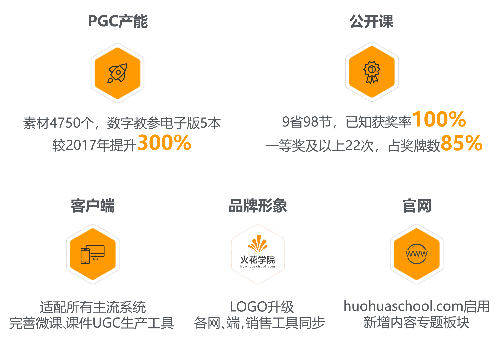
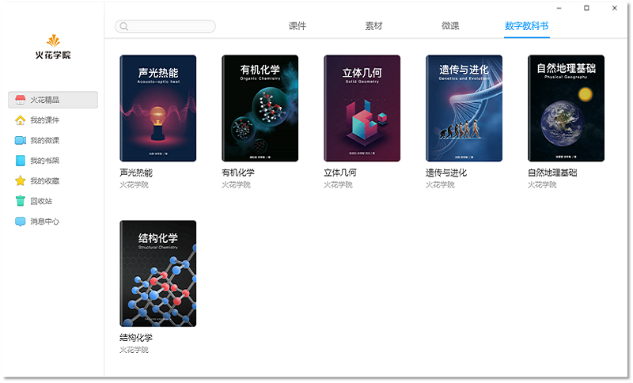
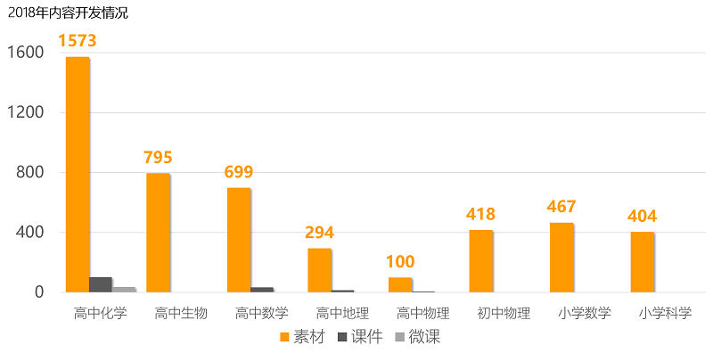
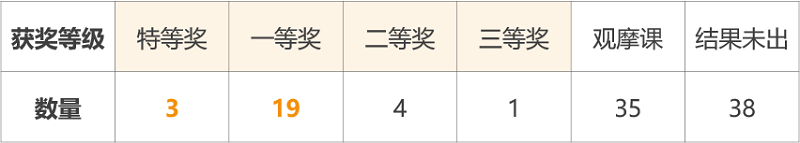
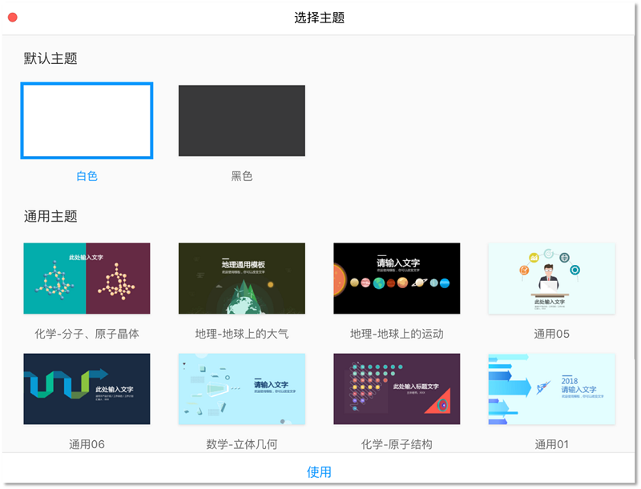
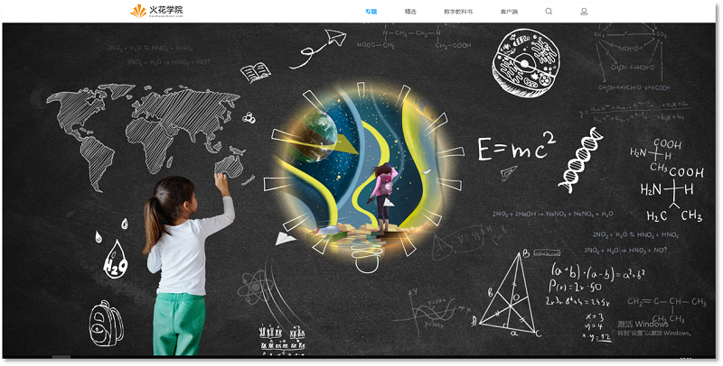
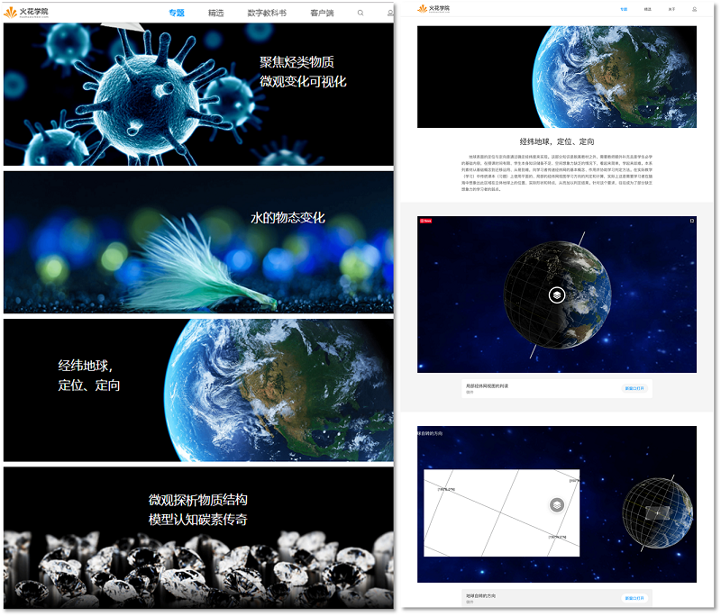
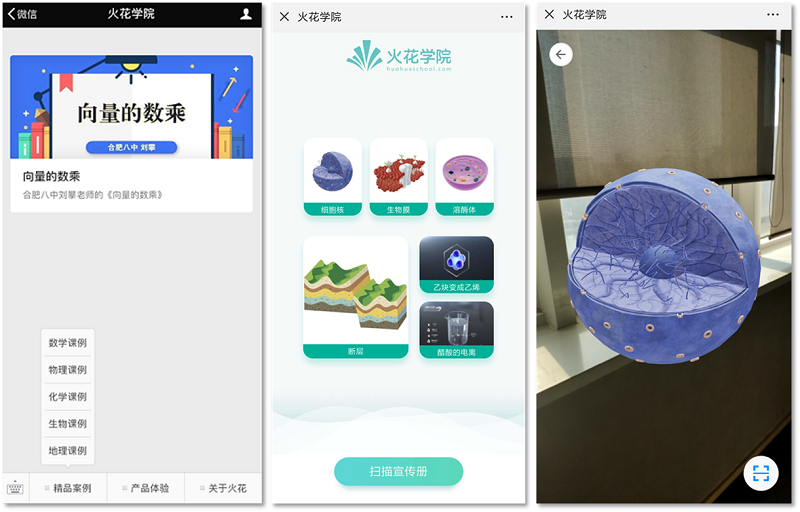
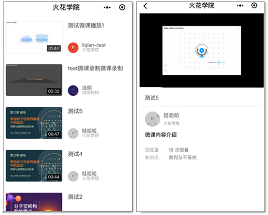
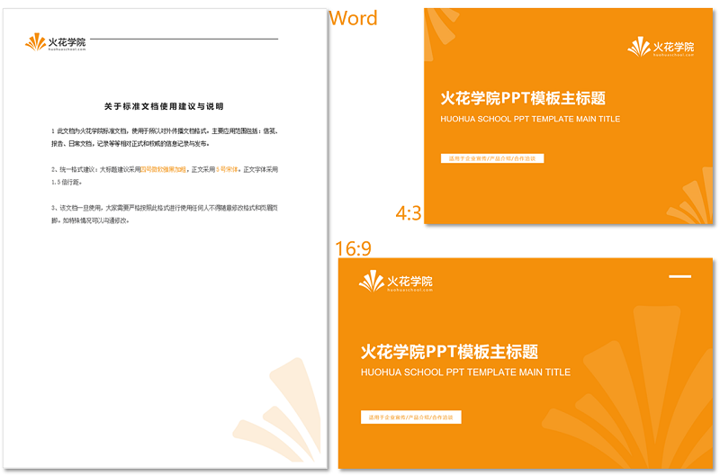

<bro/><bro/>

<bro/><bro/><bro/><bro/>

<bro/><bro/>

# 一、可视化内容扩充

2018年上架五本数字教学参考书（电子版）如下：

2018年新增小初高全学段8个学科12个知识模块素材共4750个，课件159个，微课36个。

# 二、公开课获奖增多

2018年火花学院跨9省支持公开课98次，获特等奖及一等奖共22次，分别为2016-2017年的9倍、4倍。

火花学院与蚌埠二中生物老师陶洁敏合作的《呼吸作用和光合作用》获全国最高奖，与蚌埠二中地理老师汪琳琳合作的《大气受热过程及温室效应的探究》获得国家级银奖（地理学科最高奖），与蚌埠二中化学老师蒋蓓蓓合作的《非金属氢化物的结构探究》获特等奖。

# 三、客户端功能完善

2018年火花学院客户端适配移动端、PC端所有主流平台系统；新增多套主题课件模板，新增微课录制功能，用户内容生产更便利。

# 四、顶级域名启用

2018年火花学院官网改版，[www.huohuaschool.com](www.huohuaschool.com) 启用，新增专题版块及相关资源推荐。

# 五、公众号新增AR体验

2018年微信公众号新增AR体验及课例版块，未安装火花APP的情况下也可体验火花内容产品。

# 六、微课小程序上线

2018年火花学院首个微信小程序（火花微课）上线。

# 七、品牌形象升级

2018年火花学院LOGO升级，新LOGO造型圆润柔和，视觉上更舒适、友好。火花学院网站各端UI加载动效、对外宣传文档模版（火花课件、word、ppt），微信公众号视觉规范、火花学院充值卡版面设计等同步更新。

火花学院新LOGO：

火花学院对外宣传文档模版：

[Word下载](images/火花学院word模板.docx) · [PPT4:3下载](images/火花学院ppt模版--4_3.pptx) · [PPT16:9下载](images/火花学院ppt模版-16_9.pptx) · [火花课件下载](images/火花学院模板.huohua)

火花学院充值卡：

# 八、微信推文61篇

| 阅读量排名 |  推文及链接  | 
|:------:|:---------------|
| 1	|[不好意思，我们又拿第一名了！这回是物理！↙](https://mp.weixin.qq.com/s/mxKigvQGgJf-5zuH2nBmlQ)|
| 2	|[教师必备！16款最值得收藏的app推荐↙](https://mp.weixin.qq.com/s/Zr81jnhnh83AdPo5LRu5-w)|
| 3	|[独家解密蚌埠二中为何又双叒叕获奖！这次还是金奖！↙](https://mp.weixin.qq.com/s/vqiH-5LKzHn0OgwBDJrHew)|
| 4	|[《一出好戏》中的陨石有那么大威力？我不信↙](https://mp.weixin.qq.com/s/F6cGh0FWm0zCWXk6FopgZg)|
| 5	|[曾经学化学，现在教数学！这位老师“心中有团火”！↙](https://mp.weixin.qq.com/s/LGHfvWgEQPk4p9UHrl43Xg)|
| 6	|[美丽的课件这样学着做-入门课程↙](https://mp.weixin.qq.com/s/8UsBBq5DFOR57b2zWIrNdg)|
| 7	|[分子也会跳舞——这么有模有样的分子，你不了解一下？↙](https://mp.weixin.qq.com/s/0xxd0XgX219qZJiYTaYKpQ)|
| 8	|[火花学院神助攻 · 蚌埠二中连获大奖↙](https://mp.weixin.qq.com/s/Nw1T97jW-XLuyS-FVM1lHg)|
| 9	|[逆天改命？你知道有些人天生就不会得艾滋病吗？↙](https://mp.weixin.qq.com/s/yYu0BgRLNSdGJLRXFbET0w)|
|10|[究竟什么才是数学新课标中的“几何直观”↙](https://mp.weixin.qq.com/s/nMlRidsVMpHA390n00Chzw)|

