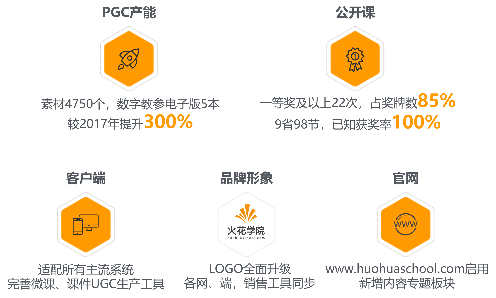
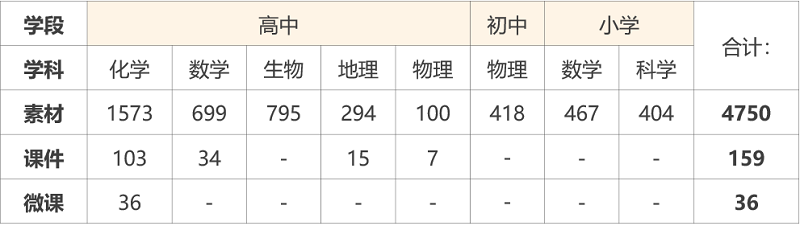
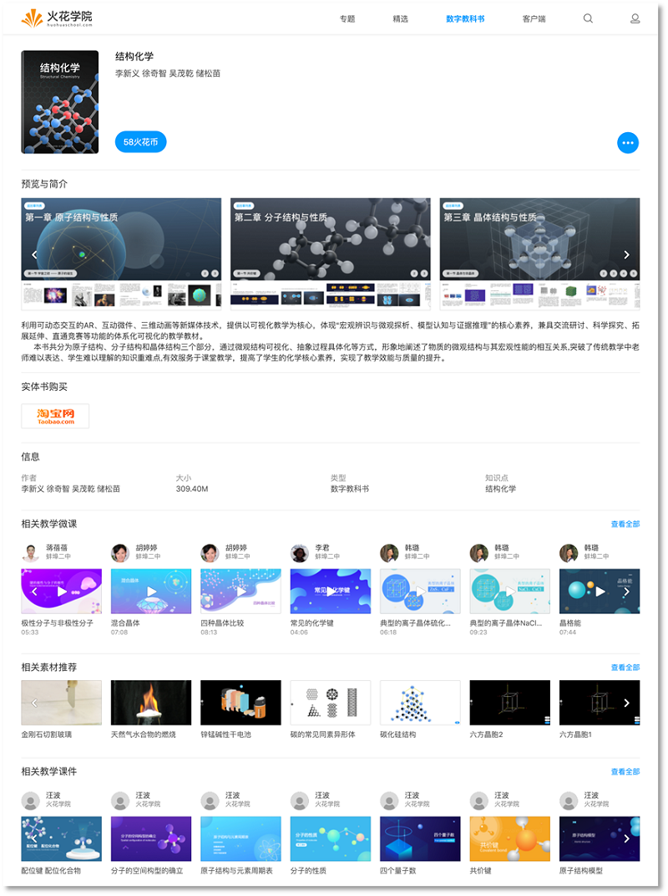

# 火花学院大事记

<bro/><bro/>

<bro/><bro/>

# 一、上架五本数字教学参考书（电子版），新增小初高八个学科素材共4750个

2018年素材开发列表

2018年电子书列表

《声光热能》、《有机化学》、《立体几何》、《自然地理》、《遗传与净化》为2018年新上架

# 二、客户端新增微课录制功能，新增多套主题课件模板

智能PC微课录制

火花课件模板

# 三、跨9省支持公开课98次，获特等奖及一等奖共22次

2018年火花学院公开课获奖统计

| 获奖等级 |  特等奖 | 一等奖 | 二等奖	| 三等奖| 观摩课	| 结果未出	|	
|----------|:------:|:------:|:------:|:------:|:------:|:------:|
|数量| 3 | 19	| 4 | 1 | 35 | 38 |

# 四、官网改版上线，新增专题版块及相关推荐内容

火花学院官网首页

火花学院官网专题模块

火花学院数字教学参考书简介及资源推介

# 五、微信公众号改版，新增AR体验功能及课例版块

火花学院公众号新版块

# 六、火花学院小程序上线，火花微课为首个上线小程序

火花微课小程序

# 七、品牌形象全面升级

火花学院LOGO全新升级，新LOGO造型圆润柔和，视觉上更舒适、友好。火花学院网站各端UI加载动效、对外宣传文档模版（火花课件、word、ppt），微信公众号视觉规范、火花学院充值卡版面设计等全面更新。

火花学院LOGO

火花学院对外宣传文档模版

[Word下载](images/火花学院word模板.docx) · [PPT4:3下载](images/火花学院ppt模版--4_3.pptx) · [PPT16:9下载](images/火花学院ppt模版-16_9.pptx)

火花学院充值卡

# 八、微信公众号关注总人数1001人，发表文章61篇

微信前十推文

| 阅读量排名 |  推文  | 
|-------------|:------:|
| 1	|[不好意思，我们又拿第一名了！这回是物理！↙](https://mp.weixin.qq.com/s/mxKigvQGgJf-5zuH2nBmlQ)|
| 2	|[教师必备！16款最值得收藏的app推荐↙](https://mp.weixin.qq.com/s/Zr81jnhnh83AdPo5LRu5-w)|
| 3	|[独家解密蚌埠二中为何又双叒叕获奖！这次还是金奖！↙](https://mp.weixin.qq.com/s/vqiH-5LKzHn0OgwBDJrHew)|
| 4	|[《一出好戏》中的陨石有那么大威力？我不信↙](https://mp.weixin.qq.com/s/F6cGh0FWm0zCWXk6FopgZg)|
| 5	|[曾经学化学，现在教数学！这位老师“心中有团火”！↙](https://mp.weixin.qq.com/s/LGHfvWgEQPk4p9UHrl43Xg)|
| 6	|[美丽的课件这样学着做-入门课程↙](https://mp.weixin.qq.com/s/8UsBBq5DFOR57b2zWIrNdg)|
| 7	|[分子也会跳舞——这么有模有样的分子，你不了解一下？↙](https://mp.weixin.qq.com/s/0xxd0XgX219qZJiYTaYKpQ)|
| 8	|[火花学院神助攻 · 蚌埠二中连获大奖↙](https://mp.weixin.qq.com/s/Nw1T97jW-XLuyS-FVM1lHg)|
| 9	|[逆天改命？你知道有些人天生就不会得艾滋病吗？↙](https://mp.weixin.qq.com/s/yYu0BgRLNSdGJLRXFbET0w)|
|10|[究竟什么才是数学新课标中的“几何直观”↙](https://mp.weixin.qq.com/s/nMlRidsVMpHA390n00Chzw)|

