# 摘要：

<bro/><bro/>

**1. PC端及移动端新官网上线，新增专题版块；**

**2. “火花微课”小程序上线；**

**3. 微信公众号新增课例及专题版块；**

**4. 支撑46堂公开课，已确认获市级二等奖一次，其他结果未公布；**

**5. 完成5个学科共44个精品素材的开发及上线，其中公开课定制开发26个。**

# 一、内容制作

## 1.1 精品素材新增44个

计划内开发18个，公开课定制开发26个：

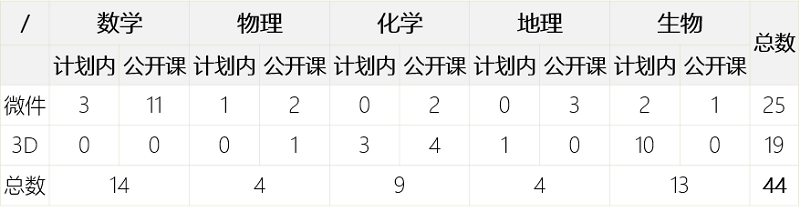

部分素材展示

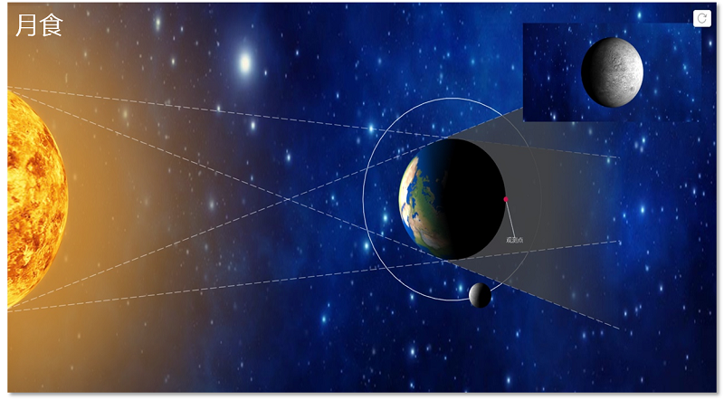

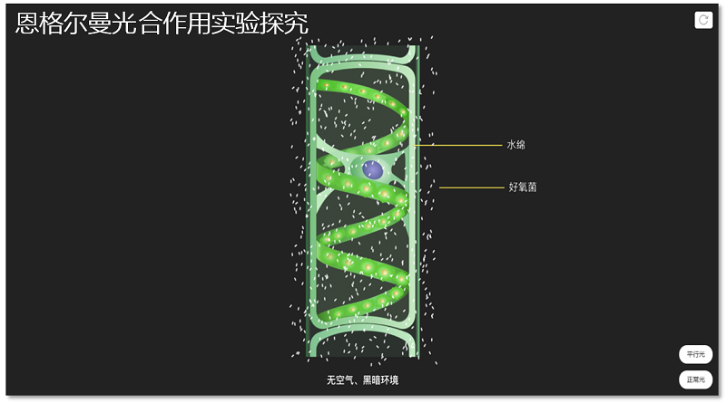

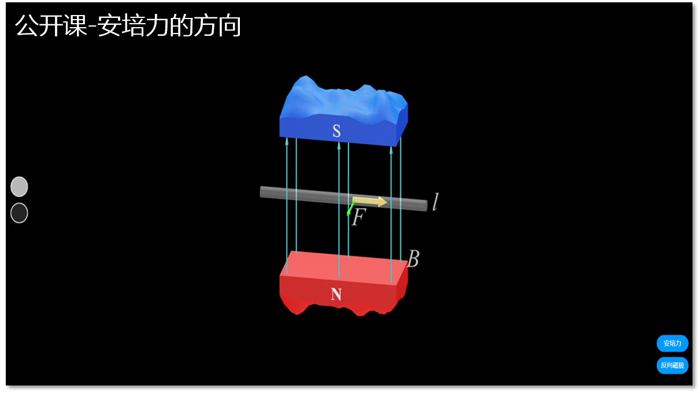

# 二、软件开发

## 2.1 PC端官网改版上线，新增“专题”版块

新版官网域名[www.huohuaschool.com](www.huohuaschool.com)将与原域名[huohua-prod.ustcnmi.org](huohua-prod.ustcnmi.org) 并行使用

（1）新增“专题”板块，提升内容展示系统性；

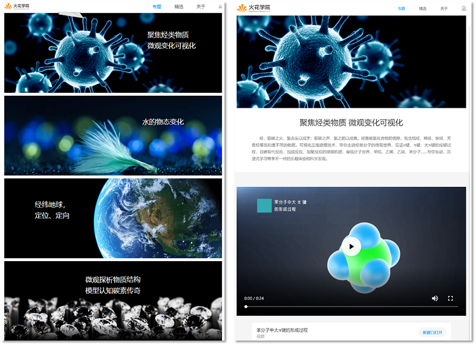

（2）提供注册登录功能；

（3）满足用户对火花内容的浏览需求，同时提供按学科、学段、知识点筛选的功能；

（4）素材详情页改版，新增相关微课、课件及素材展示及推荐；

（5）课件详情页改版，新增该课件所用素材信息、基于该课件录制的微课以及相关课件资源展示及推荐；

（6）微课详情页改版，新增该微课来源、作者、作者的其他微课资源展示，并推荐其他作者的同类型微课；

## 2.2 移动端官网全新上线
 
[m.huohuaschool.com](m.huohuaschool.com)
  
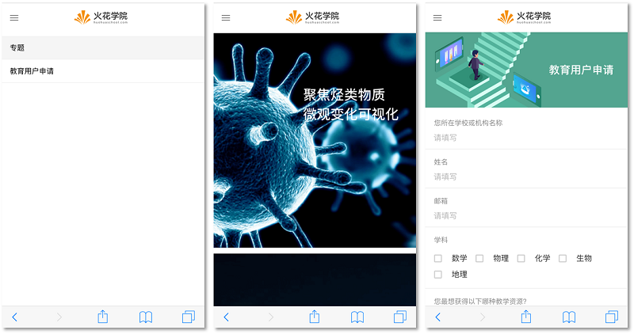

## 2.3  “火花微课”小程序上线

将优质微课以独立产品形态呈现，通过新媒体平台-微信小程序方式进行传播，最终实现用户的引流，本次发布初步实现微课内容在小程序上的展示与播放

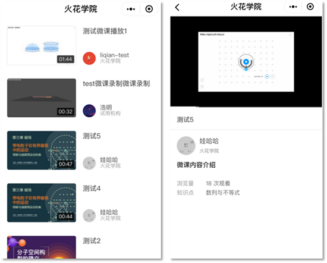

## 2.4 桌面端新增功能及优化

（1）新增课件导航，教师在播放课件时可以切换到任意镜头；

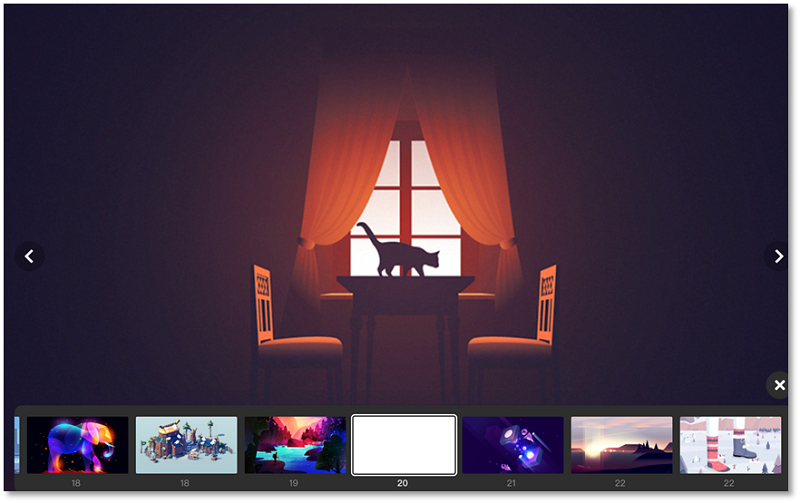

（2）新增批注功能，方便老师教学；

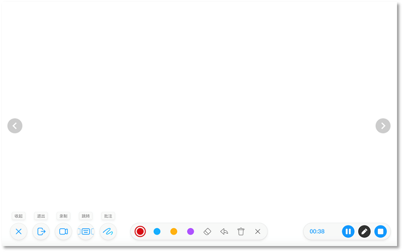

（3）优化当前形状中的线条功能，用户体验更佳。

## 2.5 移动端优化及开发

（1）安卓版本修复了课件下载提示、私信分享等问题；

（2）iOS版本开发进入中期。

# 三、运营支撑

## 3.1 公开课获奖

支撑公开课46次，获市级二等奖一次，其他结果暂未公布

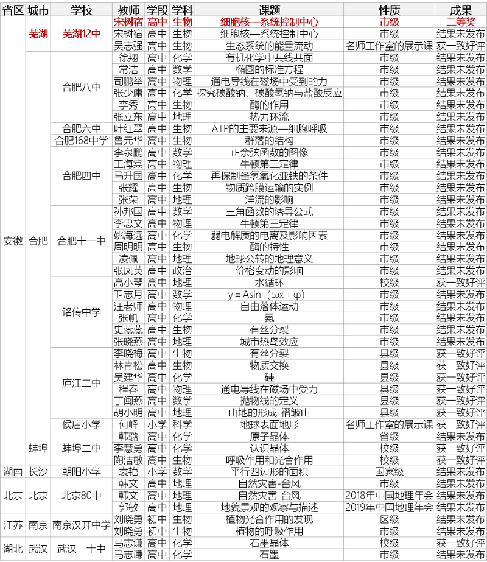

## 3.2 品牌运营

### （1）公众号新增课例与专题版块

微信公众号增加五个学科课例及解说，增加专题（素材、微课等）版块，将与官网同步上线；

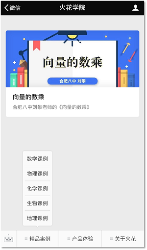

### （2）关注总人数969人（新增152人）

发表文章6篇，总阅读量1494次，总转发量129次。

| 推文名称 |  阅读人数  | 
|-------------|:------:|
|[教师必备！16款最值得收藏的app推荐↙](https://mp.weixin.qq.com/s/Zr81jnhnh83AdPo5LRu5-w)| **1009** |
|究竟什么才是数学新课标中的“几何直观”| 242 |
|日常纠结·超市快过期打折的食品到底买不买？| 143 |
|火花学院获奖作品展·生物| 42 |
|大雪·我这里下雪了，你那里呢| 31 |
|火花学院公开课（数学）天下没有想象不出来的三视图| 28 |

