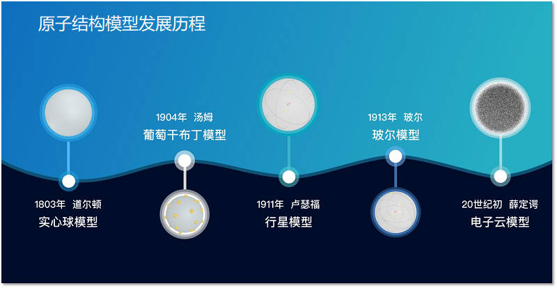
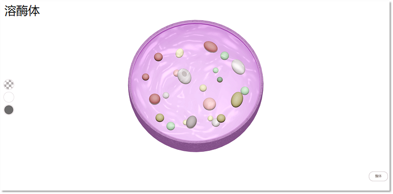
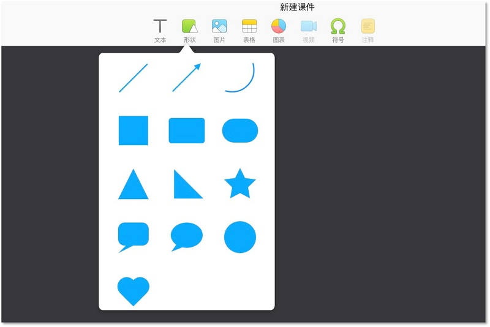
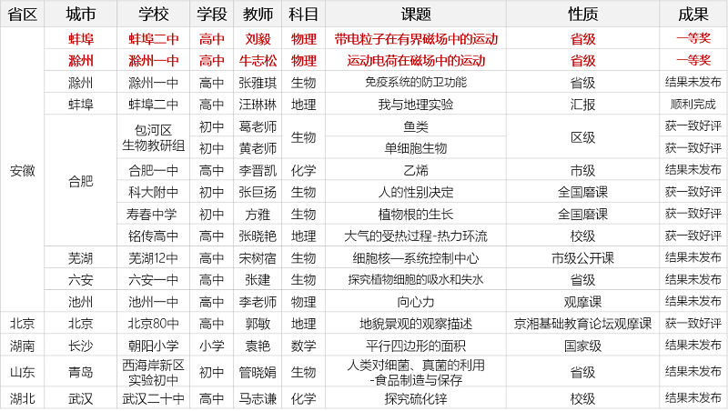
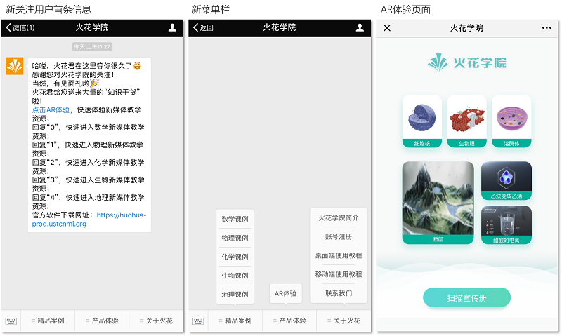
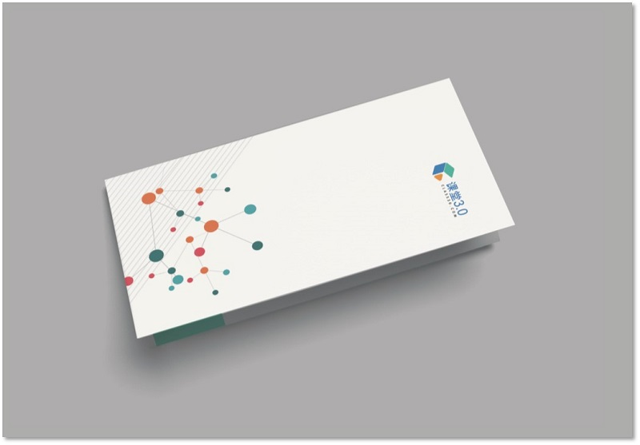
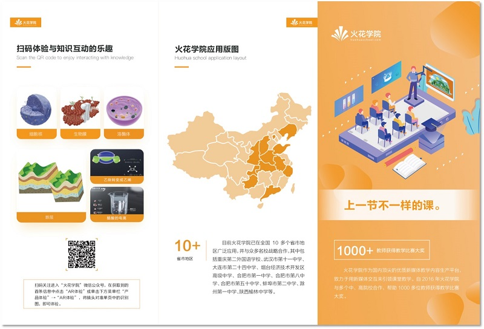

摘要：

<bro/><bro/>

**1.《立体几何》电子书上线；**

**2. 火花学院微信公众号全新改版，新增AR体验功能；**

**3. 火花学院logo全新升级，C30宣传册设计完成；**

**4. 支撑17堂公开课，获得省级一等奖3次、二等奖1次；**

**5. 完成4个学科共24个精品素材的开发及上线，优化原有素材52个；**

**6. 11月19日组织并召开与集团一线销售的交流会。**

# 一、内容制作

## 1.1 精品素材新增24个,存量素材优化52个

| /   |  数学  |  化学 | 物理   |  生物  |  地理 |  总数 |
|-----|:------:|:------:|:------:|:------:|:------:|:------:|
| 微件 | 52（存量素材） | 4 | 0 | 2 | 0 | 58 |
| 3D | 0 | 1 | 4 | 7 | 6 | 18 |
| 总数 | 52 | 5 | 4 | 9 | 6 | **76** |

部分素材展示

# 二、软件开发

## 2.1 桌面端编辑器新增功能及优化

（1）新增圆角矩形、对话框和胶囊等形状，丰富用户使用场景；

（2）新增部分常见字体，用户编辑文字效果更佳；

（3）支持图片透明度调整；

（4）优化文本框大小变化、文本对齐、镜头旋转添加图片位置错误等问题。

## 2.2 移动端开发进度
  
（1）安卓版本重构结束，软件代码结构得到进一步规范和优化；

（2）iOS版本开发启动，预计开发周期3个月。

# 三、运营支撑

## 3.1 支撑公开课17次，获得省级一等奖3次、二等奖1次

## 3.2 品牌运营

### （1）微信公众号

微信公众号全新改版，新增AR体验功能；

[**手机单击AR体验↙**](https://huohua-prod.ustcnmi.org/webar/)

关注总人数817人（新增52人），发表文章11篇，总阅读量1203次，总转发量76次。

| 推文名称 |  阅读人数  | 
|-------------|:------:|
|[如果人能以光速移动，你要上天么？↙](https://mp.weixin.qq.com/s/-VsDm0fqip4HI6U7WPKc9Q)| **284** |
|教师上课表演，学生假装学习：教育空心化亟待深层治理| 280 |
|学生学了不会用？——你的教学是时候换个套路了| 280 |
|科学家除了做实验，还会……撒狗粮！| 135 |
|火花学院助力京湘基础教育论坛| 32 |
|立冬啦，你准备好迎接冬天了吗？| 26 |
|他们拍下了光的慢动作，可能会刷新你的世界观·科学美图| 23 |

### （2）知乎机构号

关注总人数33人，回答问题5个，提问5个。

### （3）火花学院logo全新升级

### （4）C30宣传册设计出炉

### （5）11月19日组织并召开与集团一线销售的交流会

主要会议成果如下：

（1）12月底完成与戴特大屏及PC端的数据及功能对接：

&ensp;&ensp;&ensp;&ensp;①火花学院素材数据的同步更新
 
&ensp;&ensp;&ensp;&ensp;②启用火花学院桌面端的批注功能

&ensp;&ensp;&ensp;&ensp;③通过戴特的工具栏将素材分享到学生端

（2）明确火花学院与校方联合资源开发的方式

（3）规范火花学院对学校公开课支持的流程，并提供截止当前火花学院已完成的公开课信息

（4）提供火花学院现有素材及课件按学科、类型的数据统计

（5）提供火花学院《科学教育丛书》出版和素材内容规划

&ensp;&ensp;&ensp;&ensp;①至2018年底，出版丛书7本，精品素材3675；

&ensp;&ensp;&ensp;&ensp;②至2019年底，出版丛书可达30+，精品素材可达10000+

&ensp;&ensp;&ensp;&ensp;③至2020年底，出版丛书可达40+，精品素材可达20000+

（6）明确火花学院报价方案（审核中）

