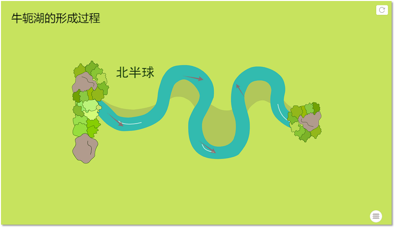
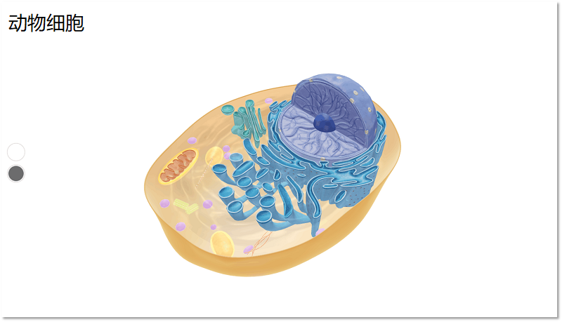
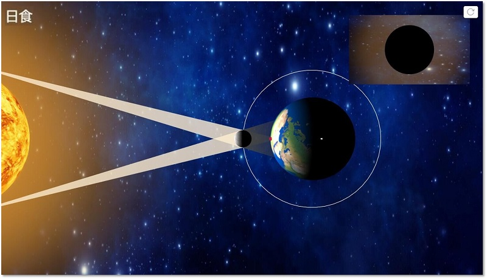
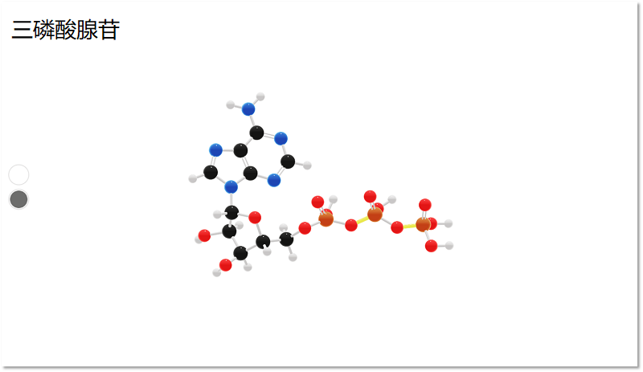
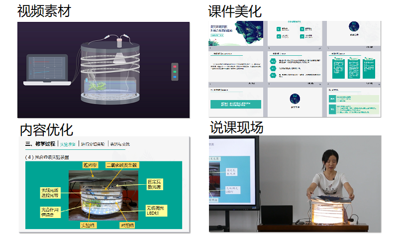

摘要：

<bro/><bro/>

**1.完成5个学科共49个精品素材的开发及上线；**

**2.支撑15堂公开课，获得国家级金奖1次；**

**3.桌面端火花即时通讯(IM)demo版启动开发。**

# 一、内容制作

## 1.1 精品素材新增49个

本月共完成5个学科共49个精品素材的开发及上线。

| /   |  数学  |  化学 | 物理   |  生物  |  地理 |  总数 |
|-----|:------:|:------:|:------:|:------:|:------:|:------:|
| 微件 |  3 | 4 | 15 | 3 | 4 | 29 |
| 3D | 0 | 1 | 1 | 18 | 0 | 20 |
| 总数 | 3 | 5 | 16 | 21 | 4 | **49** |

部分素材展示

# 二、软件开发

## 2.1 桌面端火花即时通讯（IM）demo版本启动开发

## 2.2 后台管理优化
  
（1）PMS素材管理系统可增加AR类型素材；

（2）CMS内容管理系统新增素材、课件、微课SEO信息编辑；

（3）CMS内容管理系统新增“数据统计”板块，可查看详情表、统计数据及趋势图；

（4）OMS运营管理系统新增用户增加主授学科信息选择，并优化重置密码功能。

## 2.3 其他优化

（1）解决戴特无手机号用户登录火花学院的问题，戴特用户在火花学院任意端输入用户名、密码，信息验证成功后，绑定手机号，即可实现登录，三端将同步修改戴特无手机号用户数据；

（2）移动端开始代码优化重构，预计两个月完成。

# 三、运营支撑

## 3.1 本月支撑公开课15次，获得国家级金奖1次

&ensp;&ensp;&ensp;&ensp;在第六届全国中小学实验教学说课活动中，蚌埠二中陶洁敏老师的实验说课《探究环境因素对光合作用的影响》荣获全国金奖，并列入2018年11月17-18日在南昌举行的现场展示环节。火花学院在此次活动中为陶老师提供了精美、形象的核心实验动画，对课件进行优化设计，与数字化实验设备完美结合，最终帮助陶老师此次说课在各地推选的400多个作品中脱颖而出。

## 3.2 品牌运营

### （1）微信公众号

关注总人数731人（新增75人），发表文章12篇，总阅读量2470次，总转发量201次

| 推文名称 |  阅读人数  | 
|-------------|:------:|
|[分子也会跳舞-这么有模有样的分子，你不了解一下？](https://mp.weixin.qq.com/s/0xxd0XgX219qZJiYTaYKpQ)| **433** |
|十月地理老师喊你出门啦！| 289 |
|病毒都是坏蛋吗？走近诺贝尔奖-神奇的噬菌体| 178 |
|借助形状工具给课件增色| 129 |
|你的课件是催眠宝典吗？| 115 |
|陈叔伦 人生一百万种可能，他唯独钟情这一种！| 37 |
|泡面饼和调料包谁更不健康？正确的吃法应该是这样的| 29 |
|神奇的遗传密码-你是爸妈的克隆版吗？| 27 |
|官宣！大家好这是我的化学名片！| 27 |
|长假后为什么没有力气上班？飞纸飞机前为啥要哈一口气？| 24 |
|学数学没前途？解决一个问题一百万美元奖励！| 21 |
|市面上的背单词软件，中小学生能用吗？| 10 |

### （2）知乎机构号

关注总人数27人，推文3篇，回答问题12个，提问4个。

推文如下：

[有了这些，地理还怕学不好吗？](https://zhuanlan.zhihu.com/p/43718551)

[黎曼猜想：来自珠穆朗玛的曙光](https://zhuanlan.zhihu.com/p/45704736)

[NP和霍奇猜想](https://zhuanlan.zhihu.com/p/46956761)
