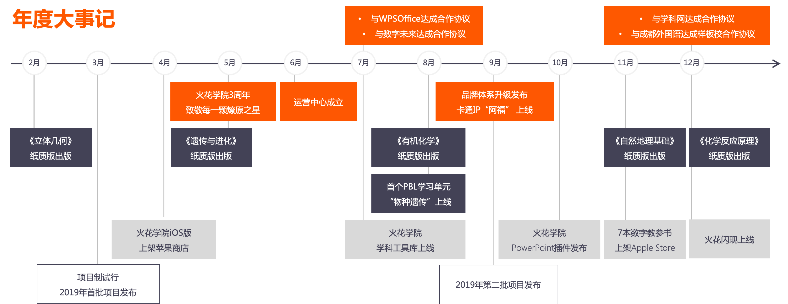

# 一、自有内容生态形成

## 1.1 素材产出翻两番，小初基本覆盖

- 2019年自研素材（微件、3d、视频）2181个，较上年（424）增长414%。

&nbsp;&nbsp;&nbsp;&nbsp;&nbsp;&nbsp;&nbsp;&nbsp;2018、2019年分科目自研素材新增&nbsp;&nbsp;&nbsp;&nbsp;&nbsp;&nbsp;&nbsp;&nbsp;&nbsp;&nbsp;&nbsp;&nbsp;&nbsp;&nbsp;&nbsp;&nbsp;&nbsp;&nbsp;&nbsp;&nbsp;&nbsp;&nbsp;&nbsp;&nbsp;&nbsp;&nbsp;&nbsp;&nbsp;&nbsp;&nbsp;&nbsp;&nbsp;&nbsp;&nbsp;&nbsp;&nbsp;&nbsp;&nbsp;&nbsp;&nbsp;&nbsp;&nbsp;&nbsp;&nbsp;&nbsp;&nbsp;&nbsp;&nbsp;&nbsp;&nbsp;&nbsp;&nbsp;&nbsp;&nbsp;&nbsp;&nbsp;&nbsp;&nbsp;&nbsp;&nbsp;&nbsp;&nbsp;&nbsp;2018、2019年分类型自研素材新增

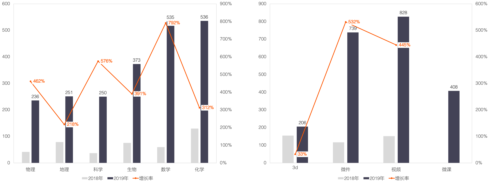

## 1.2 新增“课程”产品，内容生态形成

- “素材→课程→教科书”内容生态初步成型。

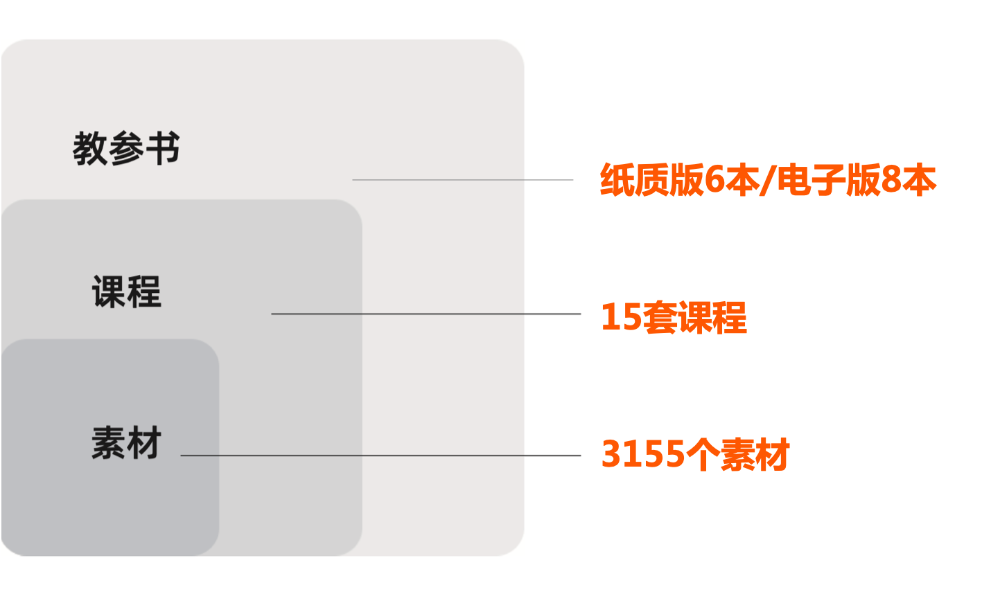

“课程“是以打造以教学设计为核心的课程体系，其丰富教学内容形式，为实现教学闭环提供完整的解决方案。

&nbsp;&nbsp;&nbsp;&nbsp;&nbsp;&nbsp;&nbsp;&nbsp;课程结构&nbsp;&nbsp;&nbsp;&nbsp;&nbsp;&nbsp;&nbsp;&nbsp;&nbsp;&nbsp;&nbsp;&nbsp;&nbsp;&nbsp;&nbsp;&nbsp;&nbsp;&nbsp;&nbsp;&nbsp;&nbsp;&nbsp;&nbsp;&nbsp;&nbsp;&nbsp;&nbsp;&nbsp;&nbsp;&nbsp;&nbsp;&nbsp;&nbsp;&nbsp;&nbsp;&nbsp;&nbsp;&nbsp;&nbsp;&nbsp;&nbsp;&nbsp;&nbsp;&nbsp;&nbsp;&nbsp;&nbsp;&nbsp;&nbsp;&nbsp;&nbsp;&nbsp;&nbsp;&nbsp;&nbsp;&nbsp;&nbsp;&nbsp;&nbsp;&nbsp;&nbsp;&nbsp;&nbsp;&nbsp;&nbsp;&nbsp;&nbsp;&nbsp;&nbsp;&nbsp;&nbsp;&nbsp;&nbsp;&nbsp;&nbsp;&nbsp;&nbsp;&nbsp;&nbsp;&nbsp;&nbsp;&nbsp;&nbsp;&nbsp;&nbsp;&nbsp;&nbsp;&nbsp;&nbsp;&nbsp;&nbsp;&nbsp;&nbsp;&nbsp;&nbsp;&nbsp;&nbsp;&nbsp;&nbsp;&nbsp;&nbsp;&nbsp;&nbsp;课程示例

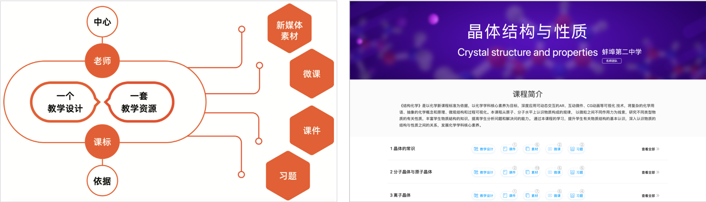

# 二、软件优化升级

## 2.1 客户端优化升级

- 新增火花首页，支持运营广告位展示；

- 新增编辑推荐资源、教学案例展示、名校课程栏目、我的课程，更好的满足教师需求；

- 按照新的UI设计标准重新优化，进一步提升产品设计感和用户体验。

## 2.2 第三方页面嵌入

- 将火花资源页面嵌入到第三方产品，比如戴特备课助手，智能大屏等，与第三方形成资源+工具产品矩阵，共同提升产品竞争力，达到互利共赢目的。

&nbsp;&nbsp;&nbsp;&nbsp;&nbsp;&nbsp;&nbsp;&nbsp;戴特备课助手集成页面

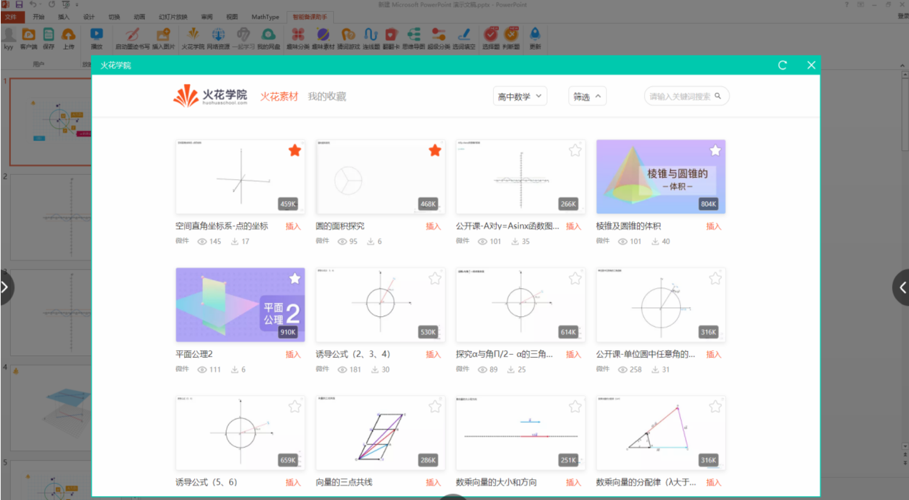

## 2.3 新产品形式探索

- 火花闪现：web版编辑器，为教师教学创作提供更随身、轻便的解决方案。

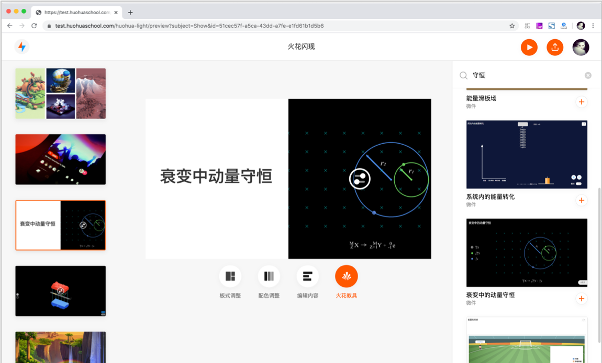

- 火花学院PowerPoint插件：更好的适应教师备课习惯。   

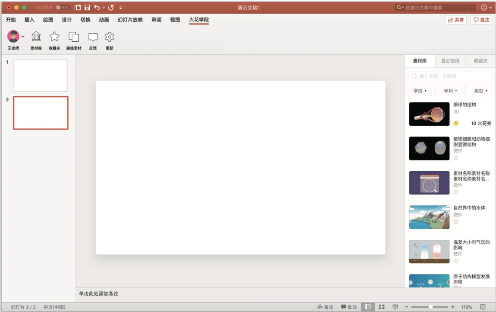

- 火花书屋：七本火花数字教参独立上架App Store。

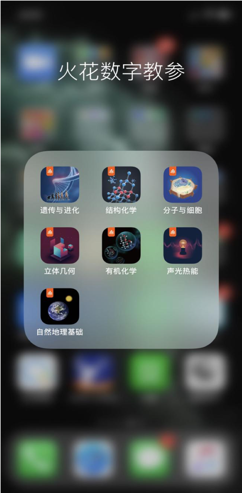

## 2.4 新增内容生产工具

- 新增多种学科素材制作工具，包括画廊，交互式图像，图像切换等，既为老师自主创作提供方便，也为素材开发提供标准化工具，提升效率。

&nbsp;&nbsp;&nbsp;&nbsp;&nbsp;&nbsp;&nbsp;&nbsp;画廊、知识分类、弹出项

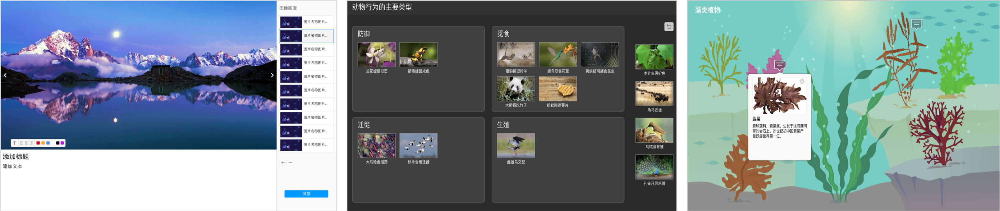

## 2.5 PBL学习单元上线

- 火花学院在2019年与合肥市包河区生物教研组合作，打造一款线上项目式学习产品——物种的遗传。它通过让学生自主探究，培育一条自己喜欢的狗，从而促进学生回顾和应用遗传学相关知识。

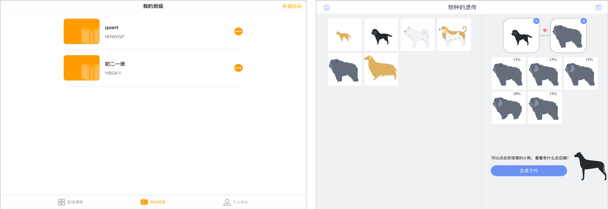

# 三、运营框架体系建成

## 3.1 运营团队成立

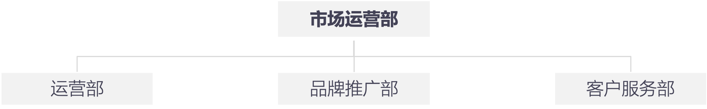

## 3.2 渠道初步建设

- 火花学院与与国内办公软件市场领导者”WPS“、中东地区最大的图书出版集团“数字未来”、教育行业头部内容资源站“学科网”等达成战略合作，未来将获得更为广泛的用户资源，极大的提升了在国内外教育行业的认知度。

- 火花学院与成都外国语学校、南京外国语学校达成样板校合作协议。

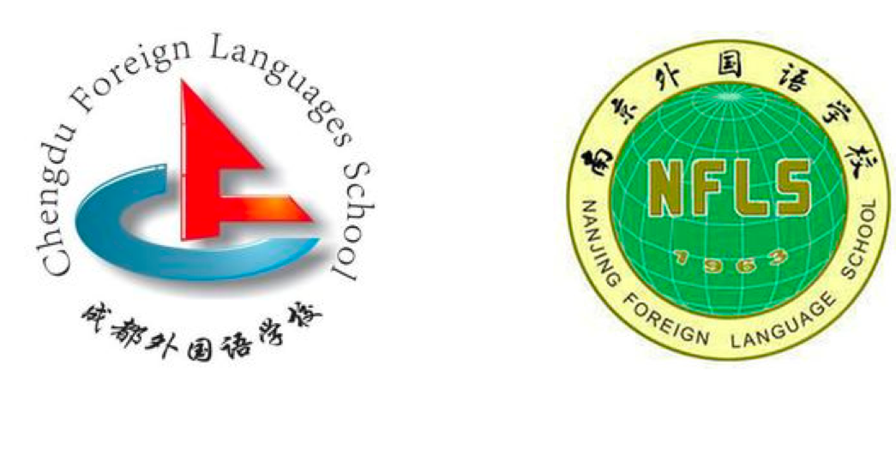

## 3.3 品牌体系升级

- MI、VI、UI建设完成，并于9月举办2019“火花·不止所见”品牌升级发布会，统一公司产品设计规范及品牌形象输出。

&nbsp;&nbsp;&nbsp;&nbsp;&nbsp;&nbsp;&nbsp;&nbsp;发布会海报、卡通IP阿福

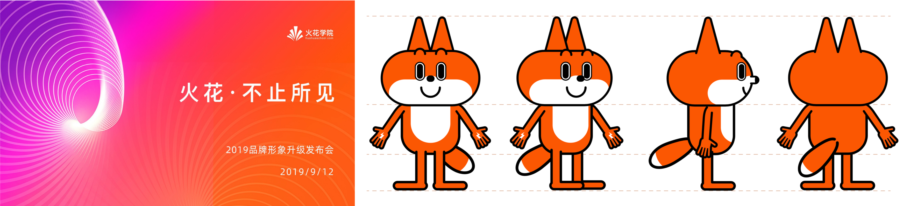

## 3.4 品牌形象输出

- 卡通表情包

火花学院形象代言人阿福微信表情包，目前有24个表情。

部分表情包展示

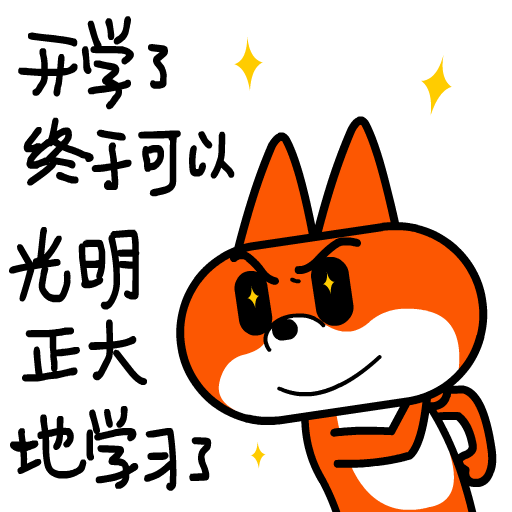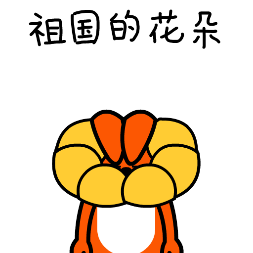

- 海报发布

自2019年8月～12月，发布海报33张，其中朋友圈和抖音落地页海报6张，品牌推广类海报3张，节气类海报8张，节日类海报16张。

&nbsp;&nbsp;&nbsp;&nbsp;&nbsp;&nbsp;&nbsp;&nbsp;部分节点海报

- 稿件发布

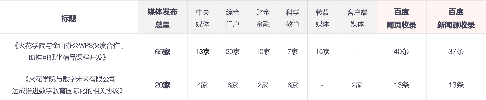

## 3.5 自媒体数据增长

- 对公司现有的自媒体账号（火花学院服务号、火花名师汇订阅号、微博火花官方、抖音火花学院、爱奇艺火花学院、优酷火花学院、腾讯火花学院）进行重新定位，以目标用户为导向，输出传播内容。

&nbsp;&nbsp;&nbsp;&nbsp;&nbsp;&nbsp;&nbsp;&nbsp;火花学院抖音号

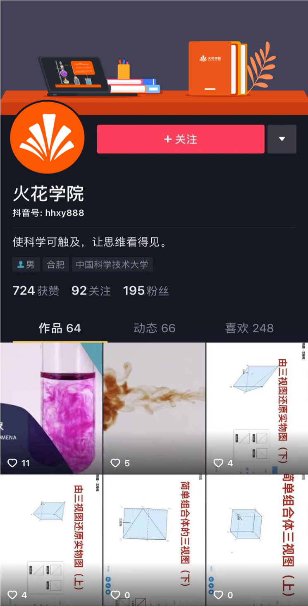

- 阅读量排名前五文章

| 推文名称 |  阅读人数  | 
|-------------|:------:|
[学不好数理化是因为脑子笨？或许只是因为……](https://mp.weixin.qq.com/s/WL6vqBW2r5MzBz2uWZyqVA)|	8459|
[中国人该不该过圣诞节？](https://mp.weixin.qq.com/s/q4WdHCcUgfA3jAdUjyLGkw)|	3399|
[双十二指南：科学花钱让人更快乐](https://mp.weixin.qq.com/s/x4wuMlC5Sey5jsydImkK6A)|	1663|
[如何用科学方法找男/女朋友]()|	1593|
[“人人都是班干部”是教育探索，还是官场遗风？](https://mp.weixin.qq.com/s/fiiPn1LynE8zZ6mKVndDCw)|	1555|

## 3.6 线上活动推广

- 2019年，主要通过双微活动推广，增强与粉丝之间的粘性及互动。

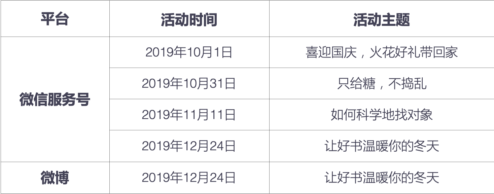

&nbsp;&nbsp;&nbsp;&nbsp;&nbsp;&nbsp;&nbsp;&nbsp;部分活动海报

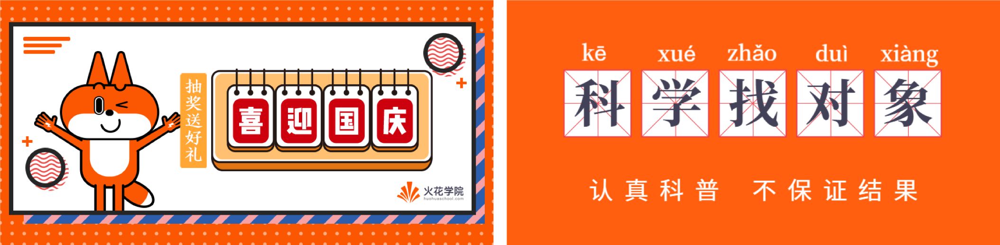

## 3.6 公开课覆盖范围扩大

- 12省65节，一等奖获奖率64%。

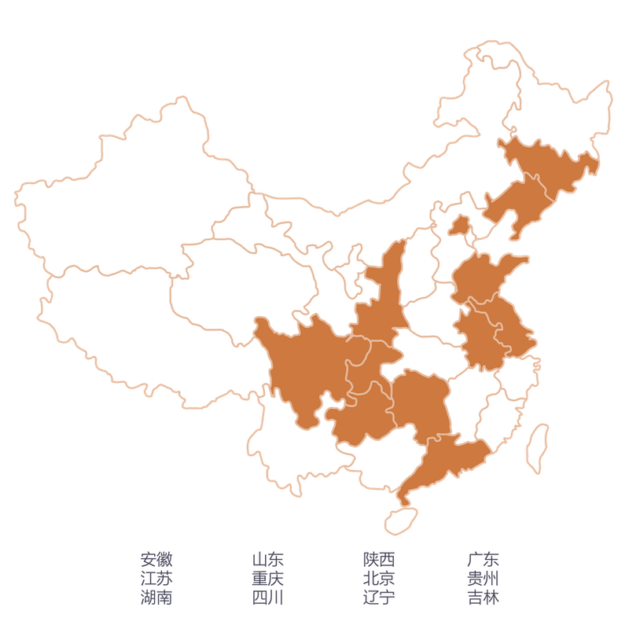

# 四、项目制运行良好

## 4.1 组织架构形成

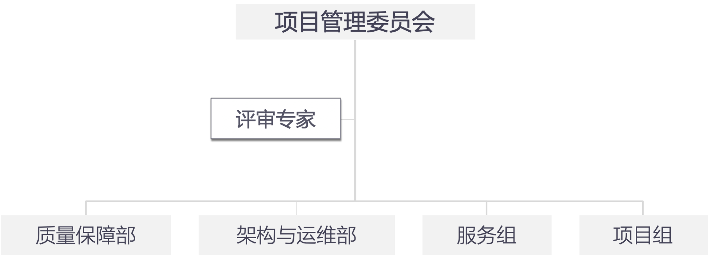

## 4.2 整体结题顺利

- 2019年立项33个，完成结题29个，结题率81%（不含冻结项目）。

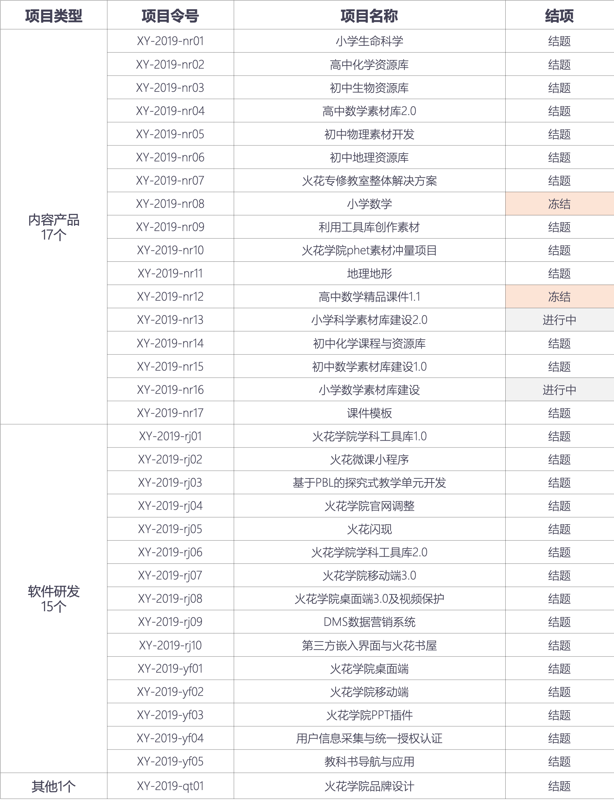

## 4.3 优秀表彰

- 项目类

**优秀项目（综合）：**

**金奖&nbsp;&nbsp;-&nbsp;&nbsp;初中生物**

**银奖&nbsp;&nbsp;-&nbsp;&nbsp;初中化学、第三方嵌入式界面与火花书屋、火花工具库2.0**

**优秀项目（专项）：**
  
**技术创新&nbsp;&nbsp;-&nbsp;&nbsp;窄带高清与视频保护、PBL**

**效率执行&nbsp;&nbsp;-&nbsp;&nbsp;phet、课件模板**

**优秀项目服务组：**

**质量保障部**

- 个人类

**优秀项目经理：**

**金奖&nbsp;&nbsp;-&nbsp;&nbsp;窦发**

**银奖&nbsp;&nbsp;-&nbsp;&nbsp;张明申、项性杰、沈阳**

**优秀项目成员（综合）：**

**张柳、鲍志国、田雪、张泽鑫、王侯杰**

**优秀项目成员（专项）：**

**创意&nbsp;&nbsp;-&nbsp;&nbsp;杨晓艳、侯媛媛、高磊、秦怡**

**攻坚&nbsp;&nbsp;-&nbsp;&nbsp;李浩、张鑫、廖伟业、方朝阳**

**优秀实习生：**

**胡小蕾**
		
**特别贡献奖：**

**刘源书雯**

