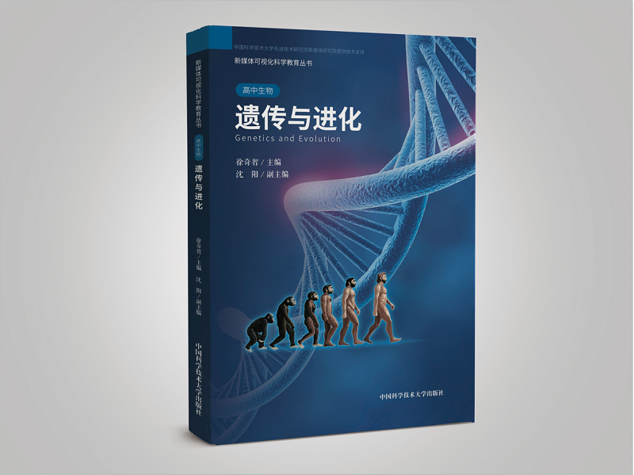
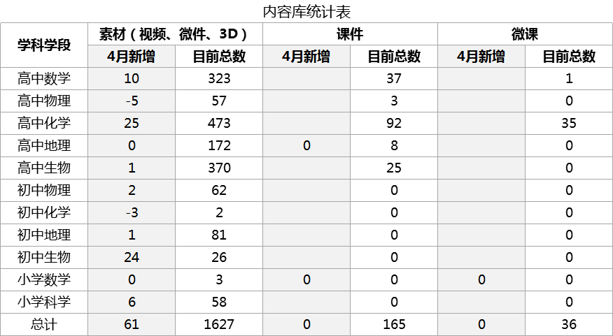
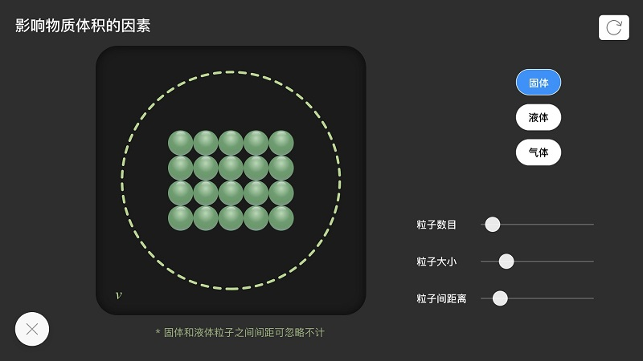
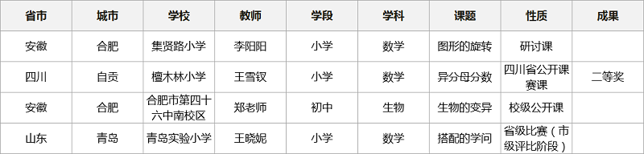
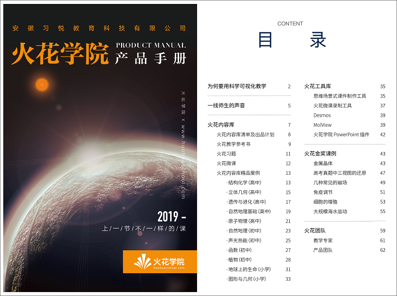

<bro/><bro/>

# 一、内容制作

## 1.1 丛书进度

- 《遗传与进化》纸质书出版倒计时，预计5月上旬面市。

- 《分子与细胞》电子书预计5月上旬上架。

## 1.2 新增内容

4月新增素材69个。因知识模块调整，高中物理及初中化学分别下架素材5个、3个。

部分素材展示

# 二、软件开发

## 2.1 iOS移动端上架

iOS v1.0.0版本正式上架苹果应用商店。

## 2.2 功能优化

- iOS中搜索栏字体居中，搜索入口设置更合理； 

- iOS搜索实时展示结果，高效响应用户需求；

- 桌面端去除火花精品非16：9封面白边，界面更美观。

# 三、	运营支撑

## 3.1 公开课支撑

常规公开课支撑4次，获省二等奖一次，其他结果暂未公布。

## 3.2 品牌运营

- 《火花学院产品手册》纸质版设计完成，预计5月印刷出炉。

- 目前公众号关注总人数1524人，其中4月新增54人，发表文章2篇，总阅读量655次，总转发量62次。

| 推文名称 |  阅读人数  | 
|-------------|:------:|
[有人学化学靠死记硬背，有人竟然靠玩游戏！](https://mp.weixin.qq.com/s/guJqRlB9odES4qrCqnZ85g)|	491|
|[好书推荐学生版·读书让春光更动人](https://mp.weixin.qq.com/s/NNo064J-EtpXxvhEqB2xDA)|	164|

