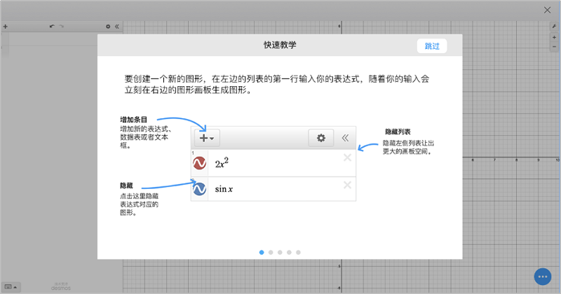
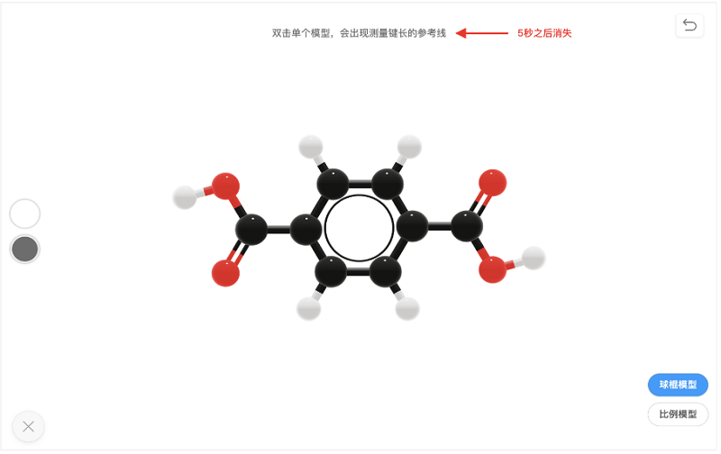

<bro/><bro/>

# 一、内容制作

## 1.1 丛书进度

- 《遗传与进化》纸质版出版流程最后阶段（预计5月上旬出版）

- 《分子与细胞》电子书即将上架（预计5月上旬）

## 1.2 新增内容

4月新增素材61个。

部分素材展示

# 二、软件开发

## 2.1 iOS移动端上架

iOS v1.0.0版本正式上架苹果应用商店

（1）优化功能如下：

- iOS中搜索栏字体居中，搜索入口设置更合理；  
- iOS搜索实时展示结果,高效解决用户者需求；
- 桌面端调整火花精品非16：9封面显示白边问题，界面更美观；

## 2.2 学科工具库

Desmos数学函数图像编辑

Desmos首次使用教学引导

画廊组件开发

MolView化学3D模型文件兼容

在火花学院中打开MolView 3D模型

# 三、	运营支撑

## 3.1 公开课支撑

常规公开课支撑4次（其中，檀木林小学获得二等奖）：

## 3.2 品牌运营

目前公众号关注总人数1524人，其中4月新增54人，发表文章2篇，总阅读量655次，总转发量62次。

| 推文名称 |  阅读人数  | 
|-------------|:------:|
[有人学化学靠死记硬背，有人竟然靠玩游戏！](https://mp.weixin.qq.com/s/guJqRlB9odES4qrCqnZ85g)|	491|
|[好书推荐学生版·读书让春光更动人](https://mp.weixin.qq.com/s/NNo064J-EtpXxvhEqB2xDA)|	164|

