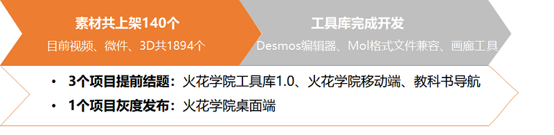
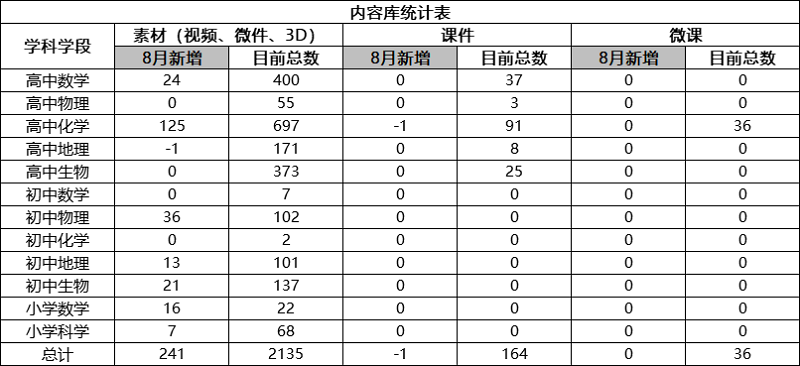
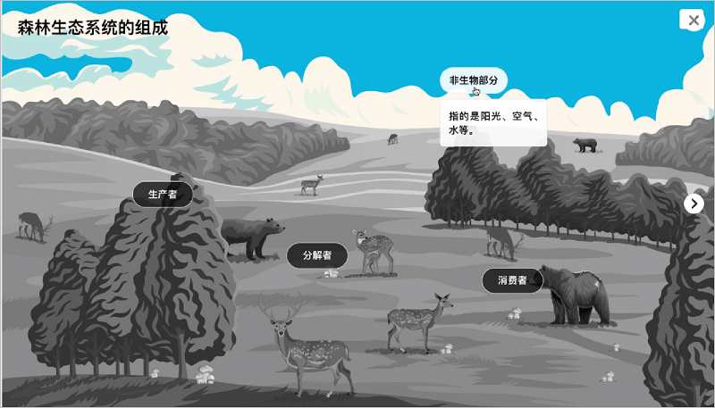
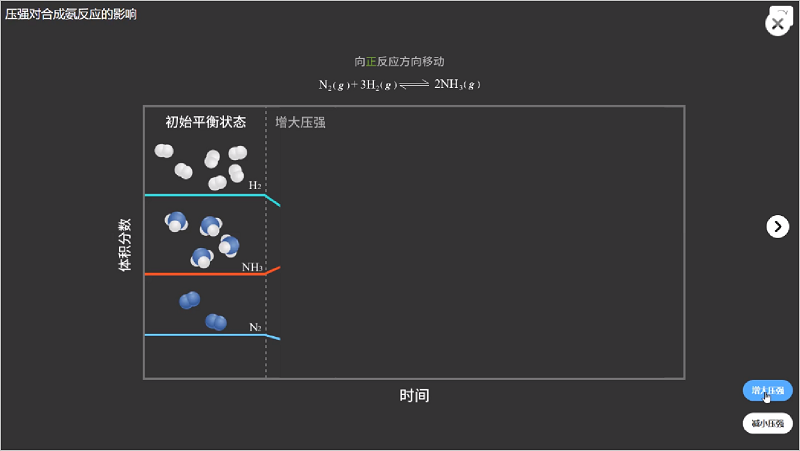
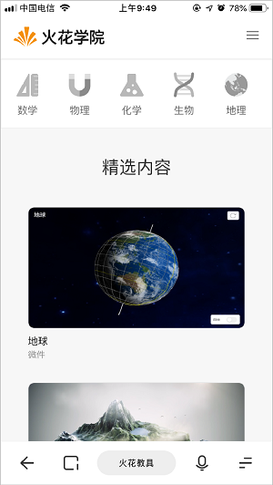
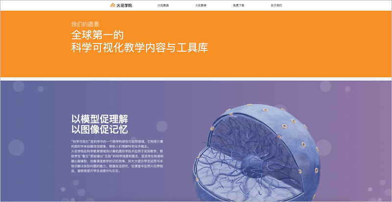
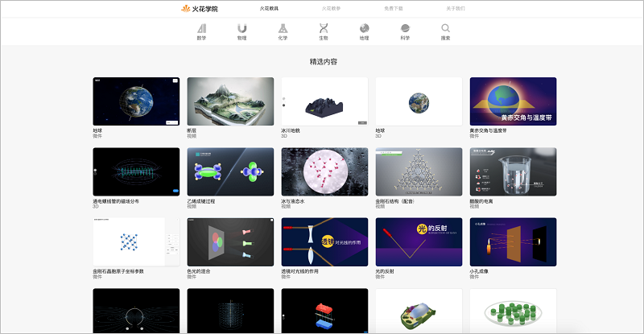
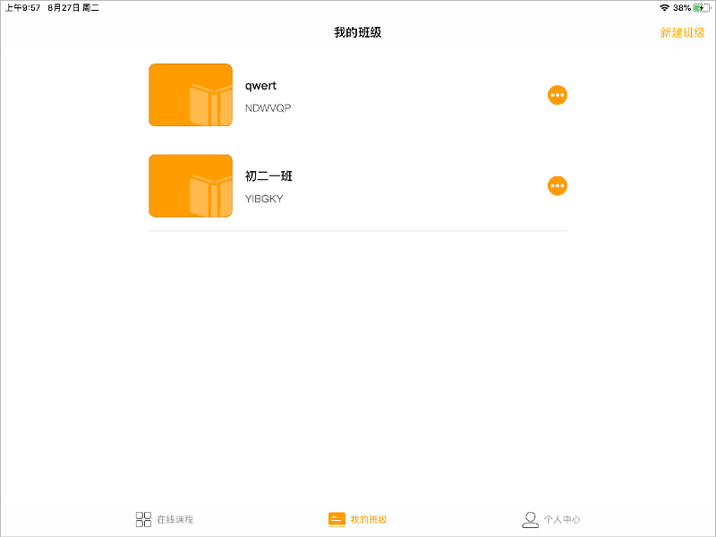
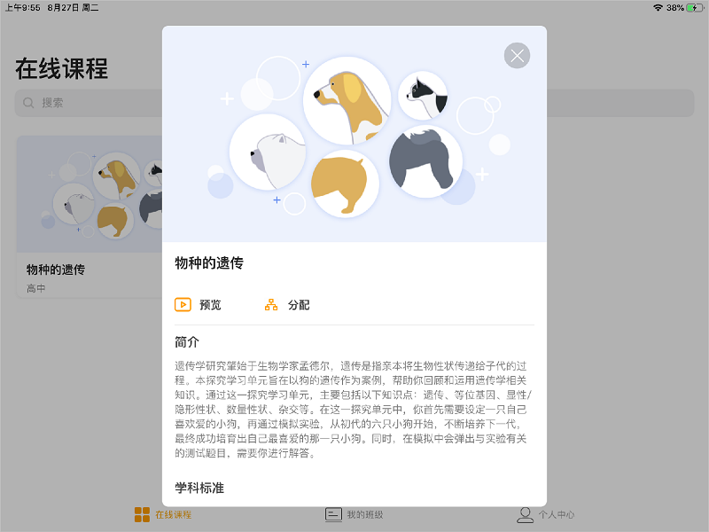
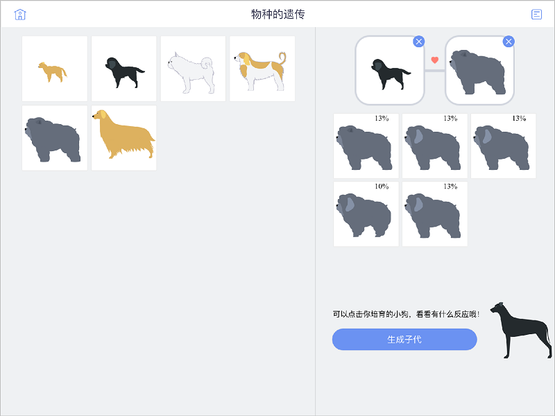

<bro/><bro/>

# 一、内容制作

## 1.1 新增内容

8月共上架素材205个，分别为高中数学、高中化学、初中物理、初中地理、小学数学、小学科学6门学科有素材增加。

部分素材展示

# 二、软件开发

## 2.1 火花学院改版上线

   火花学院的改版上线已对官网存在问题进行调整和优化

（1）优化功能

- 官网在手机、平板等移动设备上已可以适配显示，使用户更加方便使用；

- 对官网页面修改和调整，提升了官网的展示效果和用户体验；

- 优化了部分浏览器兼容性问题；

## 2.2 PBL开发完成

旨在帮助教师通过在线的方式帮助学生完成项目式学习（Project Based Learning，简称PBL），并记录每一位学生的学习过程与评价。

（1）开发内容

- 基础平台搭建安卓和iOS两个版本App，分别涉及教师端和学生端

- 物种的遗传教学单元的开发完成

# 三、	运营支撑

## 3.1 品牌运营

- 目前公众号关注总人数1683人，本月新增78人，发表文章3篇，总阅读量1207次，总转发量120次。

| 推文名称 |  阅读人数  | 
|-------------|:------:|
[火花学院与金山办公WPS深度合作：主推可视化精品课程开发](https://mp.weixin.qq.com/s/x0p9CsNpwHwNLNZPkr7pBA)|	614|
[《小欢喜》三个家庭教育的真相：你是哪一种？](https://mp.weixin.qq.com/s/3JmBIVlsxNb4NcWDWnCcnA)|	297|
[要开学了！准备好了吗？（内附超强补作业大法）](https://mp.weixin.qq.com/s/IsGzvF3TGWAUnWDpdmm_mg)|	296|

# 四、项目进展

- 3个项目提前结题，1个项目完成灰度发布
  
  详情请点击[7月项目进度公示](https://xiyue-team.github.io/doc_monthlyreport/project/Jul)
 

