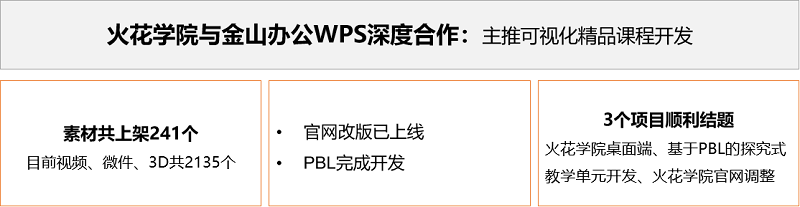
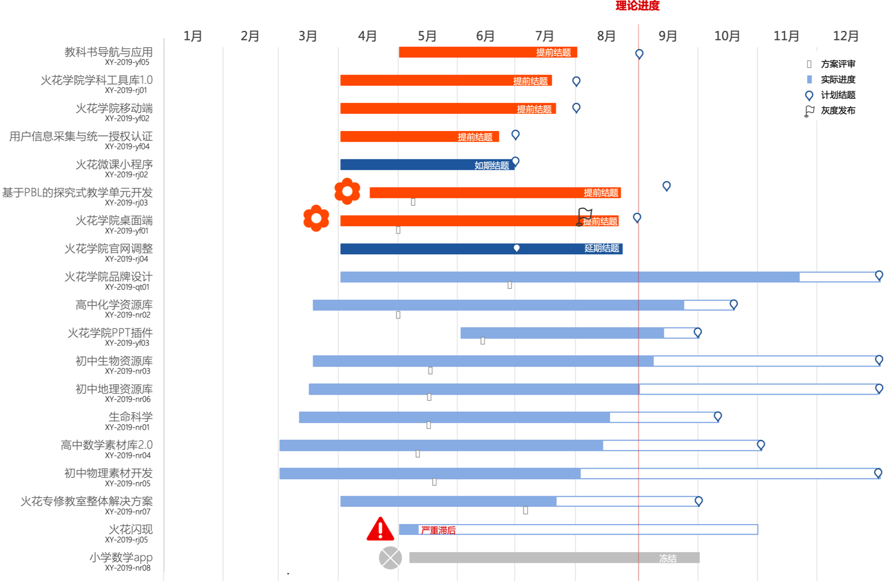

<bro/><bro/>

# 一、内容制作

## 1.1 新增内容

8月共上架素材241个。

部分素材展示

# 二、软件开发

## 2.1 火花官网改版上线

（1）优化功能

- 适配手机、平板等移动设备，更美观。

- 网页版首页内容修改调整，同时优化了部分浏览器兼容性问题，呈现更“完美”。

## 2.2 PBL首个教学单元开发完成

教师将可以通过在线的方式帮助学生完成项目式学习（Project Based Learning，简称PBL），并记录每一位学生的学习过程。

（1）平台搭建

- 基础平台分安卓和iOS两个版本App，分别涉及教师端和学生端。

- 物种的遗传教学单元已完成开发。

# 三、	运营支撑

## 3.1 品牌运营

- 火花官方微博建立，发表微博16篇，关注人数增加10023人，阅读总数6349。

- 火花订阅号“火花名师汇”建立，关注总人数14人，发表文章8篇，总阅读量581次，阅读人数223人。

- 火花服务号“火花学院”关注总人数1683人，本月新增78人，发表文章3篇，总阅读量1207次，总转发量120次

| 推文名称 |  阅读人数  | 
|-------------|:------:|
[火花学院与金山办公WPS深度合作：主推可视化精品课程开发](https://mp.weixin.qq.com/s/x0p9CsNpwHwNLNZPkr7pBA)|	614|
[《小欢喜》三个家庭教育的真相：你是哪一种？](https://mp.weixin.qq.com/s/3JmBIVlsxNb4NcWDWnCcnA)|	297|
[要开学了！准备好了吗？（内附超强补作业大法）](https://mp.weixin.qq.com/s/IsGzvF3TGWAUnWDpdmm_mg)|	296|

# 四、项目进展

- 3个项目结题，其中2个项目提前结题
  
  详情请点击[8月项目进度公示](https://xiyue-team.github.io/doc_monthlyreport/project/Aug)
 

