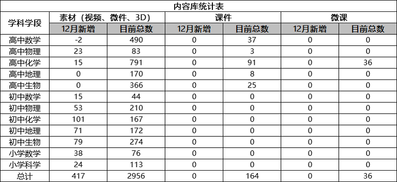
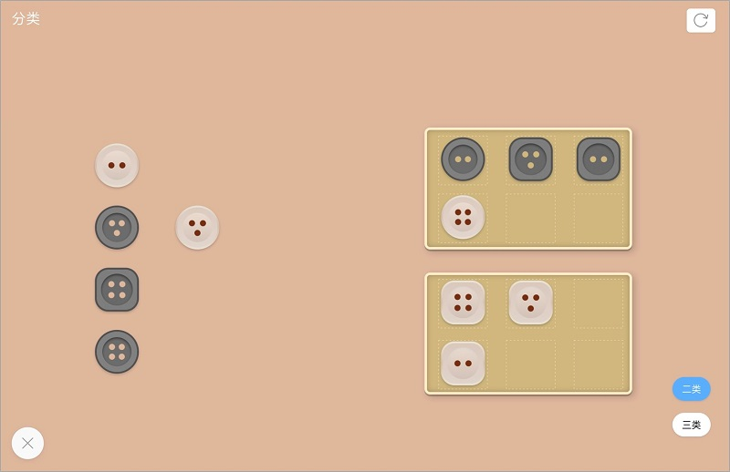
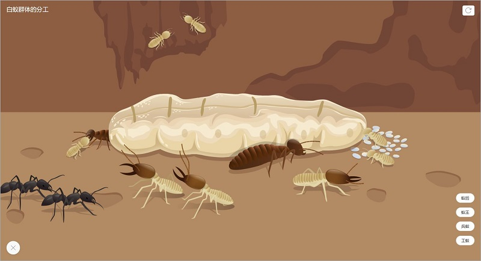
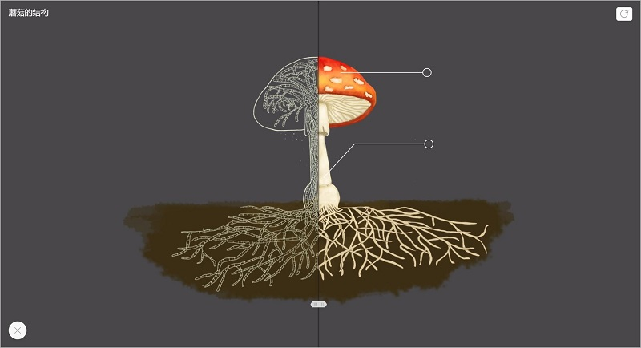

<bro/><bro/>

# 一、内容制作

## 1.1 新增内容

12月共上架素材417个。

部分素材展示

# 二、软件开发

## 2.1 火花学院桌面端3.0完成开发，预计节后发布

- 新增“首页”，包括Banner轮播、推荐素材和教学案例，动态展示火花学院运营活动和精品资源。

- 素材详情页改版，新增用户点赞和评价、相关素材推荐等。

- 增加精品课程，名校合作，课件、素材、微课等全套打包，为教师提供全面服务

- “我的课程管理”支持文件夹排列方式，资源管理更方便；

## 2.2 DMS数据营销系统1.0版上线

针对火花学院软件和内容产品数据进行汇总分析，包括机构分析、用户分析、内容分析和交易分析，为产品优化提供数据支撑。

## 2.3 7本火花教参独立APP UI界面优化

# 三、运营支撑

## 3.1 公开课支撑

常规公开课支撑2次。

| 省区 |  学校  | 教师  | 学段  | 学科  |  课题   | 性质    |
|-------------|:------:|:------:|:------:|:------:|:------:|:------:|
|山东	|青岛实验高级中学|	徐明俊	|高中|	数学	|弧度制的探究	|国家级|
|湖北	|武汉华侨城小学	|邢老师	|小学|	科学	|生态环境|	市级|

## 3.2 品牌运营

- 火花学院服务号“火花学院”关注总人数2437人，本月新增220人，发表文章4篇，总阅读量5338，总转发量1025次。

| 推文名称 |  阅读人数  | 
|-------------|:------:|
[中国人该不该过圣诞节？](https://mp.weixin.qq.com/s/q4WdHCcUgfA3jAdUjyLGkw)|	1900|
[双十二指南：科学花钱让人更快乐](https://mp.weixin.qq.com/s/x4wuMlC5Sey5jsydImkK6A)|	1368|
[你是不是也掉进过“伪挫折教育”的坑？](https://mp.weixin.qq.com/s/SiILDeYY4jl4N7a5DVFA4A)|	1135|

- 火花学院订阅号“火花名师汇”关注总人数74人，发表文章7篇，阅读量54次，阅读人数50人。

- 火花微博“火花官方”发表微博21篇，涨粉16人，阅读总数6669。

# 四、项目进展

## 2019年上半年立项项目

“高中数学素材库2.0”项目如期结题，详情请点击[2019上半年立项项目进展](https://xiyue-team.github.io/doc_monthlyreport/project/Nov#2019%E5%B9%B4%E4%B8%8A%E5%8D%8A%E5%B9%B4%E9%A1%B9%E7%9B%AE%E8%AF%A6%E6%83%85)。
 

## 2019年下半年立项项目

“火花学院学科工具库2.0”、“第三方嵌入界面与火花书屋”2个项目如期结题，详情请点击[2019下半年立项项目进展](https://xiyue-team.github.io/doc_monthlyreport/project/Nov#2019%E5%B9%B4%E4%B8%8B%E5%8D%8A%E5%B9%B4%E9%A1%B9%E7%9B%AE%E8%AF%A6%E6%83%85)。

