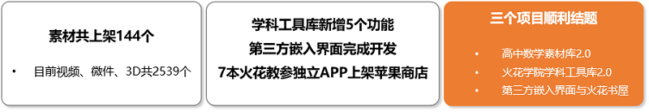
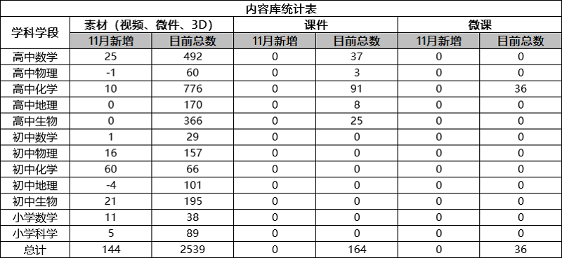
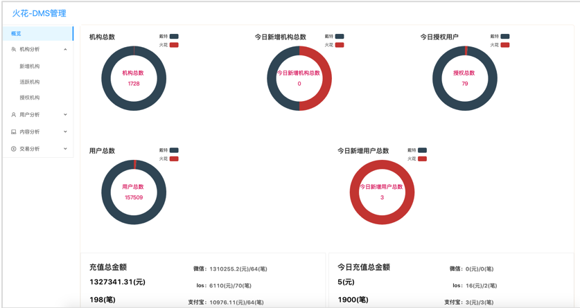
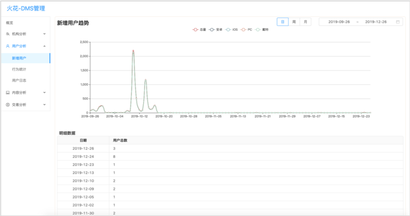
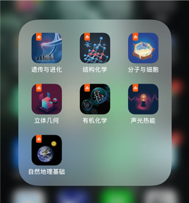
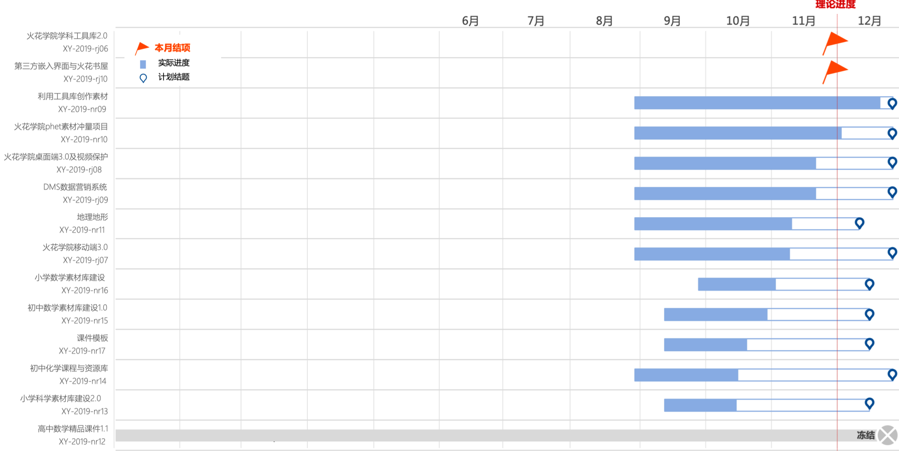

<bro/><bro/>

# 一、内容制作

## 1.1 新增内容

11月共上架素材144个。

部分素材展示

# 二、软件开发

## 2.1 火花学院桌面端3.0完成开发，预计节后发布

- 新增“首页”，包括Banner轮播、推荐素材和教学案例，动态展示火花学院运营活动和精品资源。

- 素材详情页改版，新增用户点赞和评价、相关素材推荐等。

- 增加精品课程，名校合作，课件、素材、微课等全套打包，为教师提供全面服务

- “我的课程管理”支持文件夹排列方式，资源管理更方便；

## 2.2 DMS数据营销系统1.0版上线

针对火花学院软件和内容产品数据进行汇总分析，包括机构分析、用户分析、内容分析和交易分析，为产品优化提供数据支撑。

## 2.3 7本火花教参独立APP UI界面优化

# 三、运营支撑

## 3.1 公开课支撑

常规公开课支撑5次。

## 3.2 品牌运营

- 火花服务号“火花学院”关注总人数2423人，本月新增643人，发表文章3篇，总阅读量2055，总转发量656次。

| 推文名称 |  阅读人数  | 
|-------------|:------:|
[如何用科学方法找男/女朋友](https://mp.weixin.qq.com/s/T5f7K1_zYSjvrOx1-kZntA)|	955|
[象牙塔里，也有光照不到的地方](https://mp.weixin.qq.com/s/kZ_n59dOHPoJeJ_5ZJ_qTA)|	409|
[不用量子波动，睡觉就能帮助记忆](https://mp.weixin.qq.com/s/yeNq2EpvvdIf1klCjfqCCg)|	612|

- 火花订阅号“火花名师汇”关注总人数29人，发表文章6篇，阅读量40次，阅读人数30人

- 火花微博“火花官方”发表微博18篇，涨粉16人，阅读总数5728

# 四、项目进展

## 2019年上半年立项项目

“高中数学素材库2.0”项目如期结题，详情请点击[2019上半年立项项目进展](https://xiyue-team.github.io/doc_monthlyreport/project/Nov#2019%E5%B9%B4%E4%B8%8A%E5%8D%8A%E5%B9%B4%E9%A1%B9%E7%9B%AE%E8%AF%A6%E6%83%85)。
 

## 2019年下半年立项项目

“火花学院学科工具库2.0”、“第三方嵌入界面与火花书屋”2个项目如期结题，详情请点击[2019下半年立项项目进展](https://xiyue-team.github.io/doc_monthlyreport/project/Nov#2019%E5%B9%B4%E4%B8%8B%E5%8D%8A%E5%B9%B4%E9%A1%B9%E7%9B%AE%E8%AF%A6%E6%83%85)。

