<bro/><bro/>

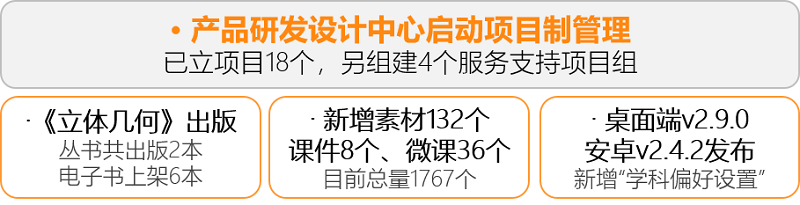

# 一、项目制启动

产品研发设计中心启动项目制管理，原有任务分发机制转为承包验收机制，成立相应项目机构、颁发暂行管理办法，旨在激发团队主观能动性和创造性，搭建开放性、激励性创新平台，形成良性竞争格局，实现员工与公司的共同发展。
2019年已立项目18个，同时组建服务支持项目组承接项目团队输出的外包任务。详情请点击[“项目公示”](https://xiyue-team.github.io/doc_monthlyreport/project/2019)。

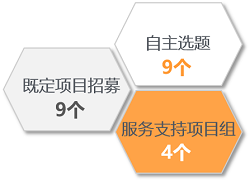

# 二、内容制作

## 2.1 《立体几何》纸质版出版

截至目前火花学院纸质版数字教学参考书出版2本：《结构化学》、《立体几何》；

电子版数字教学参考书上架6本：《结构化学》、《有机化学》、《立体几何》、《声光热能》、《遗传与进化》、《自然地理基础》。

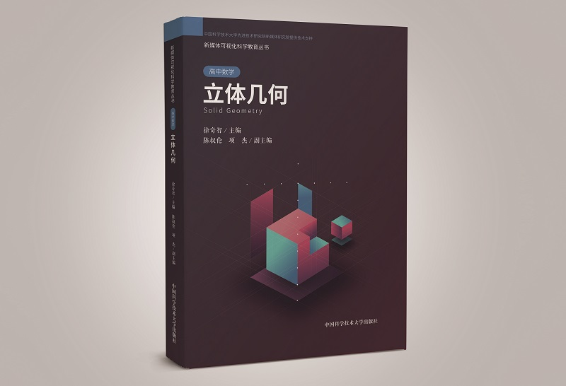

## 2.2 新增内容

2~3月新增新增素材132个、课件8个、微课36个。

部分素材展示

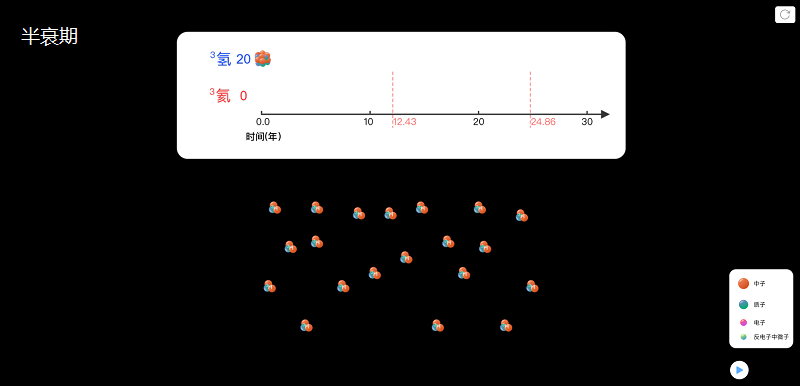

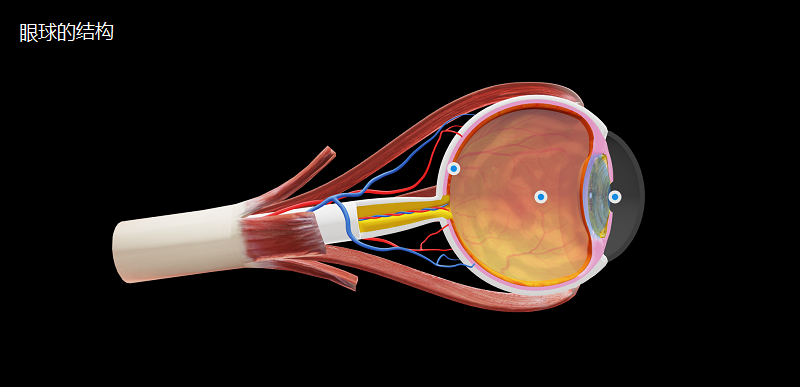

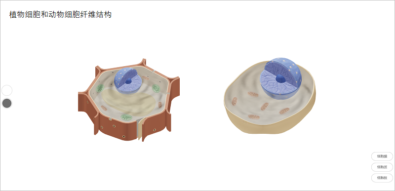

# 三、软件开发

## 3.1 桌面端更新

### v2.9.0版本发布

（1）新增功能如下：

- 本地火花课件可直接播放，无需联网或登录；  
- 编辑课件支持从桌面拖拽图片至编辑区；
- 用户可进行“学科偏好设置”，选择火花精品展现的内容；

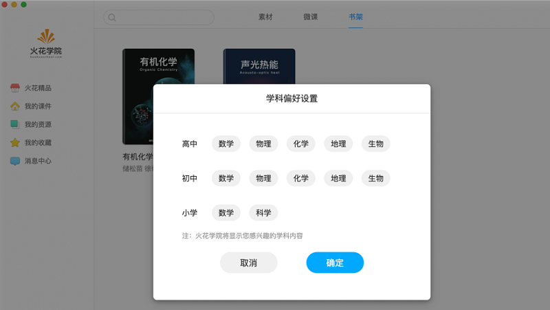

- Windows系统可进行远程协助；

（2）优化功能如下：
- “回收站”调整至“我的课件”，入口设置更合理；
- 离线素材、微课和书架合并成“我的资源”，管理更方便；
- 微课录制填写字段简化，录制、管理更加简单高效。

（3）其他
- 新增用户日志，便于开发追踪整改；
- 编辑器组件化架构调整完成，开发效率、迭代频率提高。

## 3.2 移动端更新

### 安卓v2.4.2版本发布
  
与桌面端同步新增“学科偏好设置”、并简化微课录制。

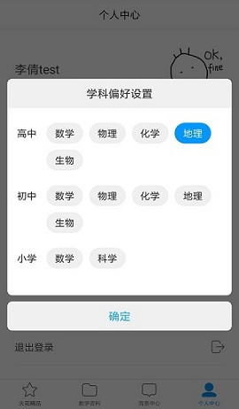

### iOS版本预计4月上线

## 3.3 PC官网更新

### 新增“帮助中心”

[“帮助中心”](https://prod.huohuaschool.com/help/index.html)为用户提供主要功能操作指南。

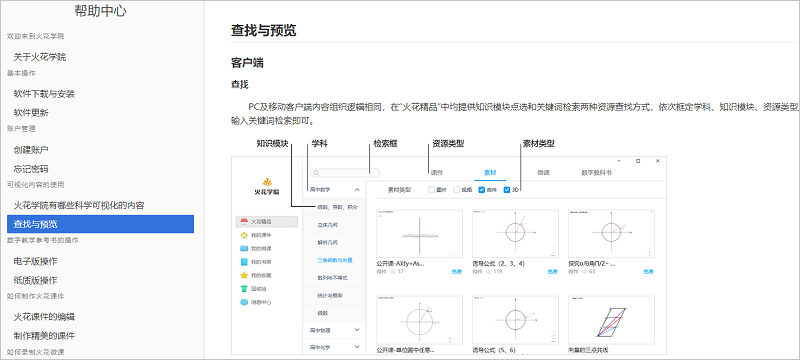

### 新增加“充值中心”和“消息通知”

用户登录后可实现与客户端相同的充值和消息查看功能。

### 新增Android版下载二维码

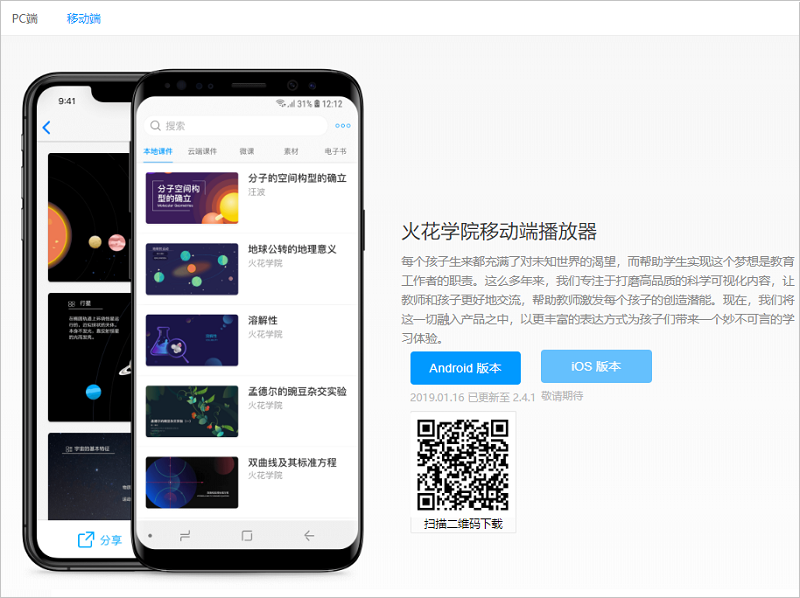

### 优化官网浏览器适配

优化官网在IE浏览器上的适配，支持IEEDGE、IE10浏览器访问，同时增加IE10以下浏览器用户提示，引导用户下载CHROME浏览器访问官网。

## 3.4 运营管理系统优化

（1）素材预览呈现方式多样化，图片、视频皆可；

（2）按学段-学科-知识模块的方式对机构进行授权，业务逻辑更贴合实际教学需求；

（3）微课由事前审查机制调整为事后审查机制，用户录制的微课在审查前可随意分享，如火花运营人员认为此微课不合格，可进行屏蔽，屏蔽后用户无法继续分享，此前已分享的微课，系统将提示用户“微课已删除”。

# 四、运营支撑

## 4.1 公开课支撑

常规公开课支撑5次：

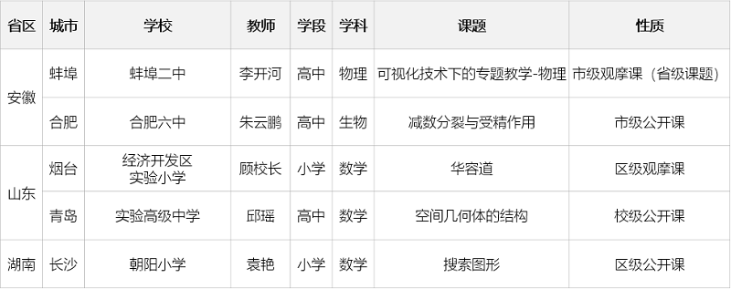

## 4.2 品牌运营

目前公众号关注总人数1464人，其中2~3月新增432人，发表文章10篇，阅读量9556次，转发量634次。

| 推文名称 |  阅读人数  | 
|-------------|:------:|
[学不好数理化是因为脑子笨？或许只是因为……](https://mp.weixin.qq.com/s/WL6vqBW2r5MzBz2uWZyqVA)|	7661|
|[女孩子天生学不好数学？](https://mp.weixin.qq.com/s/FYKOmpTI0_S3KHt7N0vdlw)|	697|
|[带地球去流浪，从这些高中物理知识开始](https://mp.weixin.qq.com/s/z3F4Pc7qpVt0EhGf5BO4kA)|	254|
|夸夸群大火，孩子每天夸就会进步？|	224|
|开学季好物推荐·我真的不能没有你|	213|
|美丽中国·如何在爬山的时候“秀”一下|	196|
|好书推荐·教师版	|172|
|美丽中国·春节适合去哪儿玩|	81|
|好物推荐·新学期，你开始 “拔草”了吗？|	36|
|火花学院公开课·向量数乘运算及其几何意义|	22|

