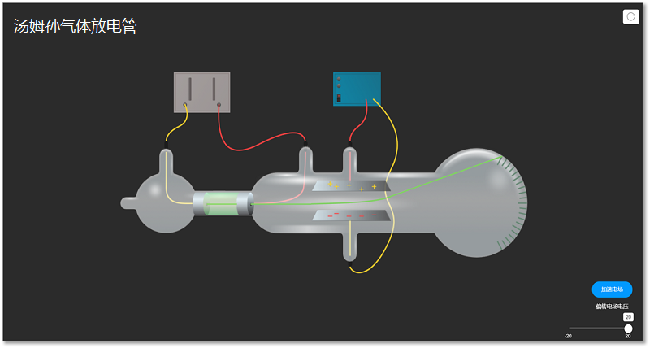
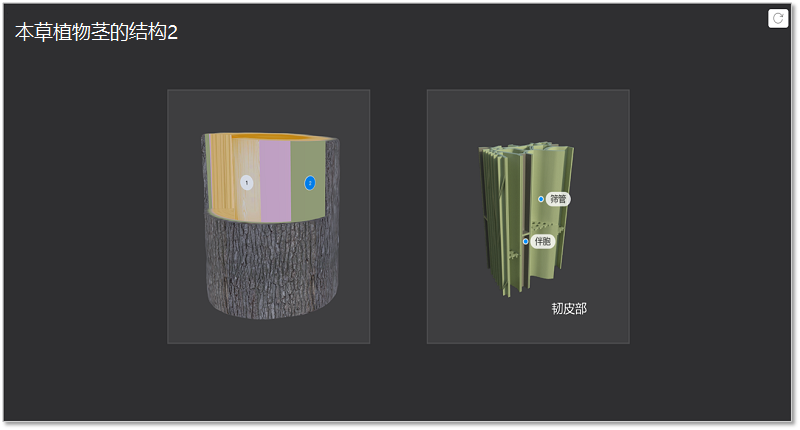
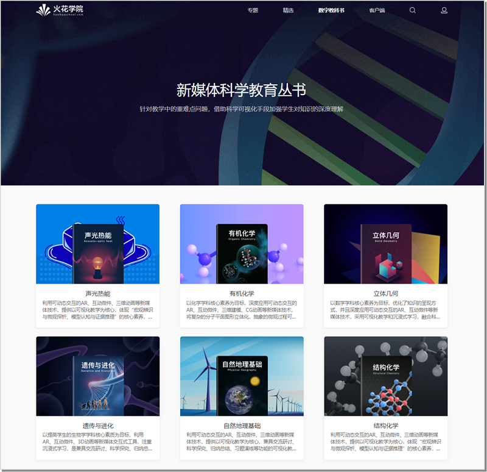
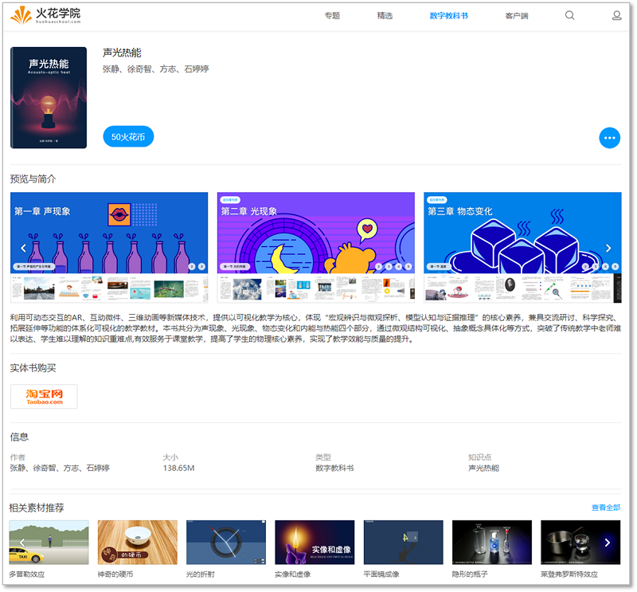
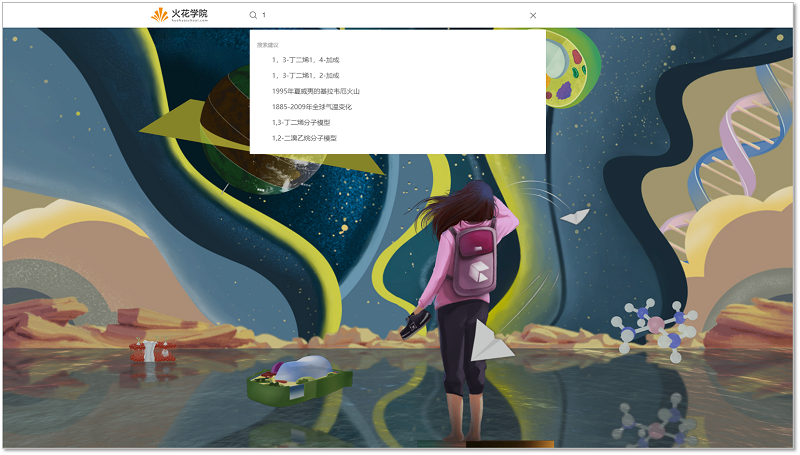
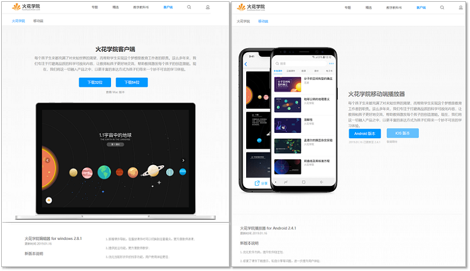
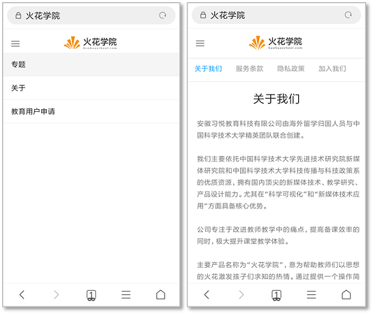
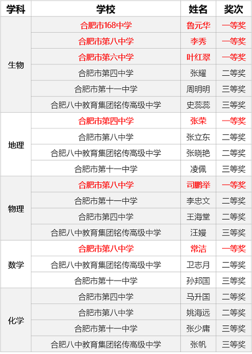
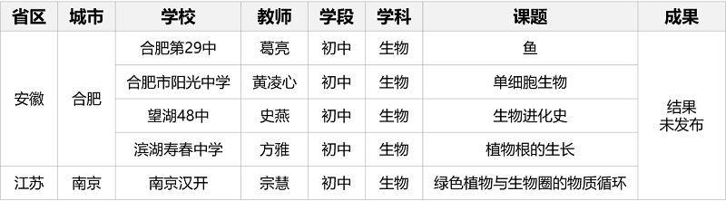

<bro/><bro/>

# 一、内容制作

## 1.1 新增素材

完成5个学科共48个精品素材的开发及上线

| /   |  数学  |  化学 | 物理   |  生物  |  地理 |  总数 |
|-----|:------:|:------:|:------:|:------:|:------:|:------:|
| 微件 | 12 | 1 | 4 | 17 | 2 | 36 |
| 3D | 0 | 3 | 0 | 9 | 0 | 12 |
| 总数 | 12 | 4 | 26 | 2 | 6 | **48** |

部分素材展示

# 二、软件开发

## 2.1 桌面端更新

（1）v2.8.1版本发布，新增习题播放器；

（2）软件基础架构调整，重要服务功能以组件形式开发，为后期单功能升级提供便利。

## 2.2 移动端更新
  
（1）安卓v2.4.1发布，新增习题播放器；

（2）iOS版本软件基本功能实现，预计2月提交苹果App Store进行第一次审核。

## 2.3 官网2.0

（1）PC官网原域名huohua-prod.ustcnmi.org停止服务;新官网[www.huohuaschool.com](www.huohuaschool.com) 2.0上线，新增“数字教科书”、“客户端”板块和搜索功能。

“数字教科书”现上架6本，单本详情页提供预览图片及简介文字，电子版各客户端下载路径及纸质版购买链接，相关可视化素材、课件、微课列表，拓展了用户教学场景应用范围。

教科书概览:

教科书详情页：

搜索页：

客户端下载页：

（2）移动端官网[m.huohuaschool.com](m.huohuaschool.com)新增“关于我们”版块，用户可了解公司背景及产品信息。

# 三、运营支撑

## 3.1 公开课支撑

（1）在合肥市第三届高中智慧课堂优质课（录像课）评比中，火花学院合作的23个参赛作品全部获奖，数学、地理、物理、生物四科获一等奖6个。

获奖详情如下：

（2）常规支撑公开课5次，结果未公布，详情如下：

## 3.2 品牌运营

### （1）微信公众号

关注总人数1024人（新增55人），发表文章6篇，总阅读量1378次，总转发量108次。

| 推文名称 |  阅读人数  | 
|-------------|:------:|
|[知否，知否	，一波新书免费送喽↙](https://mp.weixin.qq.com/s/wPzY5nrYK2FtcRSvIv822Q)| **799** |
|报告老师	，我真的听不进去了| 236 |
|火花学院2018	年度报告新鲜出炉，这一年他们做了哪些突破| 212 |
|火花学院获奖作品展·物理| 131 |
