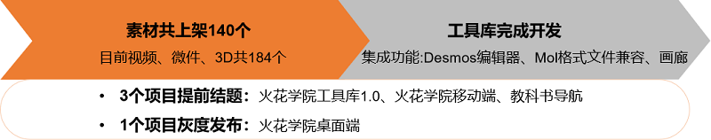
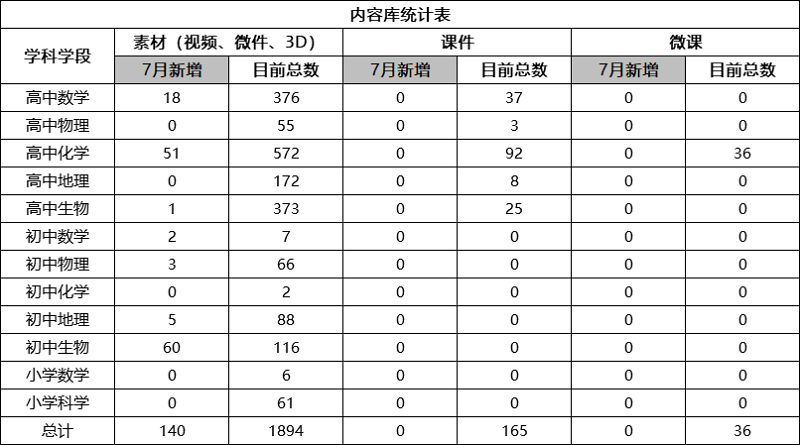
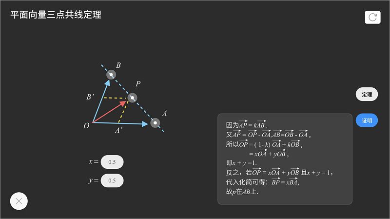
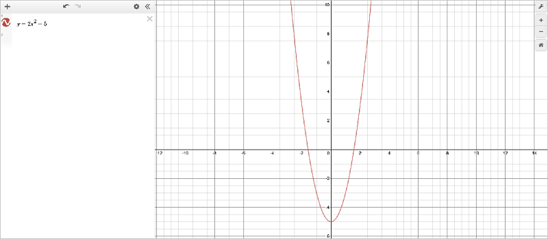
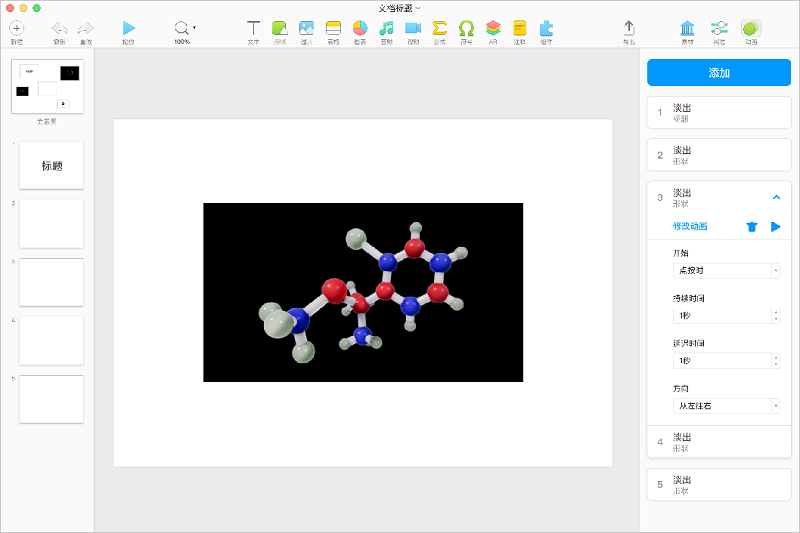
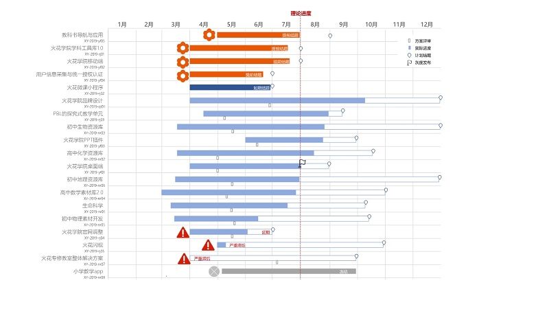

<bro/><bro/>

# 一、内容制作

## 1.1 新增内容

6月共上架素材140个，其中高中数学、高中化学、高中生物、初中数学、初中物理、初中地理、初中生物有新增素材。

部分素材展示

# 二、软件开发

## 2.1 工具库完成开发

  集成功能

- Desmos编辑器：在线绘图型计算器，输入函数式便能自动绘制出对应的方程式或函数图形；

- Mol格式文件兼容：Mol是一种化学3D模型的通用文件格式，本次完成对该文件格式的兼容，并将常见的100种分子模型放入素材库中，供教师直接使用；

- 画廊：以简单的轮播形式展示不同的图片，用户可以自己制作简单的微件 。

# 三、	运营支撑

## 3.1 公开课支撑

常规公开课支撑2次，省级、区级公开课各一次。

## 3.2 品牌运营

- 目前公众号关注总人数1673人，其中7月新增126人，发表文章2篇，总阅读量506次，总转发量62次。

| 推文名称 |  阅读人数  | 
|-------------|:------:|
[《银河补习班》一场关于教育的沉思](https://mp.weixin.qq.com/s/bzX4gUtwKVVESyAiEeUHrQ)|	12|
[莫扎特其实不是音乐天才](https://mp.weixin.qq.com/s/Wzpiev-nUmLptD1JO_Ws2Q)|	8|

# 四、项目进展

- 3个项目提前结题，1个项目进入灰度发布

  项目进展甘特图展示
 

