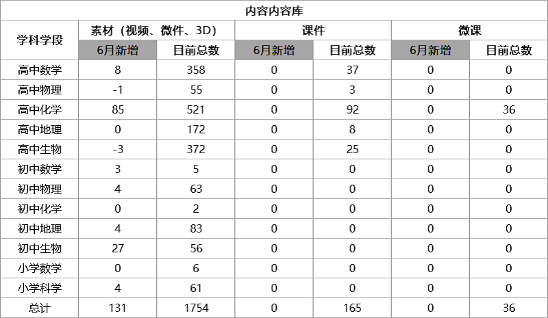
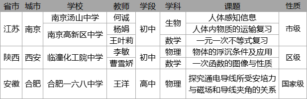

<bro/><bro/>

# 一、内容制作

## 1.1 丛书进度

- 《遗传与进化》纸质书已印刷出版。

## 1.2 新增内容

6月新增素材131个，因素材重复下架素材4个。

部分素材展示

# 二、	运营支撑

## 2.1 火花学院MI初步确立

使命：让1.6亿中小学生学科学获得美好体验。

愿景：全球第一的科学可视化教学内容与工具库

价值观：

对内 /  严谨 专业 责任（产品生产）

对外 /  积极 朝气 进取（行为态度）

## 2.2 公开课支撑

常规公开课支撑6次。

