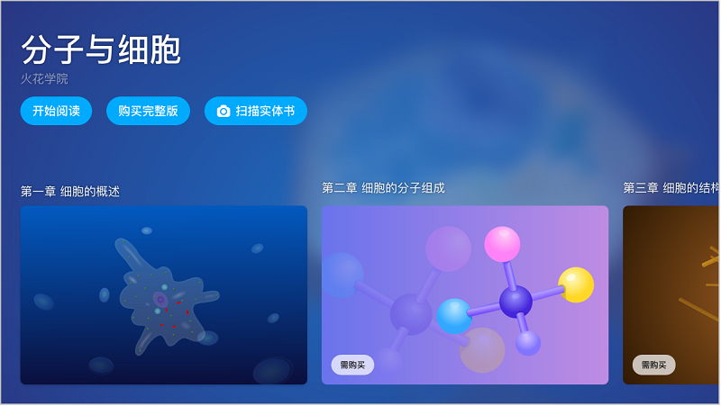
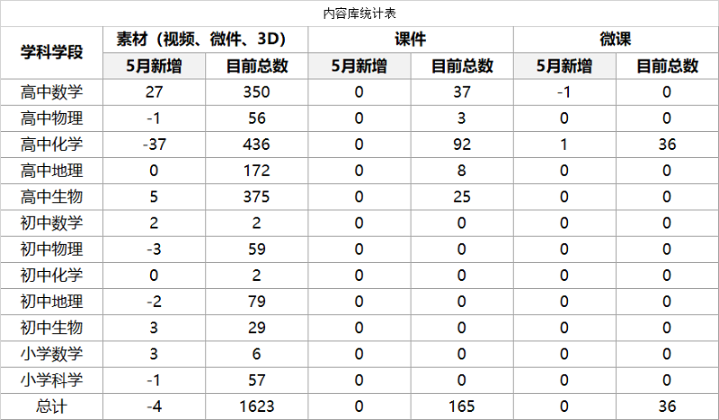
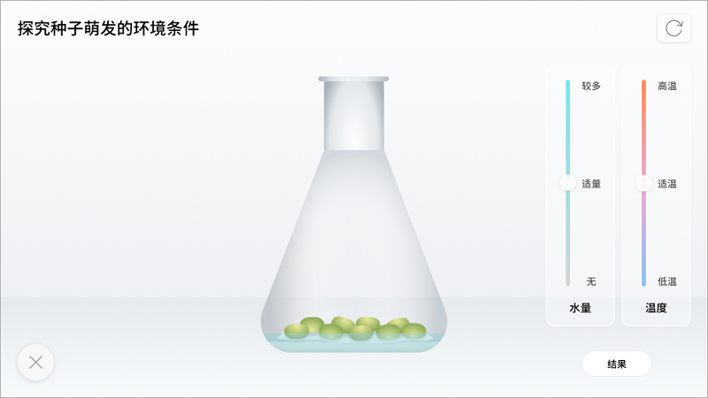
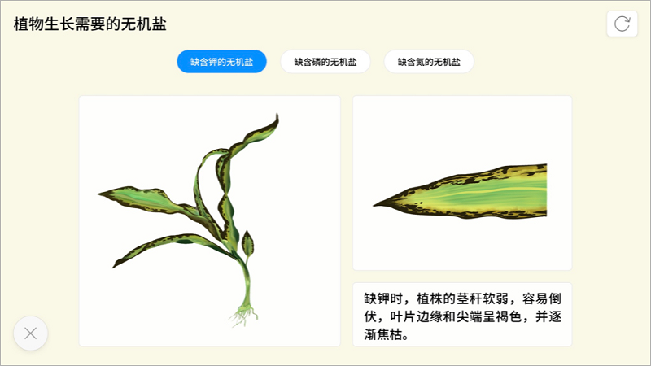
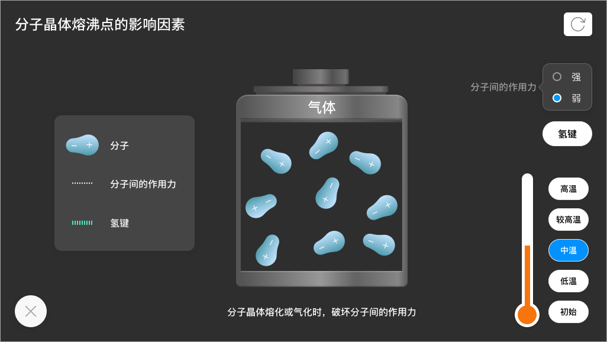
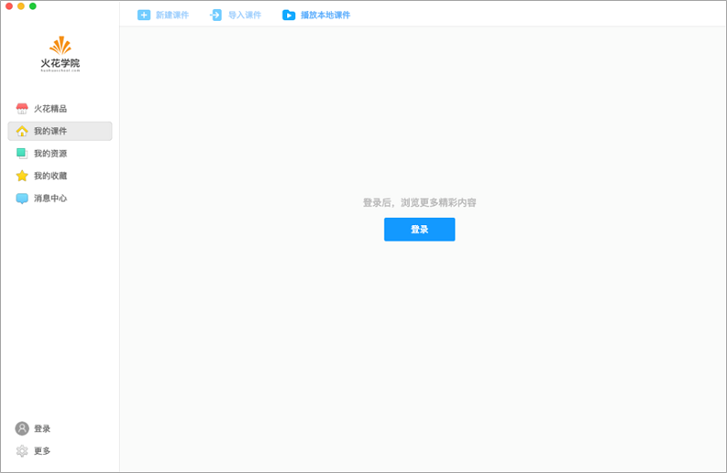
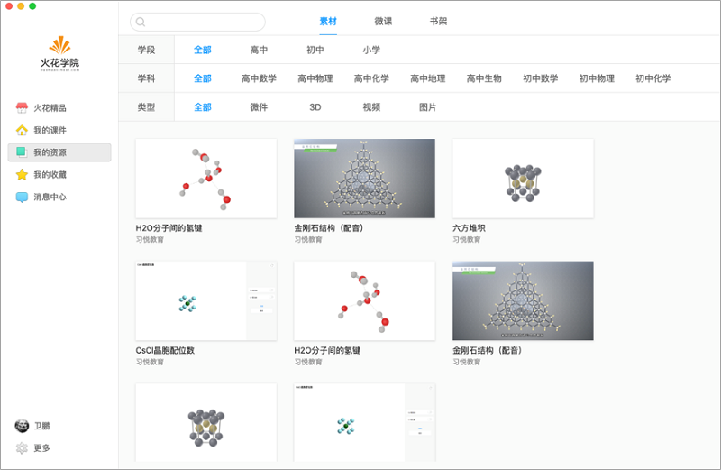
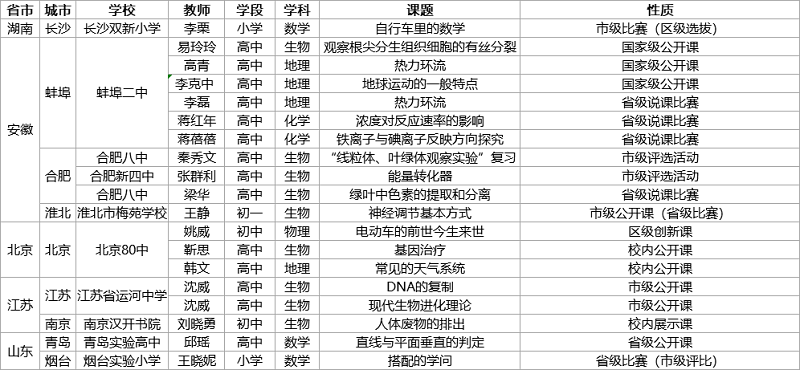

<bro/><bro/>

# 一、内容制作

## 1.1 丛书进度

- 《分子与细胞》电子书上架

## 1.2 新增内容

5月新增素材40个，因知识模块调整下架素材44个，高中化学新增微课1个。

部分素材展示

# 二、软件开发

## 2.1 iOS移动端更新

v1.0.2版本上架苹果应用商店

## 2.2 Mac版本更新

v2.9.0版本发布

- 支持不登录启动软件，可直接播放本地课件，方便顾客使用； 

- 新增“学科偏好设置”，使用户可根据自己的需求设置火花精品展现内容；

- 将素材、书架等常用资料入口合并，用户使用更方便。

# 三、	运营支撑

## 3.1 公开课支撑

常规公开课支撑19次。

## 3.2 品牌运营

- 目前公众号关注总人数为1552人，发表文章2篇，总阅读量1018次，总转发量83次。

| 推文名称 |  阅读人数  | 
|-------------|:------:|
[老师这样做 学生不再讨厌写作业](https://mp.weixin.qq.com/s/Ni_sdK-980q0oqUdXKhsig)|	374|
|[火花3岁生日 一起成长是最好的礼物（内涵高清靓照） ](https://mp.weixin.qq.com/s/vL5mctiIJ0gh0KUbc4oSyw)|	644|

