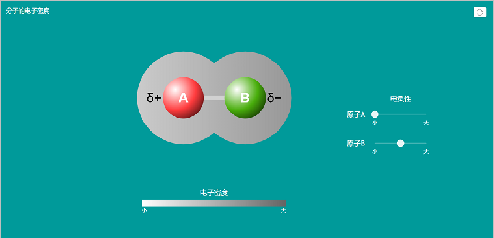
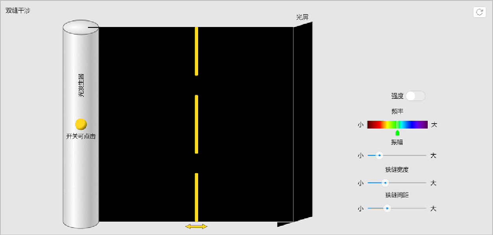
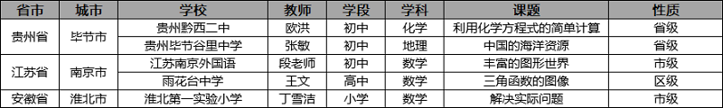

<bro/><bro/>

# 一、内容制作

## 1.1 新增内容

10月共上架素材140个。

部分素材展示

# 二、软件开发

## 2.1 火花学院Powerpoint插件开放下载

- 火花学院Powerpoint插件下载： [请点击](https://www.huohuaschool.com/download)

# 三、	运营支撑

## 3.1 公开课支撑

常规公开课支撑5次。

## 3.2 品牌运营

- 火花服务号“火花学院”关注总人数2423人，本月新增643人，发表文章3篇，总阅读量2055，总转发量656次。

| 推文名称 |  阅读人数  | 
|-------------|:------:|
[如何用科学方法找男/女朋友](https://mp.weixin.qq.com/s/T5f7K1_zYSjvrOx1-kZntA)|	955|
[象牙塔里，也有光照不到的地方](https://mp.weixin.qq.com/s/kZ_n59dOHPoJeJ_5ZJ_qTA)|	409|
[不用量子波动，睡觉就能帮助记忆](https://mp.weixin.qq.com/s/yeNq2EpvvdIf1klCjfqCCg)|	612|

- 火花订阅号“火花名师汇”关注总人数29人，发表文章6篇，阅读量40次，阅读人数30人

- 火花微博“火花官方”发表微博18篇，涨粉16人，阅读总数5728

# 四、项目进展

## 2019年上半年立项项目

“高中化学资源库”项目如期结题，详情请点击[10月项目进度公示](https://github.com/Xiyue-team/doc_monthlyreport/blob/master/project/Oct.md)。
 

## 2019年下半年立项项目

下半年立项项目中“火花学院学科工具库2.0”、“利用工具库创作素材”、“DMS数据营销系统”3个项目的方案评审已通过，详情请点击[10月项目进度公示](https://github.com/Xiyue-team/doc_monthlyreport/blob/master/project/Oct.md)。

