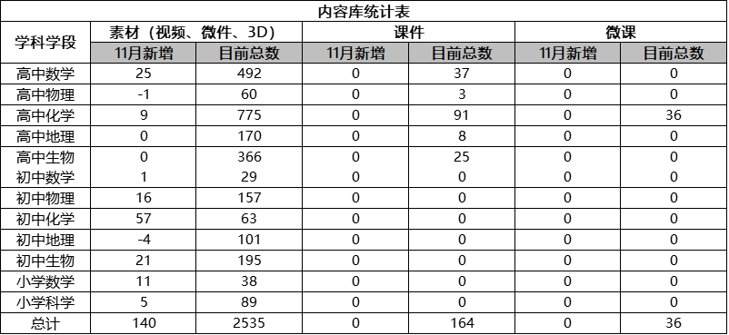
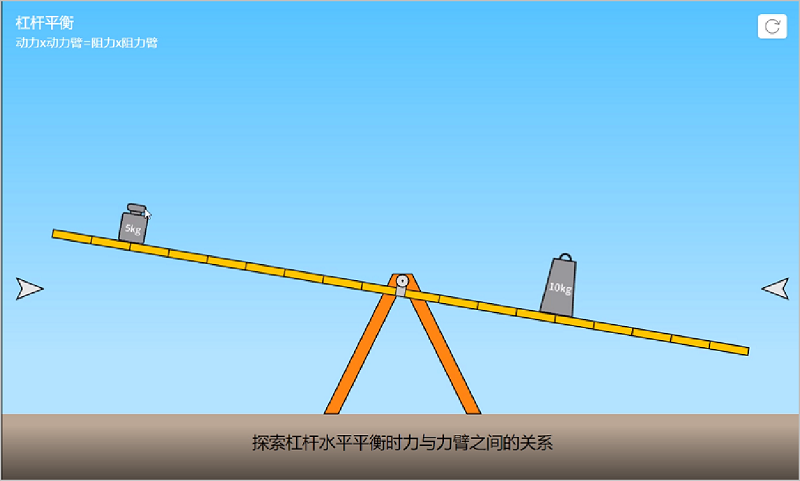
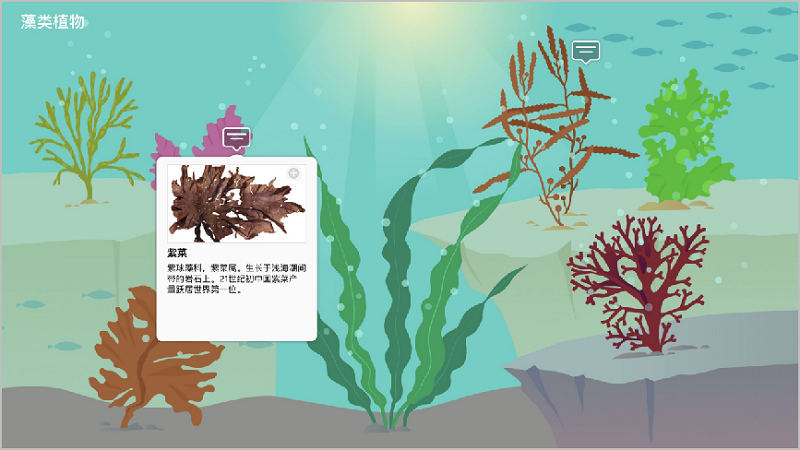
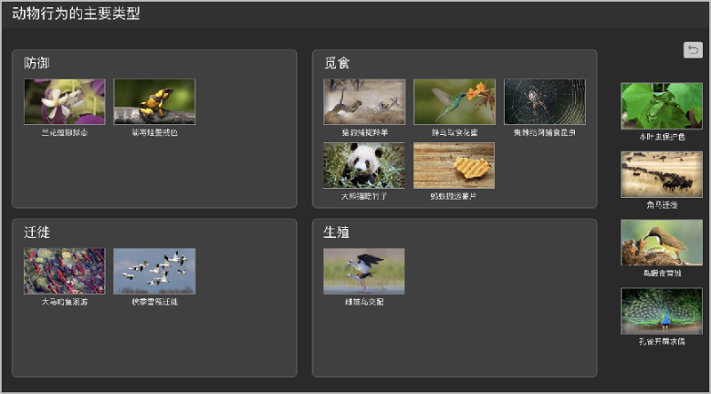
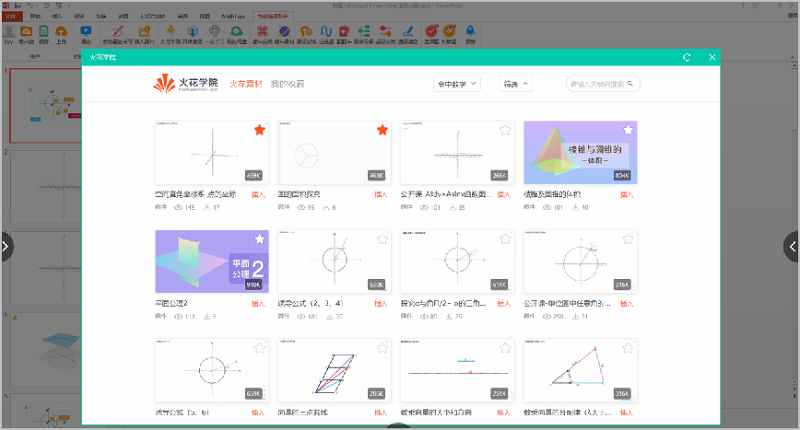
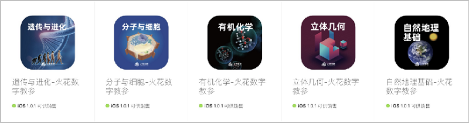

<bro/><bro/>

# 一、内容制作

## 1.1 新增内容

11月共上架素材140个。

部分素材展示

# 二、软件开发

## 2.1 “火花学院学科工具库2.0”完成开发

- 新增五个学科工具：弹出项、思维导图、交互式图像、知识分类、图像切换。

部分开发工具图示：

## 2.2 第三方嵌入界面完成开发

为第三方（如戴特）调取火花资源提供解决方案。

## 2.3 7本火花教参独立APP上架苹果商店

火花学院新媒体可视化教学教育丛书除纸质版和火花学院客户端电子版外，还为每本书提供ios版独立APP。

# 三、	运营支撑

## 3.1 公开课支撑

常规公开课支撑5次。

## 3.2 品牌运营

- 火花服务号“火花学院”关注总人数2423人，本月新增643人，发表文章3篇，总阅读量2055，总转发量656次。

| 推文名称 |  阅读人数  | 
|-------------|:------:|
[如何用科学方法找男/女朋友](https://mp.weixin.qq.com/s/T5f7K1_zYSjvrOx1-kZntA)|	955|
[象牙塔里，也有光照不到的地方](https://mp.weixin.qq.com/s/kZ_n59dOHPoJeJ_5ZJ_qTA)|	409|
[不用量子波动，睡觉就能帮助记忆](https://mp.weixin.qq.com/s/yeNq2EpvvdIf1klCjfqCCg)|	612|

- 火花订阅号“火花名师汇”关注总人数29人，发表文章6篇，阅读量40次，阅读人数30人

- 火花微博“火花官方”发表微博18篇，涨粉16人，阅读总数5728

# 四、项目进展

## 2019年上半年立项项目

“高中数学素材库2.0”项目如期结题，详情请点击[11月项目进度公示](https://github.com/Xiyue-team/doc_monthlyreport/blob/master/project/Nov.md)。
 

## 2019年下半年立项项目

“火花学院学科工具库2.0”、“第三方嵌入界面与火花书屋”2个项目如期结题，详情请点击[11月项目进度公示](https://github.com/Xiyue-team/doc_monthlyreport/blob/master/project/Nov.md)。

