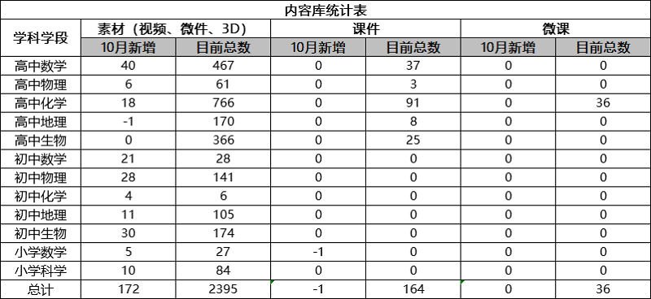
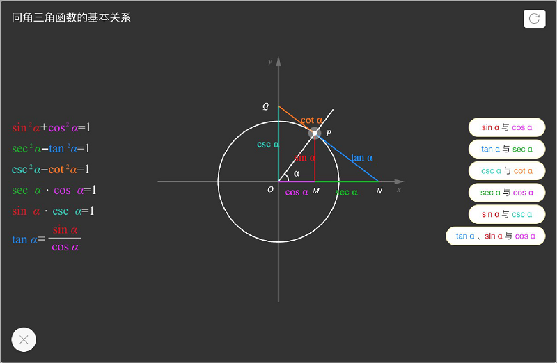
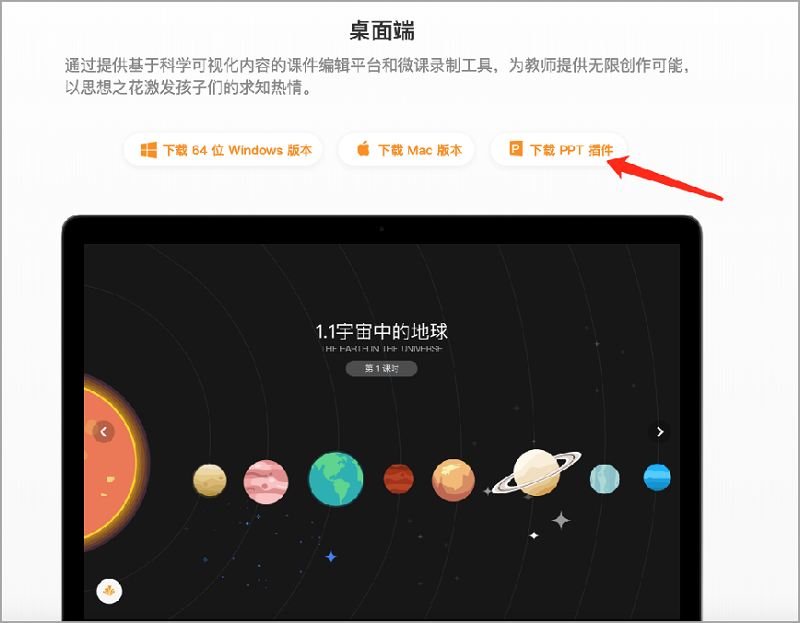
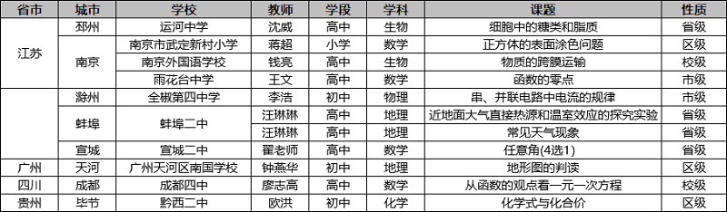
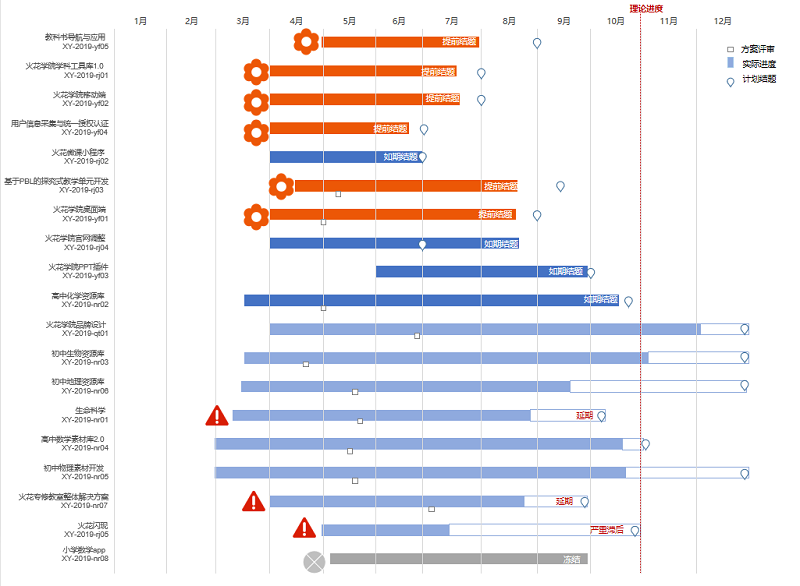
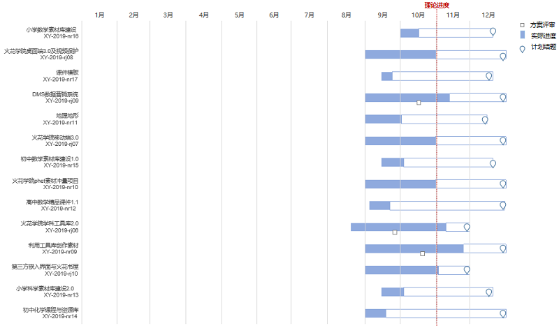

<bro/><bro/>

# 一、内容制作

## 1.1 新增内容

10月共上架素材172个,其中有素材增加的学科包括：高中数学、高中物理、高中化学、初中数学、初中物理、初中化学、初中地理、初中生物、小学数学、小学科学。

部分素材展示

# 二、软件开发

## 2.1 火花学院Powerpoint插件

- 已于火花学院官方网站发布，用户可登录官方网站下载并使用。

- 该插件主要针对win7以上系统（包括win7）、Office13以上版本（包括Office13）。

# 三、	运营支撑

## 3.1 公开课支撑

常规公开课支撑11次，其中包括：江苏省及安徽省分别4次，广州省、四川省、贵州省分别1次。

## 3.2 品牌运营

- 火花服务号“火花学院”关注总人数1780人人，本月新增132人，发表文章5篇，总阅读量1731次，总转发量268次。

| 推文名称 |  阅读人数  | 
|-------------|:------:|
[国庆去哪玩|这些地方不止是景点，更是知识点](https://mp.weixin.qq.com/s/ctLyew9MhgtEk93enC8)|	233|
[喜迎国庆，火花好礼带回家](https://mp.weixin.qq.com/s/1NGM3bIr9yiMbxjoR8G25Q)|	134|
[你为什么这么懒？终于找到原因了！](https://mp.weixin.qq.com/s/lyRyTPZKDs1AT4A0PJaQJg)|	585|
[火花学院助力蚌埠二中再创佳绩！](https://mp.weixin.qq.com/s/h4-xX_TgfXjTbVKdmD6Upg)|	69|
[原来诺贝尔奖还可以如此浪漫](https://mp.weixin.qq.com/s/RN89pS5vjKOgGqfLULFpwQ)|	500|

- 火花订阅号“火花名师汇”关注总人数27人，发表文章5篇，阅读量364次，阅读人数116人。

- 火花微博“火花官方”发表微博29篇，涨粉22人，阅读总数1.19W

# 四、项目进展

## 2019年上半年立项项目

火花学院PowerPoint插件项目如期结题，详情请点击[10月项目进度公示](https://xiyue-team.github.io/doc_monthlyreport/project/Sep)。
 

## 2019年下半年立项项目

下半年立项项目中火花学院学科工具库2.0、利用工具库创作素材、DMS数据营销系统方案评审已通过，详情请点击[10月项目进度公示](https://xiyue-team.github.io/doc_monthlyreport/project/2019#2019年下半年立项项目)。

