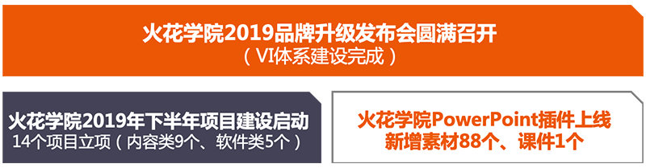
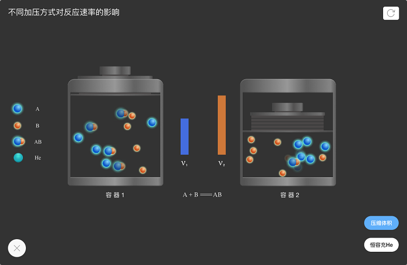
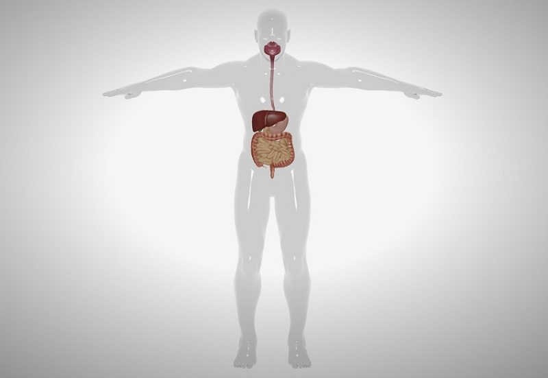
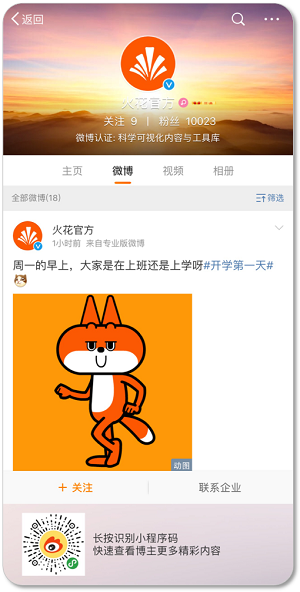

<bro/><bro/>

# 一、内容制作

## 1.1 新增内容

8月共上架素材241个。

部分素材展示

# 二、软件开发

## 2.1 Powerpoint插件已上线

（1）优化功能

- 教师可以在Powerpoint中插入火花素材，便于轻松创作课件。

- 可利用U盘等存储设备拷贝至其他电脑使用，降低了教师的使用门槛。

# 三、	运营支撑

## 3.1 品牌合作

- 火花学院与数字未来有限公司达成推进数字教育国际化的相关协议。

双方将在数字内容国际化生产与推广方面加强交流与合作，进一步提升整体运营效率的同时，创造更大的商业价值和社会效益。数字未来有限公司是中东地区最大的数字出版商，总部位于有“出版之都”美誉的贝鲁特，在全球包括美国、加拿大、比利时、丹麦、以色列、马来西亚、澳大利亚、土耳其等22个国家或地区拥有分支机构。数字未来擅长处理数字内容，精通翻译、编辑和配音，在教科书、视频和数字内容方面具有专业性，与国际广播电视台、著名的纪录片频道拥有长期合作关系。

- 火花学院与国内办公软件市场领导者“金山办公WPS”宣布达成深度合作。

根据协议内容，金山办公WPS所有主流操作系统下的桌面端将先行提供应用入口，无缝接入“火花学院”科学可视化资源。在为用户提供轻量级内容创作与演示工具的同时，注入科学教育领域的专业内容体系，金山办公WPS用户尤其是教育领域的用户能够更加便利地获取和使用优质资源，进行教学创作。

## 3.2 品牌运营

- 火花官方微博建立，发表微博16篇，关注人数增加10023人，阅读总数6349。

- 火花订阅号“火花名师汇”建立，关注总人数14人，发表文章8篇，总阅读量581次，阅读人数223人。

- 火花服务号“火花学院”关注总人数  人，本月新增  人，发表文章4篇，总阅读量1230次，总转发量  次。

| 推文名称 |  阅读人数  | 
|-------------|:------:|
[“兴趣能当饭吃吗？“你别说，还真能””](https://mp.weixin.qq.com/s/TCJD_NvXAfwVtknAfChS1Q)|	291|
[粉笔染白头 三尺献师恩](https://mp.weixin.qq.com/s/nDJ_rwn_FjUwa-TNYyvu6w)|	157|
[中秋节快乐！](https://mp.weixin.qq.com/s/X2MlrfRkgnEXMkRpHSGHQA)|	113|
[火花学院2019品牌形象升级发布会](https://mp.weixin.qq.com/s/VtxmtHura42mVM3f6jdUTg)|	669|

# 四、项目进展

- 1个项目提前结题.
  
  详情请点击[9月项目进度公示](https://xiyue-team.github.io/doc_monthlyreport/project/Aug)
 

- 2019下半年新一批项目立项.

  20个子项目主题招募工作已顺利结束，已申报13个项目，详情见下：
  
  | 序号 | 项目名称  | 项目经理  |项目令号  | 明细  |
|-------------|:------:|:------:|:------:|
[1]初中化学课程与资源库|	储松苗|XY-2019-nr14|点击 |
[粉笔染白头 三尺献师恩](https://mp.weixin.qq.com/s/nDJ_rwn_FjUwa-TNYyvu6w)|	157|
[中秋节快乐！](https://mp.weixin.qq.com/s/X2MlrfRkgnEXMkRpHSGHQA)|	113|
[火花学院2019品牌形象升级发布会](https://mp.weixin.qq.com/s/VtxmtHura42mVM3f6jdUTg)|	669|

