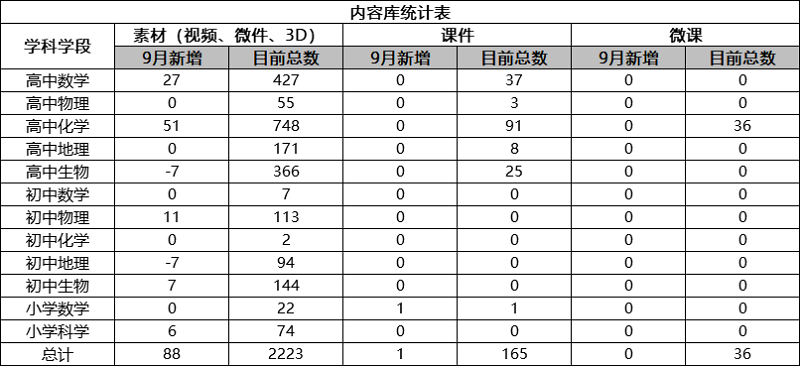
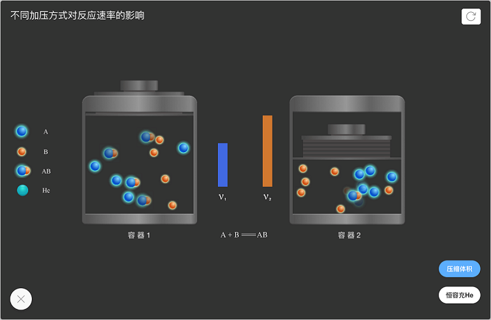
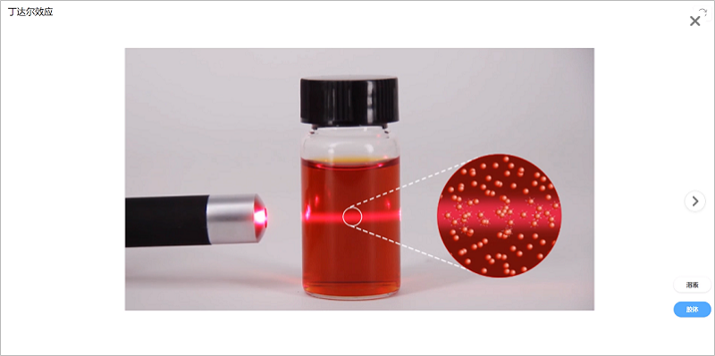
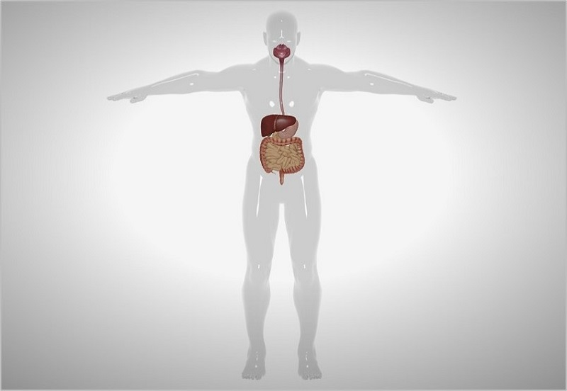
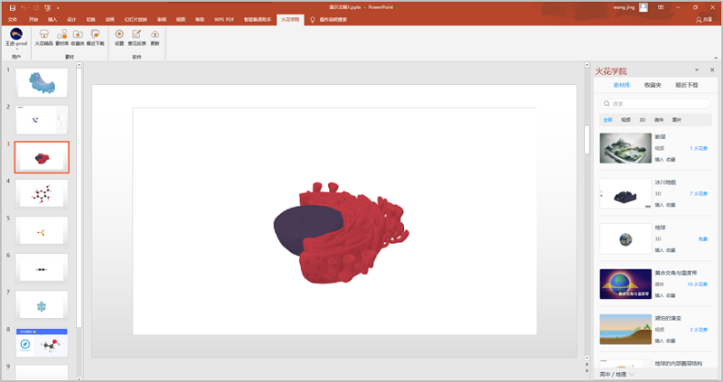
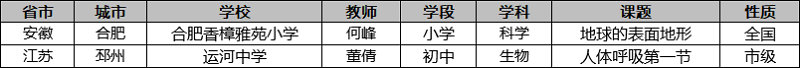

<bro/><bro/>

# 一、内容制作

## 1.1 新增内容

9月共上架素材88个、课件1个。

部分素材展示

# 二、软件开发

## 2.1 Powerpoint插件已上线

（1）优化功能

- 教师可以在Powerpoint中插入火花素材，便于轻松创作课件。

- 可利用U盘等存储设备拷贝至其他电脑使用，降低了教师的使用门槛。

# 三、	运营支撑

## 3.1 公开课支撑

常规公开课支撑2次。

## 3.2 品牌运营

- 火花服务号“火花学院”关注总人数  人，本月新增  人，发表文章4篇，总阅读量1230次，总转发量  次。

| 推文名称 |  阅读人数  | 
|-------------|:------:|
[“兴趣能当饭吃吗？“你别说，还真能””](https://mp.weixin.qq.com/s/TCJD_NvXAfwVtknAfChS1Q)|	291|
[粉笔染白头 三尺献师恩](https://mp.weixin.qq.com/s/nDJ_rwn_FjUwa-TNYyvu6w)|	157|
[中秋节快乐！](https://mp.weixin.qq.com/s/X2MlrfRkgnEXMkRpHSGHQA)|	113|
[火花学院2019品牌形象升级发布会](https://mp.weixin.qq.com/s/VtxmtHura42mVM3f6jdUTg)|	669|

# 四、项目进展

- 1个项目提前结题.
  
  详情请点击[9月项目进度公示](https://xiyue-team.github.io/doc_monthlyreport/project/Aug)
 

- 2019下半年新一批项目立项:20个子项目主题招募工作已顺利结束，14个项目已立项，详情见下
  
| 项目名称  | 项目经理  | 项目令号   | 明细  |
|-------------|:------:|:------:|:------:|
|初中化学课程与资源库|	储松苗|XY-2019-nr14|点击 |
|小学科学素材库建设2.0|张泰铭|XY-2019-nr13| 点击  |
|高中数学精品课件1.1|项性杰|	XY-2019-nr12|  点击 |
|初中数学素材库建设1.0|滕磊|	XY-2019-nr15|   点击|
|第三方嵌入界面与火花书屋|康营营|	XY-2019-rj10|  点击 |
|利用工具库创作素材|窦发|	XY-2019-nr09| 点击  |
|火花学院学科工具库2.0|薛敏|	XY-2019-rj06| 点击  |
|火花学院phet素材冲量项目|张明申|	XY-2019-nr10|点击   |
|火花学院移动端3.0|李浩|	XY-2019-rj07|点击   |
|地理地形|高磊|XY-2019-nr11|  点击 |
|DMS数据营销系统|张国斌|XY-2019-rj09|  点击 |
|火花学院桌面端3.0及视频保护|窦发|XY-2019-rj08|点击   |

