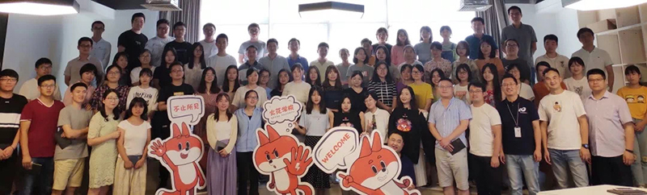
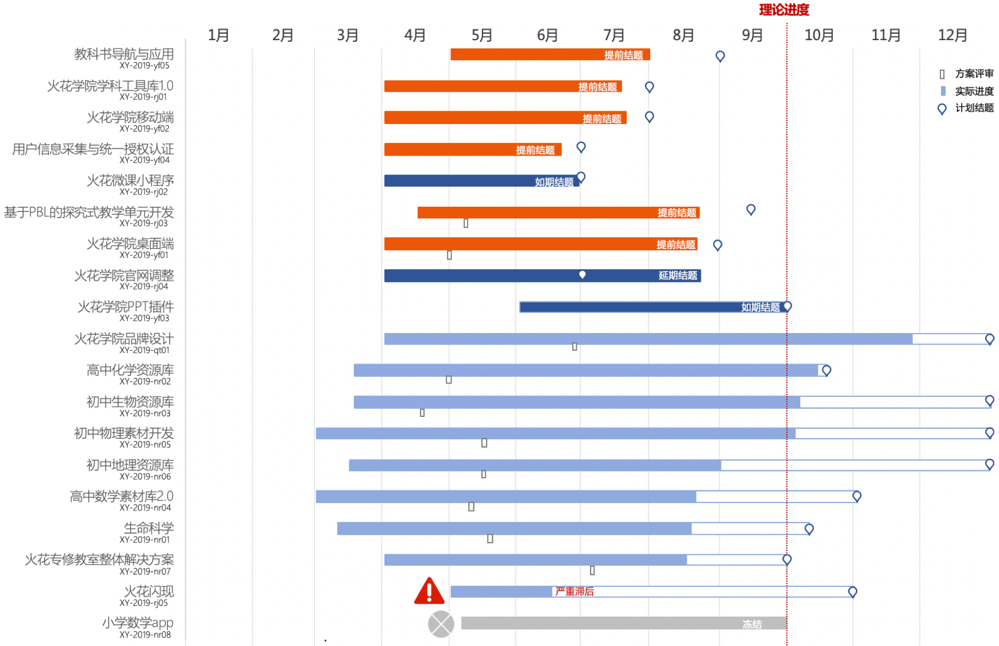

<bro/><bro/>

# 一、内容制作

## 1.1 新增内容

9月共上架素材88个、课件1个。

部分素材展示

# 二、软件开发

## 2.1 火花学院Powerpoint插件上线

- 教师可在Powerpoint中插入火花素材，轻松创作课件。

- 可利用U盘等存储设备拷贝至其他电脑使用，降低使用门槛。

# 三、	运营支撑

## 3.1 公开课支撑

常规公开课支撑2次。

## 3.2 品牌运营

- 火花学院2019品牌升级发布会“火花·不止所见”圆满完成，品牌发言人王敏分别从MI理念输出、VI使用管理规范，UI未来发展规划等方向阐述了品牌的核心理念，描绘了火花学院的品牌形象。详情点击查看[火花学院VI体系](http://wiki.huohuaschool.com/confluence/pages/viewpage.action?pageId=7016780)。

- 火花服务号“火花学院”关注总人数1715人，本月新增97人，发表文章5篇，总阅读量1958次，总转发量152次。

| 推文名称 |  阅读人数  | 
|-------------|:------:|
[“兴趣能当饭吃吗？“你别说，还真能””](https://mp.weixin.qq.com/s/TCJD_NvXAfwVtknAfChS1Q)|	275|
[粉笔染白头 三尺献师恩](https://mp.weixin.qq.com/s/nDJ_rwn_FjUwa-TNYyvu6w)|	146|
[中秋节快乐！](https://mp.weixin.qq.com/s/X2MlrfRkgnEXMkRpHSGHQA)|	112|
[火花学院2019品牌形象升级发布会](https://mp.weixin.qq.com/s/VtxmtHura42mVM3f6jdUTg)|	662|
[科技变革教育，数字驱动未来](https://mp.weixin.qq.com/s/9oL_8NA2nSZ9QKte1ljy2g)|	620|

- 火花订阅号“火花名师汇”关注总人数20人，发表文章7篇，阅读量260次，阅读人数246人。

- 火花微博“火花官方”发文25篇，涨粉23人，阅读总数1.2W。

# 四、项目进展

## 2019年上半年立项项目

火花学院PowerPoint插件项目如期结题，详情请点击[9月项目进度公示](https://xiyue-team.github.io/doc_monthlyreport/project/Sep)
 

## 2019年下半年立项项目

项目建设启动，发布20个子项目主题，立项14个，其中内容类9个、软件类5个，详情请点击[2019年下半年项目详情](https://xiyue-team.github.io/doc_monthlyreport/project/2019#2019年下半年立项项目)。
