# 一、产品体系形成

## 1.1 明确两大产品线（素材库、课程包）

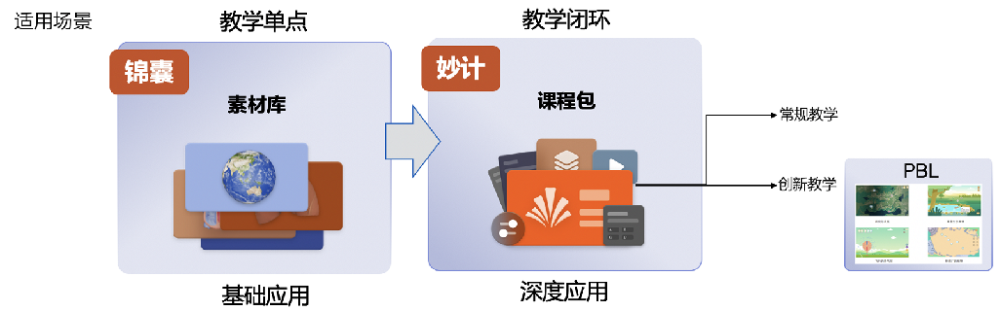

- 火花素材库扩充：2020年新增素材824个，其中微件483个，视频256个，3D 85个，各学科、各种类的素材均呈增长趋势。

- 火花课程包初期建设完成：提供老师所需的基于“科学可视化”的完整、便捷的教学资料集，形成闭环。

&nbsp;&nbsp;&nbsp;&nbsp;&nbsp;&nbsp;**类型一**：常规型课程包-9套

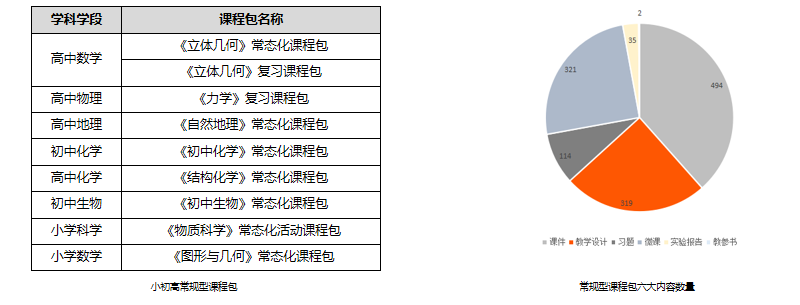

&nbsp;&nbsp;&nbsp;&nbsp;&nbsp;&nbsp;**类型二**：创新PBL课程包-7个单元

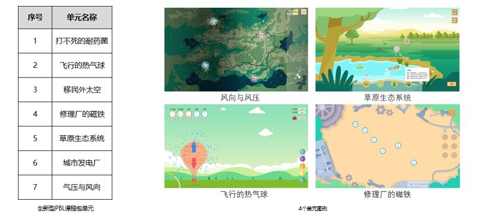

# 二、软件优化升级

## 2.1 产品优化

- **官网**：UI框架更新，增加个人中心板块及VIP功能；

- **客户端、移动端3.0上线**

&nbsp;&nbsp;&nbsp;1）新增VIP功能；

&nbsp;&nbsp;&nbsp;2）界面改版-新增运营活动、编辑推荐、微课专题；

&nbsp;&nbsp;&nbsp;3）新增资源管理功能-支持添加精品资源至我的资源。

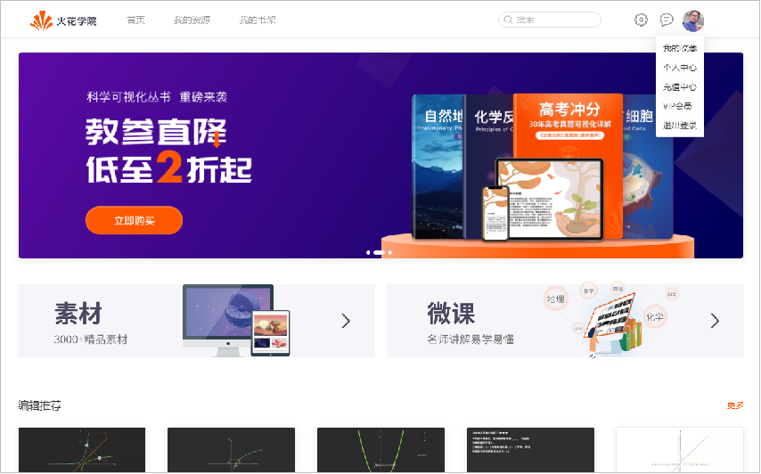

- **火花书屋**

&nbsp;&nbsp;&nbsp;1）全年下载量达50w；2） 11本火花数字教参已全部独立上架Appstore（其中7本于2019年上架），其它应用渠道部分上架。

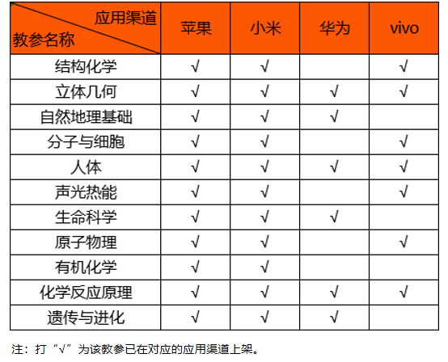

## 2.2 微件框架更新至2.0

- 使用户可快速掌握火花产品的使用方法、操作更简便，并保证了体验的一致性。

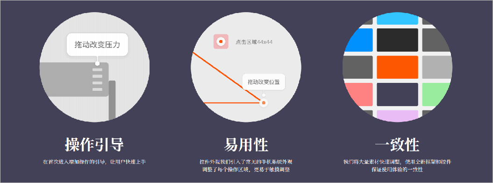

# 三、运营成果

## 3.1 渠道建设

- 截至目前，广州智慧教育公共服务平台上，已累计**千万人次**进行可视化学习。

- 2020年，近40w人于学科网进行火花资源的学习。

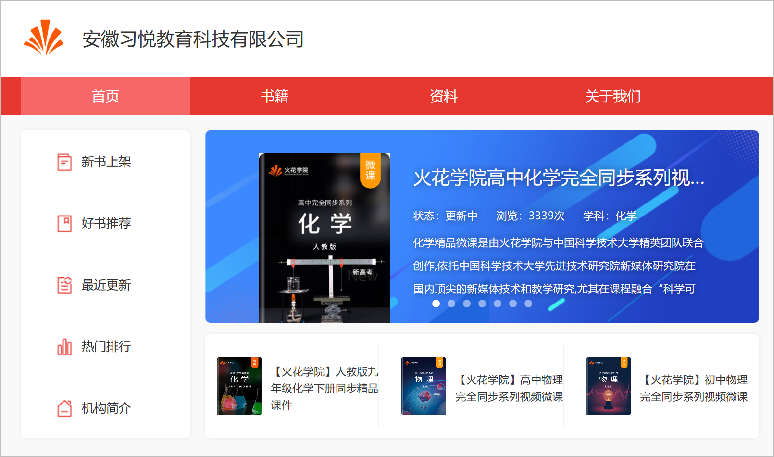

- “丰县人民路小学项目”校本资源平台一期交付：2个课程包（含教学设计80个、课件190个、素材81个）、7个PBL创新型课程。

- 与山东科学技术出版社 合作开发7本鲁科版新教材配套资源。

- 大连三十六中、成都外国语学校五龙山校区两所示范校建设中。

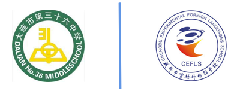

## 3.2 运营数据增长

- 公开课支撑：已知参赛情况的公开课获奖率达100%，一等奖获奖率超60%。

- 2020年C端用户1.6w，较去年（2986人）增长440%。

- B端导入机构近3万，用户40万。

- 五大网站（B站、腾讯、爱奇艺、抖音、优酷）视频播放量 较2019年呈飞跃式增长，2020年单视频最高播放量达17w。

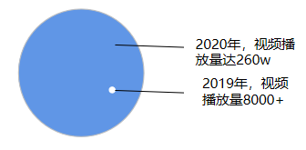

## 3.3 B站试点

- 针对火花核心用户-年轻化用户，于B站以视频合辑形式推广。

**合辑一**：常态化同步微课——与学校授课进度同步、以学段为单位进行常态化更新，维护粉丝活跃度。

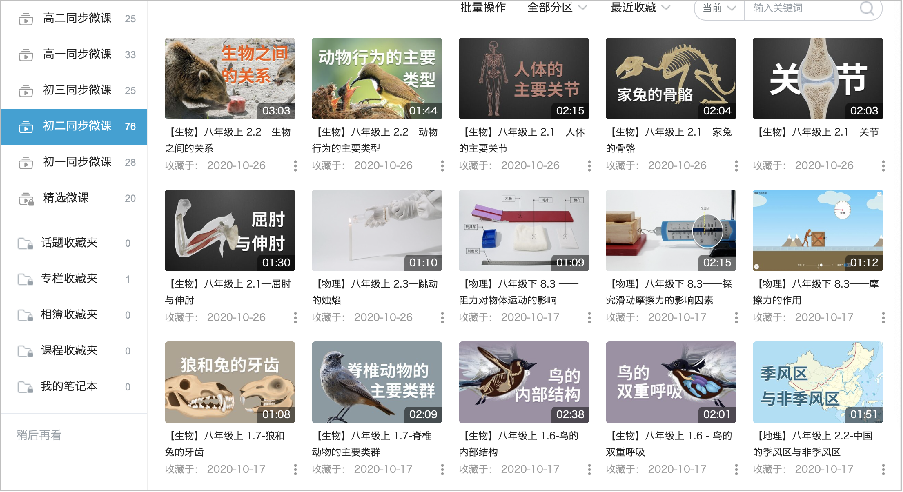

**合辑二**：火花精品课——包括高中数学-外接球系列保姆级提分合集、高中生物-生物人体系列课程。

## 3.4 公众号推文 

- 阅读量排名前五的公众号推文，粉丝数量较2019年增长25%

| 推文名称 |  阅读人数  | 
|-------------|:------:|
[火花学院微课全平台免费上线啦！](https://mp.weixin.qq.com/s/4kj6ofPltC6lywC2lUUWUQ)|	5078|
[今日清明，别怕，我们来聊聊死亡](https://mp.weixin.qq.com/s/tYfeexzjWgDn3KLrwi47WA)|	2696|
[停课不停学 轻松掌握重难点](https://mp.weixin.qq.com/s/x4wuMlC5Sey5jsydImkK6A)|	1921|
[复课后，他们选择自杀。](https://mp.weixin.qq.com/s/yljMO7-EggoHltuQA3yPkg)|	1669|
[雨҈雨҈雨҈雨҈我҈被҈淹҈了҈雨҈雨҈雨҈雨҈](https://mp.weixin.qq.com/s/RpPWjrYvbobpx-xBwkH7zw)|	1515|

# 四、项目建设

- 2020年立项23个项目，结题14个，结题率83%，按期结题率70%，13个项目经费有余。

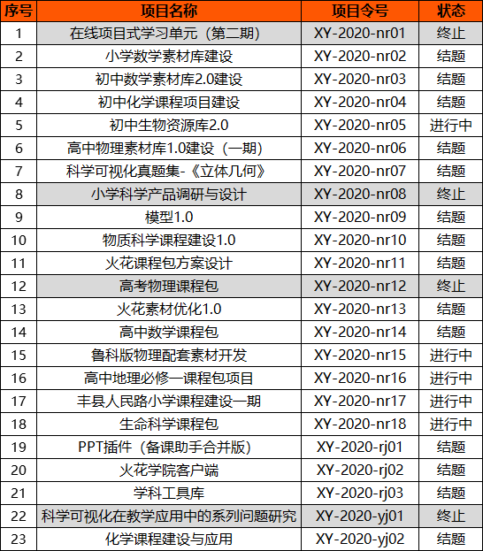
