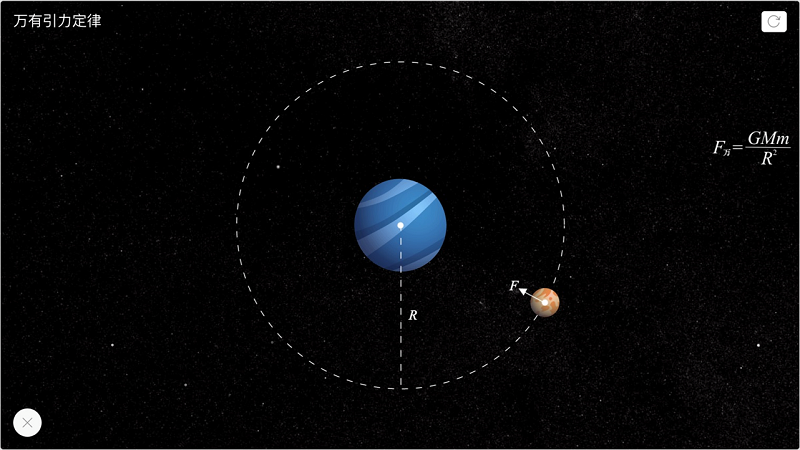
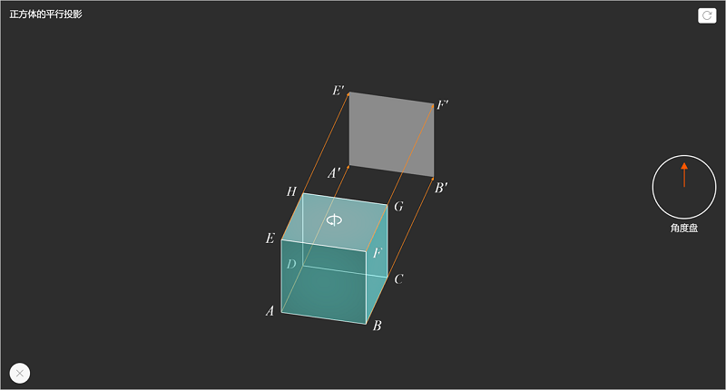
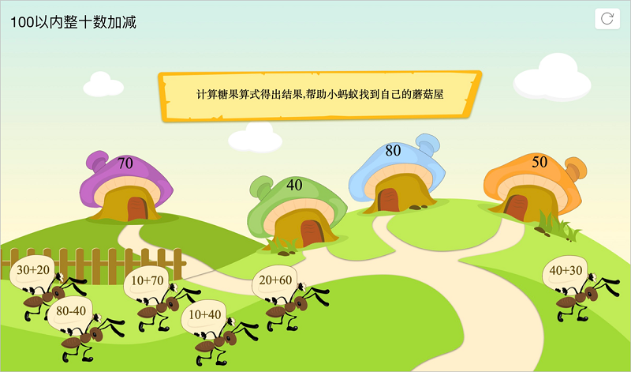
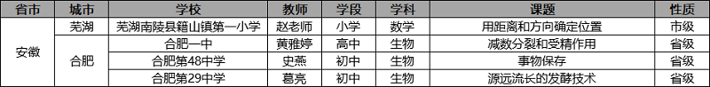

<bro/><bro/>

# 一、内容制作

## 1.1 新增内容

应市场需求和精品内容标准，4月下架223个有版权争议的视频素材。

部分素材展示

# 二、软件开发

## 2.1 “火花学院”官网调整上线

- 新增“个人中心”模块。

- 官网首页已更新上线，便于用户更深层次了解火花学院。

## 2.2 火花学院桌面端 3.0.1 版本灰度发布

- 应⽤打包优化：增加⾃动更新、在线安装器；

- 新增离线播放器：可通过双击打开并播放本地素材⽂件；

- ⽕花精品⻚⾯改版：1）新增编辑推荐、教学案例、微课专题功能； 2）新增资源管理功能：支持教师将零散的素材添加到“我的资源”进行管理，并支持资源的在线预览、下载，可多端同步、多端并用，大大节省了教师备课时间，提高教师备课效率；

## 2.3 火花学院PPT插件新版本灰度发布

- 完成与戴特智能备课助⼿的合并；

- ⽕花素材库及精品⻚⾯增加⽤⼾⾏为统计；

## 2.4 火花书屋v1.0.7 版本发布

# 三、运营支撑

## 3.1 公开课支撑

常规公开课支撑4次。

## 3.2 品牌运营

- 火花学院服务号“火花学院”关注总人数3008人，4月新增129人，发表文章5篇，总阅读量14402次，总转发量1174次。

| 推文名称 |  阅读人数  | 
|-------------|:------:|
[专栏呈现 火花学院资源上线广州智慧教育公共服务平台](https://mp.weixin.qq.com/s/K454tdaRhYqcuJWlJHAiAA)|	281|
[今天没有推送，千万不要点开！](https://mp.weixin.qq.com/s/WYiBy9fo31wBhOkr5hJBKg)|	565|
[高颜值？硬实力！看火花学院如何在学科网C位出道！](https://mp.weixin.qq.com/s/FS9DdIUUyHAD810A48C1Sg)|	345|
[今日清明，别怕，我们来聊聊死亡](https://mp.weixin.qq.com/s/tYfeexzjWgDn3KLrwi47WA)|	2049|
[那些父母买不起学区房的孩子注定输了吗？](https://mp.weixin.qq.com/s/P1IgltD_aVFAlKjP4br8dA)|	1107|

- 火花学院订阅号“火花名师汇”关注总人数165人，发表文章11篇，阅读量8122次，阅读人数914人

- 火花微博“火花官方”发表微博17篇，阅读总数3103

# 四、示范校合作

火花学院与大连三十六中展开科学可视化资源合作：将通过开展定期联合教研等方式，针对高三物理一轮复习中存在的重难点进行梳理总结，研发相应的科学可视化素材，解决实际教学中的困难点。

# 五、项目进展

## 2020年已立项项目

4月新立项2个内容产品类项目，分别为“模型1.0”项目、“物质科学课程建设1.0”项目，截至目前，在建项目共14个。

项目进程见下。
 

