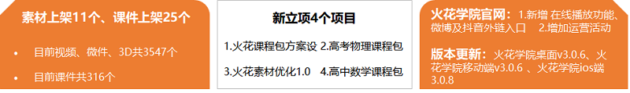
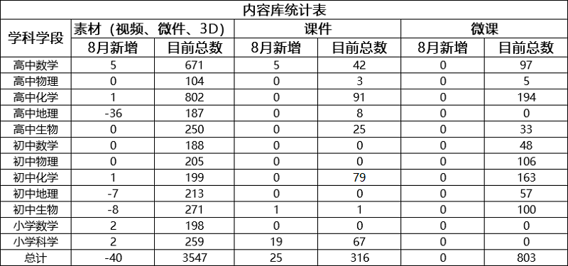
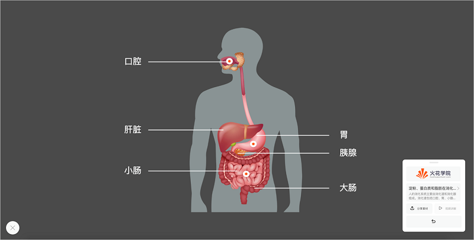
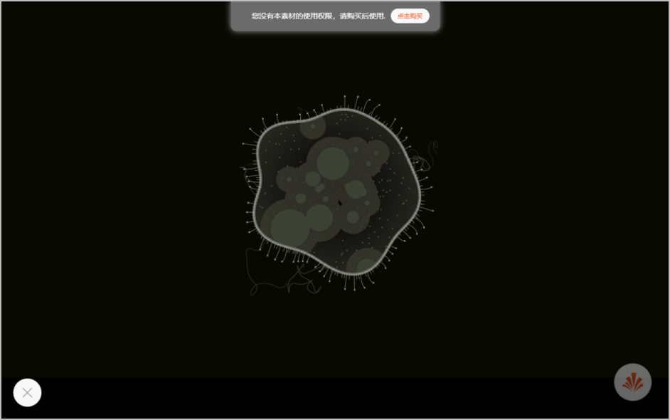
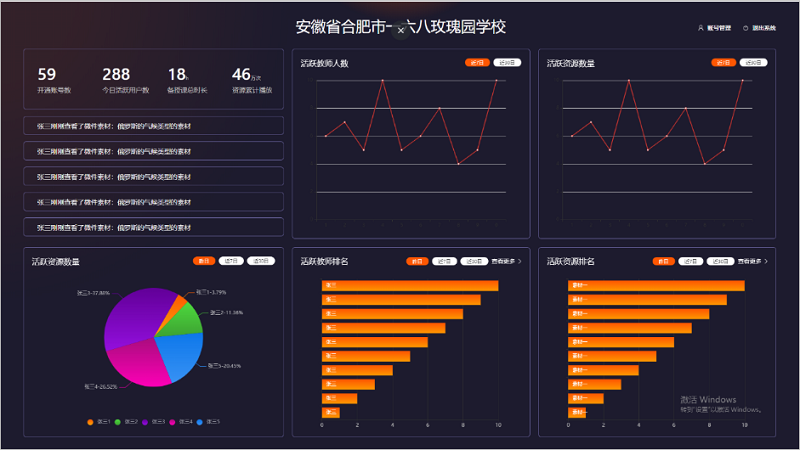
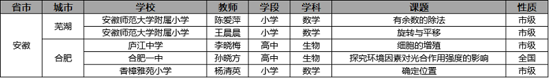
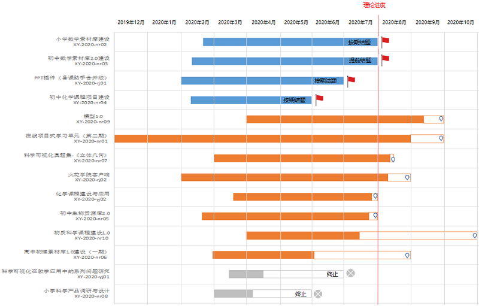

<bro/><bro/>

# 一、内容制作

## 1.1 新增内容

- 8月新上架素材  个、微课  个。

部分素材展示

# 二、软件开发

## 2.1 “火花学院客户端”VIP重构

- 预计8月5日正式发布；

- 增加“素材权限验证”提示，便于对用户的素材使用权限进行鉴定；

## 2.2 OMS机构看板系统V2.0

- 预计8月7日正式上线；

## 2.3 “CMS运营管理系统”功能新增及重构

- 新增“会员管理、内购项目管理、新闻管理”等功能；

- 重构“机构管理、用户管理”功能；

- 重构“教学案例管理、专题管理”功能，使图文可编辑可排版；

# 三、运营支撑

## 3.1 公开课支撑

常规公开课支撑5次。

## 3.2 品牌运营

- 火花学院服务号“火花学院”关注总人数3391人，8月新增87人，发表文章3篇，总阅读量6622次，总转发量408次。

| 推文名称 |  阅读人数  | 
|-------------|:------:|
[俗话说，不会用歌词科普的作词人不是一个好的歌手](https://mp.weixin.qq.com/s/jFJdaSFcaNh-CdJy8zVkxg)|	1015|
[七夕｜文化人的土味情话图鉴，你能看懂几个？](https://mp.weixin.qq.com/s/Da4_l0nsTMoIRdxOT86UrQ)|	507|
[有一种焦虑是，别人家的小孩都上了暑假补习班](https://mp.weixin.qq.com/s/y2Zux73Ic_T_WlVW3g5f8Q)|	247|

- 火花学院订阅号“火花名师汇”关注总人数220人，发表文章4篇，阅读量2684次，阅读人数1805人。

- 火花微博“火花官方”发表微博15篇，阅读总数3.36w。

- 截至本月底，腾讯、爱奇艺、b站、优酷四大网站视频播放总量达115w。

# 四、项目进展

## 2020年已立项项目

- 7月共结题2个项目：包括提前结题项目1个（初中数学素材库建设2.0）、按期结题项目1个（小学数学素材库建设），截至目前，在建项目共8个。

- 项目进程见下，详情请点击[2020年已立项项目进展](https://github.com/Xiyue-team/doc_monthlyreport/blob/master/project/2020/Jul.md)。
 

