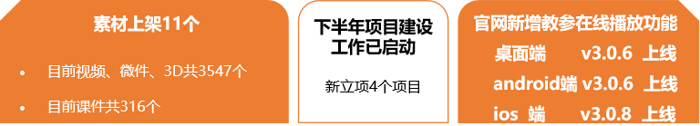
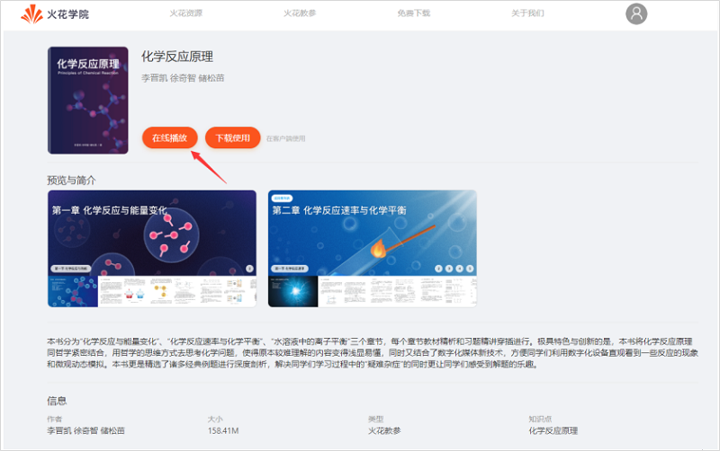
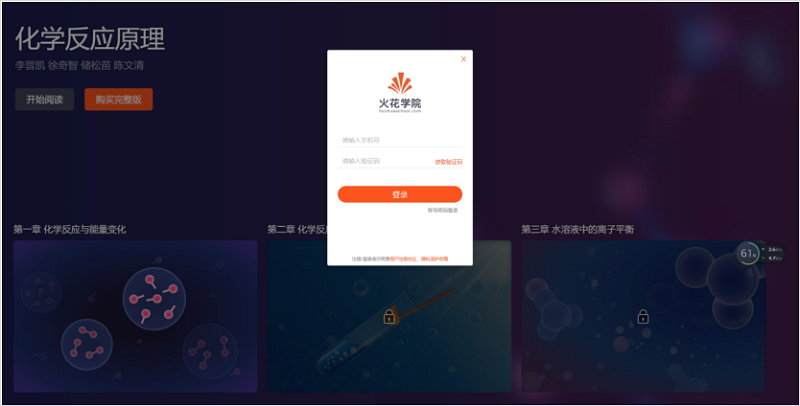
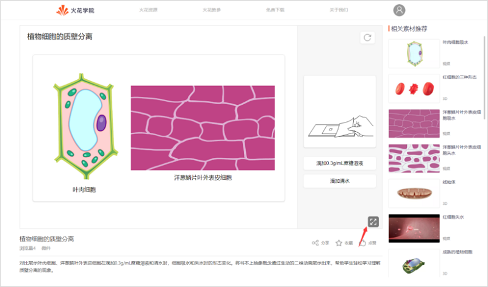
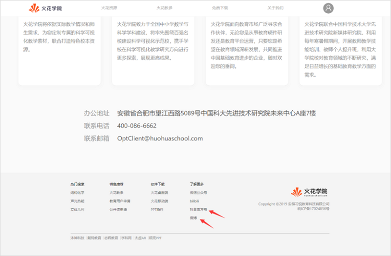
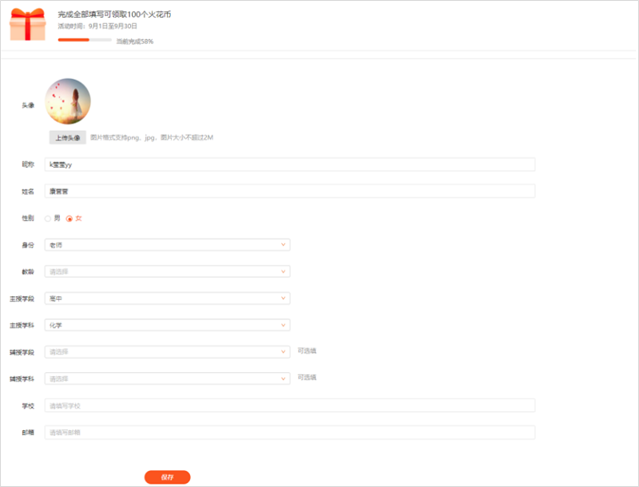
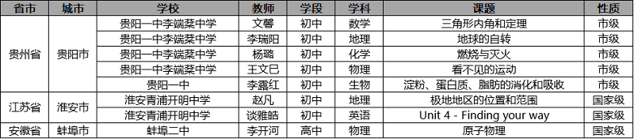
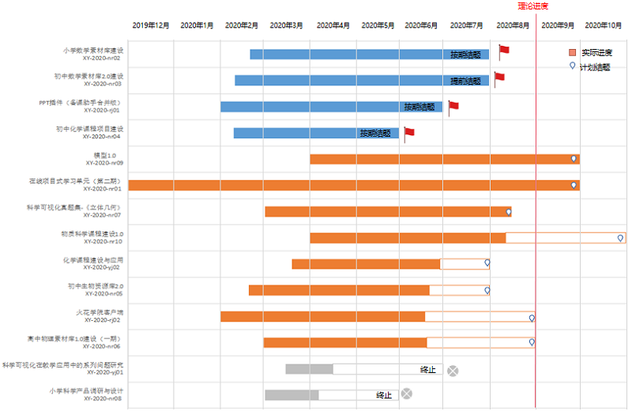
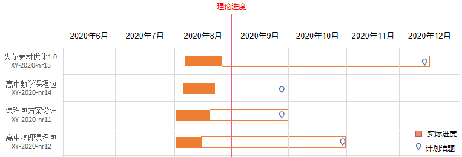

<bro/><bro/>

# 一、内容制作

## 1.1 新增内容

- 8月新上架素材11个(因版权问题下架51个)。

部分素材展示

# 二、软件开发

## 2.1 “火花学院官网”新增功能

- 教参详情页增加“在线播放”功能：

&nbsp; 1）点击"在线播放-开始阅读"，可在线播放教参；

&nbsp; 2）离线状态下，点击“在线播放-购买完整版”，将提示用户登录火花学院账号；

- 素材详情页增加“全屏播放”按钮，使用户更清晰的使用素材；

- 官网页脚增加“微博、抖音”的外链入口，方便用户了解更多火花资源；

- 新增运营活动：用户完善资料后，可领取100个火花币（预计9月1日与火花学院桌面端、火花学院移动端同步上线）；

- 增加数据统计优化，优化了首页、素材详情页埋点（已与火花学院桌面端、火花学院移动端同步上线）；

## 2.2 火花学院桌面端、火花学院移动端新版本上线

- 桌面端 v3.0.6、android端 v3.0.6、ios端 v3.0.8 已上线；

## 2.3 “DMS数据营销系统”功能新增

- 预计8月31日上线；

- 增加“微课行为”及“spm”数据统计功能；

- 支持导出新增用户数据为excel，方便内部运营部门对用户数据的管理；

## 2.4 “CMS运营管理系统”功能新增

- 预计8月31日上线；

- 增加“知识点管理”功能，并优化“素材管理”中的知识点关联功能；

- 支持导出教育用户申请数据为excel；

- 增加“素材构建管理”，支持素材批量打包；

- 优化用户权限管理、增加spm管理；

# 三、运营支撑

## 3.1 公开课支撑

常规公开课支撑8次。

## 3.2 品牌运营

- 火花学院服务号“火花学院”关注总人数3391人，8月新增87人，发表文章3篇，总阅读量6622次，总转发量408次。

| 推文名称 |  阅读人数  | 
|-------------|:------:|
[俗话说，不会用歌词科普的作词人不是一个好的歌手](https://mp.weixin.qq.com/s/jFJdaSFcaNh-CdJy8zVkxg)|	1015|
[七夕｜文化人的土味情话图鉴，你能看懂几个？](https://mp.weixin.qq.com/s/Da4_l0nsTMoIRdxOT86UrQ)|	507|
[有一种焦虑是，别人家的小孩都上了暑假补习班](https://mp.weixin.qq.com/s/y2Zux73Ic_T_WlVW3g5f8Q)|	247|

- 火花学院订阅号“火花名师汇”关注总人数220人，发表文章4篇，阅读量2684次，阅读人数1805人。

- 火花微博“火花官方”发表微博15篇，阅读总数3.36w。

- 截至本月底，腾讯、爱奇艺、b站、优酷四大网站视频播放总量达115w。

# 四、项目进展

## 2020年上半年已立项项目

- 截至目前，在建项目共8个。

- 项目进程见下，详情请点击[2020年上半年已立项项目进展](https://github.com/Xiyue-team/doc_monthlyreport/blob/master/project/2020/Aug.md)。
 

## 2020年下半年已立项项目

- 2020年下半年项目建设工作已启动，8月新立项项目4个。

- 项目进程见下，详情请点击[2020年下半年已立项项目进展](https://github.com/Xiyue-team/doc_monthlyreport/blob/master/project/2020/Aug.md)。
 

