<bro/><bro/>

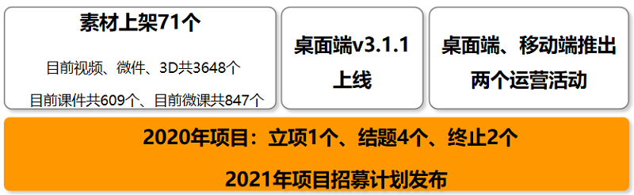

# 一、内容制作

## 1.1 新增内容

- 12月新上架素材71个，下架素材120个（下架素材为卡点视频的原视频）。

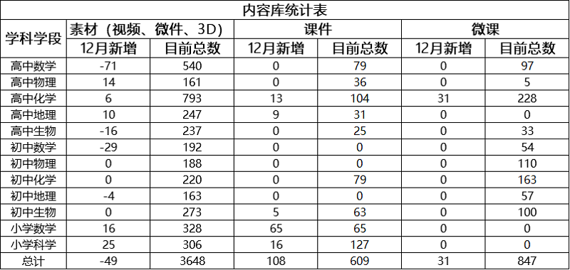

部分素材展示

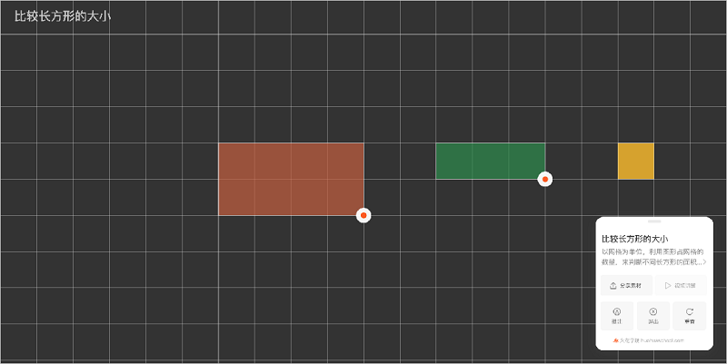

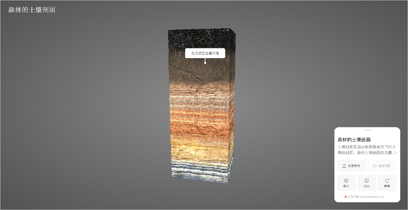

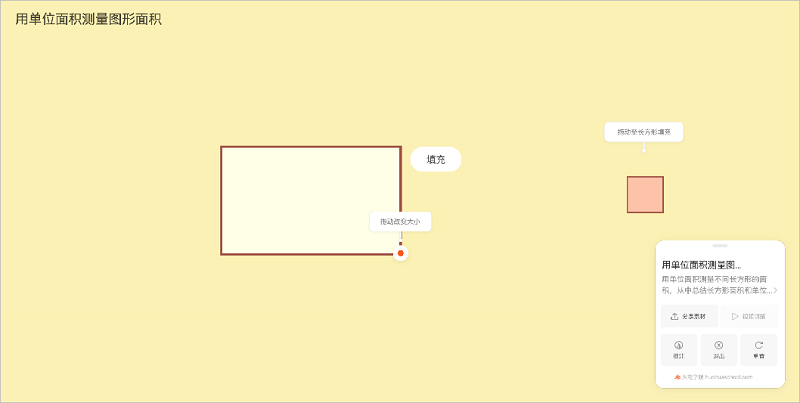

# 二、软件开发

## 2.1 火花学院桌面端v3.1.1上线

- 新增“图形验证”功能（移动端、官网同步新增）；

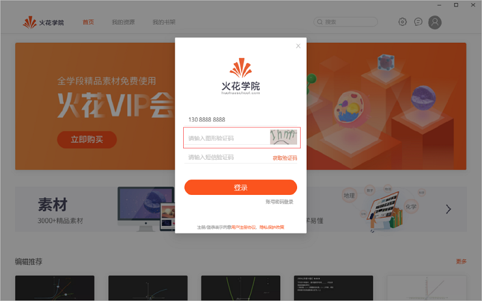

- 新增全屏模式，便于用户使用；

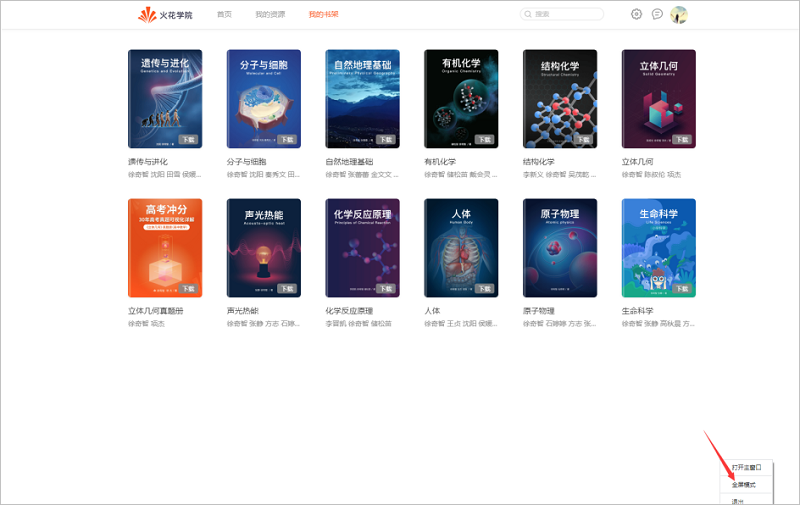

# 三、运营支撑

## 3.1 推出两个运营活动（移动端同步推出）

- 活动一：教参直降&nbsp;低至二折起；

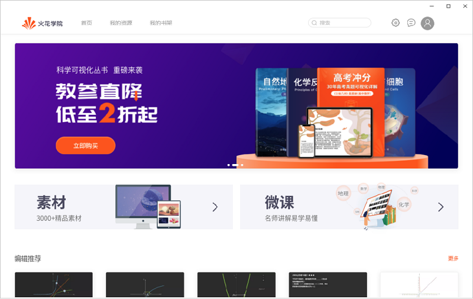

- 活动二：7天VIP会员&nbsp;限时免费领取；

## 3.2 公开课支撑

常规公开课支撑8次。

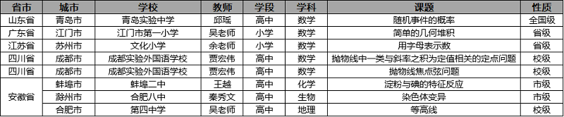

## 3.3 品牌运营

- 火花学院服务号“火花学院”关注总人数4228人，12月新增203人，发表文章2篇，总阅读量4058次，总转发量304次。

| 推文名称 |  阅读人数  | 
|-------------|:------:|
[377万人今天考研，你有学历焦虑吗？](https://mp.weixin.qq.com/s/YHX6i6VS68rE_v3eJd3vHA)|	482|
[“AR安徽非遗APP”上线啦，快来把非遗精品带回家！](https://mp.weixin.qq.com/s/FnOLG2fulEU7ox0fby-9eQ)|432|

- 火花学院订阅号“火花名师汇”关注总人数242人。

- 火花微博“火花官方”发表微博10篇，阅读总数1.3w。

- 截至本月底，腾讯、爱奇艺、b站、优酷四大网站视频播放总量达240w。

## 3.3 B站运营

- 上架外接球系列保姆级提分合集（13个视频）;

- [观看请点击](https://www.bilibili.com/video/BV18z4y1y7vn)

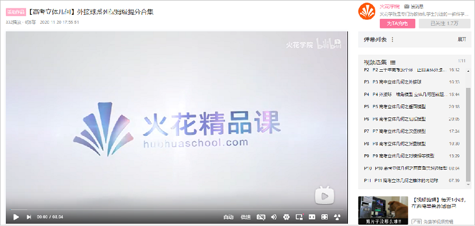

- 生物系列之令人心动的《人体》微课指南：第一章、第二章微课视频更新;

- [观看请点击](https://www.bilibili.com/video/BV1Lh411f71p)

# 四、项目进展

## 2021年项目招募计划发布

- 2021年计划招募项目共20个：内容产品类项目14个、研发类项目3个、软件产品类项目3个；

## 2020年上半年已立项项目

- 本月共提前结题2个项目：高中物理素材库1.0建设（一期）、火花学院客户端；

- 终止1个项目：在线项目式学习单元（第二期），截至目前，在建项目共1个。

- 项目进程见下，详情请点击[2020年上半年已立项项目进展](https://github.com/Xiyue-team/doc_monthlyreport/blob/master/project/2020/Dec.md)。
 
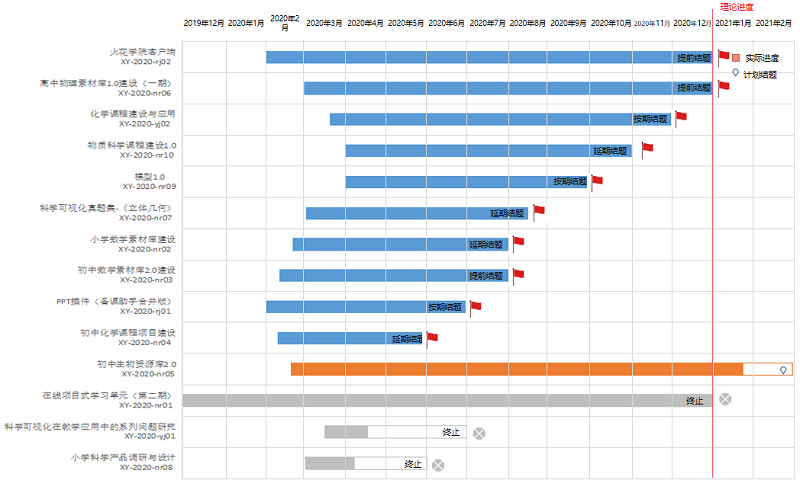

## 2020年下半年已立项项目

- 本月新立项1个项目：生命科学课程包；

- 按期结题2个项目：学科工具库、火花素材优化1.0；

- 终止1个项目：高考物理课程包，截至目前，在建项目共4个。

- 项目进程见下，详情请点击[2020年下半年已立项项目进展](https://github.com/Xiyue-team/doc_monthlyreport/blob/master/project/2020/Dec.md)。
 
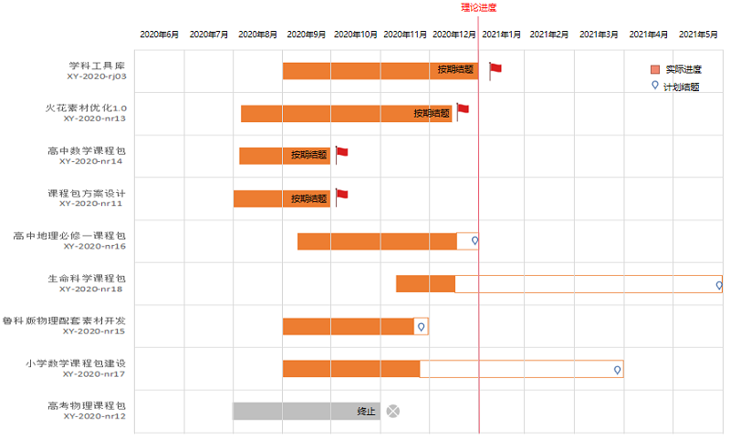
