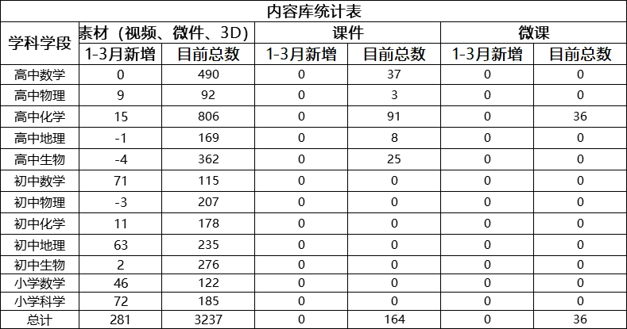
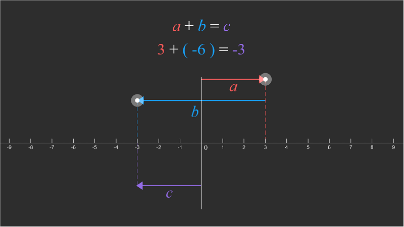
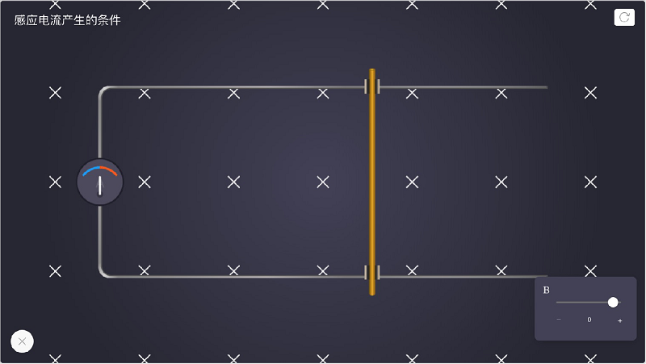
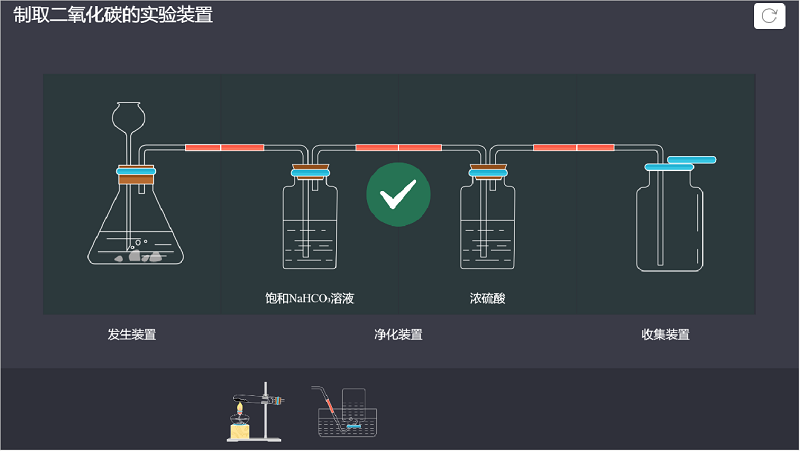
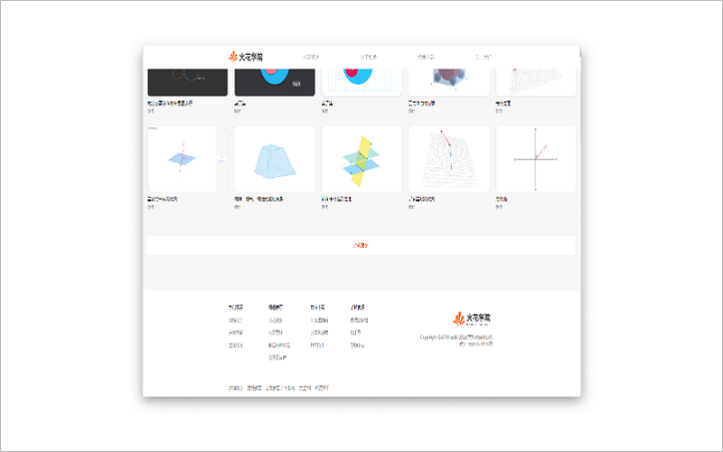
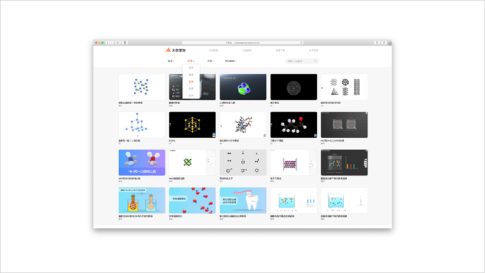
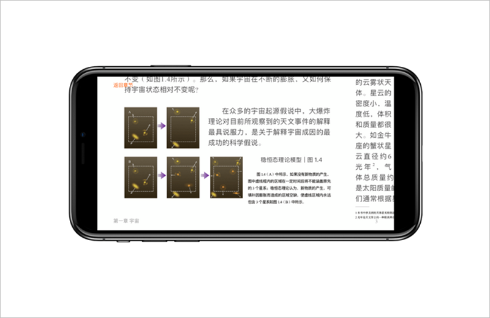
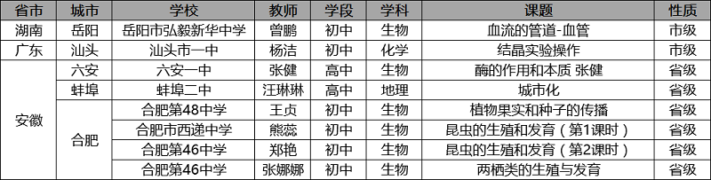
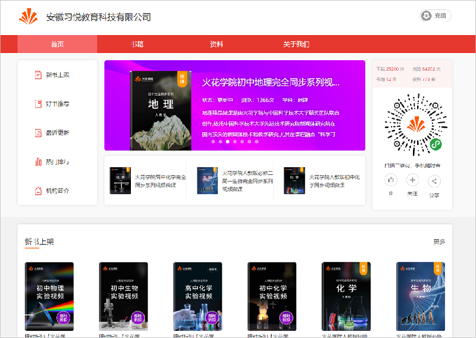
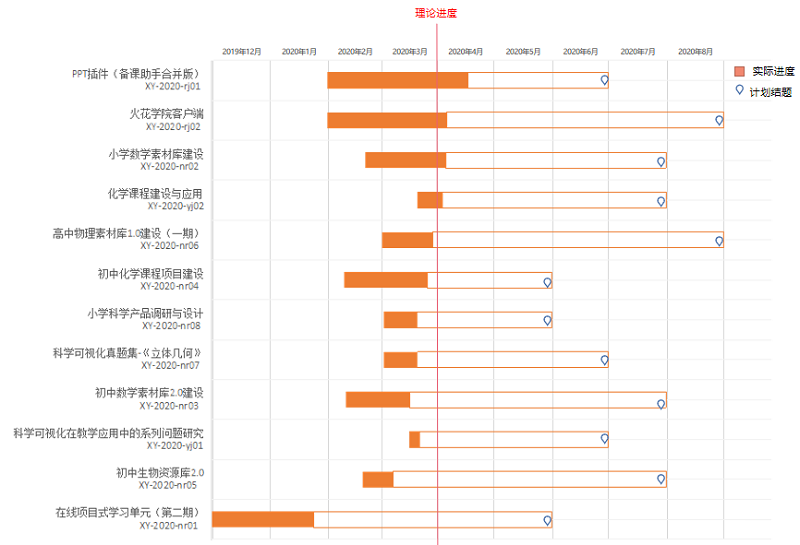

<bro/><bro/>

# 一、内容制作

## 1.1 新增内容

1月-3月共上架素材281个，此外，为响应停课不停学，将586节微课整理成85个专题。

部分素材展示

# 二、软件开发

## 2.1 移动端“火花微课”H5上线

- 可由“火花学院”微信公众号中“火花微课”⼊⼝进⼊页面。

## 2.2 “火花学院”官网调整上线

- 下载页面调整：火花学院PPT插件、火花学院桌⾯端、火花学院移动端分为3个独立页面介绍，同时提供对应的下载功能。

- 新增模块：官网页脚增加友情链接；教具页面增加筛选模块，为用户使用过程中的查找素材过程提供便利。

## 2.3 《化学反应原理》上架appstore，新增其他教参引导入口

- 《化学反应原理》新书上架，现独立火花教参共8本。

- 各独立APP章列表页新增“更多书籍”入口，点击该入口后可查看所有火花教参获取列表、“⽕花学院”客⼾端下载⼊⼝、 常见问题及反馈入口，更好的满足用户使用需求。

- 进入书页后，可通过双指滑动放⼤阅读内容。

- 优化安装包的大小，提升用户体验。

## 2.3 火花学院APP3.0灰度发布

# 三、运营支撑

## 3.1 公开课支撑

常规公开课支撑8次。

## 3.2 品牌合作

- 火花学院与教育行业头部内容资源站学科网正式达成资源合作，自2月在学科网上线以来，火花学院课件、视频下载总量达23442次。

- 合作资源详情[请点击](http://www.zxxk.com/organ/267/)。

## 3.2 品牌运营

- 火花学院服务号“火花学院”关注总人数2879人，1月-3月新增442人，发表文章12篇，总阅读量37550次，总转发量2910次。

| 推文名称 |  阅读人数  | 
|-------------|:------:|
[2019，不止所见！](https://mp.weixin.qq.com/s/4fLofpuI_cQiNm9Xiu-i_A)|	684|
[拖延症晚期还有救吗？](https://mp.weixin.qq.com/s/-SQoOheZb5vKNKthAzd68g)|	1023|
[官方 火花学院2019年度报告重磅发布](https://mp.weixin.qq.com/s/gkr2eSMAioE38leC9ej-yg)|	543|
[除了你，还能和谁擦出火花！](https://mp.weixin.qq.com/s/dstIToTtrFKgrKLRAe3STw)|	412|
[超长假期来了，孩子宅在家里都能干点啥？](https://mp.weixin.qq.com/s/8s22HN3PexTE0oMy323Vfg)|	850|
[闹元宵 猜灯谜 元宵礼包带回家](https://mp.weixin.qq.com/s/AV7eKx8MDnZLpo2ePFxa9A)|	285|
[火花学院微课全平台免费上线啦！](https://mp.weixin.qq.com/s/4kj6ofPltC6lywC2lUUWUQ)|4367|
[停课不停学 轻松掌握重难点](https://mp.weixin.qq.com/s/pBfdBw8V5jlxYL4qIE4__A)|	1751|
[强强联手 火花学院与学科网正式达成资源合作协议](https://mp.weixin.qq.com/s/oax-1ziaOgueOnS-J6towQ)|	838|
[莫名被百万人围观，这些B站评论让我瞬间懵了](https://mp.weixin.qq.com/s/L1SwrHHWjD2v8sLGh0fvHA)|	905|
[到底是孩子不听话还是父母不好当？疫情里的亲情危机](https://mp.weixin.qq.com/s/nODxoR2f1vPaLOh9f1xUHg)|	1114|
[火花学院支撑录播课上线各省市教育平台](https://mp.weixin.qq.com/s/cNbYWrz5lMg9voMlaWBy-Q)|	335|

- 四大视频网站（爱奇艺、B站、腾讯、优酷）共上传视频1900+，总播放量30w+，总播放量（爱奇艺除外）排名前十的视频见下

| 视频名称 | 播放量 | 播放网站|
|:-------------|:------:|:-----:|
|[【生物】蝗虫](https://page.om.qq.com/page/OkXD86T61FYhyyaOfqogj3Mw0)|26464|腾讯|
|[【生物】食物的消化过程](https://www.bilibili.com/video/BV1Z741157an)|22882|B站|
|[【地理】中国主要的工业基地](https://www.bilibili.com/video/BV1n7411g7ej)|8140|B站|
|[【生物】血液循环系统](https://www.bilibili.com/video/BV1o741157kv)|5000|B站|
|[【生物】DNA分子的复制过程](https://www.bilibili.com/video/BV1o741157kv)|3940|B站|
|[【生物】胎儿的脐带和胎盘](https://www.bilibili.com/video/BV1o741157ud)|3916|B站|
|[【生物】尿液的形成](https://www.bilibili.com/video/BV1f7411575C)|3880|B站|
|[【生物】显微镜的使用](https://www.bilibili.com/video/BV15741157nN)|3762|B站|
|[【生物】模拟隔膜运动](https://www.bilibili.com/video/BV1Z741157xZ)|3030|B站|
|[【生物】噬菌体侵染细菌](https://www.bilibili.com/video/BV14E41137Zq)|2166|B站|

扫描下列二维码可直接观看各大网站火花学院视频

- 火花学院订阅号“火花名师汇”关注总人数121人，发表文章23篇，阅读量15248次，阅读人数10774人

- 火花微博“火花官方”发表微博28篇，阅读总数12080

# 四、项目进展

## 2020年已立项项目

截至目前，2020年已立项项目共12个，包括内容产品类项目8个、软件产品类项目2个、研究类项目2个，项目进程见下
 

