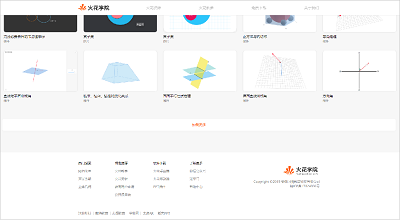
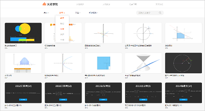

<bro/><bro/>

# 一、内容制作

## 1.1 新增内容

1月-3月共上架素材281个。

部分素材展示

# 二、软件开发

## 2.1 移动端“火花微课”H5上线

- 可通过“火花学院”微信公众号中“火花微课”⼊⼝直接进⼊页面体验

## 2.2 “火花学院”官网调整上线

- 下载页面调整：火花学院PPT插件、火花学院桌⾯端、火花学院移动端分为3个独立页面介绍，同时提供对应的下载功能

- 增加页面功能：官网页脚增加友情链接、教具页面增加筛选模块，为用户使用过程中的查找素材过程提供便利

## 2.3 火花书屋新书上架 功能更新

### 2.3.1 《化学反应原理》新书上架火花书屋，现独立火花教参共8本

### 2.3.2 功能更新及新增

- 新增相关书籍列表、“⽕花学院”客⼾端下载⼊⼝ 

- 新增“常见问题”功能，用户可找到对应使用APP过程中可能遇到常见问题的解决方法将问题解决，更好的满足用户使用需求

- 新增“意见反馈”功能，“常见问题”无法解决的其他问题，通过"意见反馈"后，工作人员将及时与用户沟通，使问题得到解决

- 阅读时可双指放⼤内容功能及安装包大小的优化，可提高用户的体验感

## 2.3 火花学院APP3.0 灰度发布

# 三、运营支撑

## 3.1 公开课支撑

常规公开课支撑8次。

## 3.2 品牌合作

### 3.2.1 火花学院与教育行业头部内容资源站学科网正式达成资源合作协议 

- 《强强联手 火花学院与学科网正式达成资源合作协议》新闻稿件，累计发稿媒体22家，中央级媒体8家、教育类媒体6家、大型门户网站8家

- 双方在教育资源及教学服务等方面进行深度合作，为广大师生提供更丰富的教育教学资源，以满足教育信息化大趋势下的资源新需求

## 3.2 品牌运营

- 火花学院服务号“火花学院”关注总人数2879人，1月-3月新增442人，发表文章12篇，总阅读量37550次，总转发量2910次。

| 推文名称 |  阅读人数  | 
|-------------|:------:|
[2019，不止所见！](https://mp.weixin.qq.com/s/4fLofpuI_cQiNm9Xiu-i_A)|	684|
[拖延症晚期还有救吗？](https://mp.weixin.qq.com/s/-SQoOheZb5vKNKthAzd68g)|	1023|
[官方 火花学院2019年度报告重磅发布](https://mp.weixin.qq.com/s/gkr2eSMAioE38leC9ej-yg)|	543|
[除了你，还能和谁擦出火花！](https://mp.weixin.qq.com/s/dstIToTtrFKgrKLRAe3STw)|	412|
[超长假期来了，孩子宅在家里都能干点啥？](https://mp.weixin.qq.com/s/8s22HN3PexTE0oMy323Vfg)|	850|
[闹元宵 猜灯谜 元宵礼包带回家](https://mp.weixin.qq.com/s/AV7eKx8MDnZLpo2ePFxa9A)|	285|
[火花学院微课全平台免费上线啦！](https://mp.weixin.qq.com/s/4kj6ofPltC6lywC2lUUWUQ)|4367|
[停课不停学 轻松掌握重难点](https://mp.weixin.qq.com/s/pBfdBw8V5jlxYL4qIE4__A)|	1751|
[强强联手 火花学院与学科网正式达成资源合作协议](https://mp.weixin.qq.com/s/oax-1ziaOgueOnS-J6towQ)|	838|
[莫名被百万人围观，这些B站评论让我瞬间懵了](https://mp.weixin.qq.com/s/L1SwrHHWjD2v8sLGh0fvHA)|	905|
[到底是孩子不听话还是父母不好当？疫情里的亲情危机](https://mp.weixin.qq.com/s/nODxoR2f1vPaLOh9f1xUHg)|	1114|
[火花学院支撑录播课上线各省市教育平台](https://mp.weixin.qq.com/s/cNbYWrz5lMg9voMlaWBy-Q)|	335|

- 各大视频网站共上传视频1900+，总播放量30w+

| 网站名称 | 上传视频量 | 播放量|
|:-------------:|:------:|:-----:|
|爱奇艺|900|10.5w|
|B站|393|10.3w|
|腾讯|329|10.0w|
|优酷|310|1.70w|

扫描下列二维码可直接观看各大网站火花学院视频

- 火花学院订阅号“火花名师汇”关注总人数121人，发表文章23篇，阅读量15248次，阅读人数10774人

- 火花微博“火花官方”发表微博28篇，阅读总数12080

# 四、项目进展

## 2019年上半年立项项目

火花学院品牌设计、火花闪现、火花学院专修教室整体解决方案、初中生物资源库、初中物理素材开发五个项目结题，详情请点击[2019上半年立项项目进展](https://xiyue-team.github.io/doc_monthlyreport/project/Dec#2019%E5%B9%B4%E4%B8%8A%E5%8D%8A%E5%B9%B4%E9%A1%B9%E7%9B%AE%E8%AF%A6%E6%83%85)。
 

## 2019年下半年立项项目

初中化学课程与资源库、DMS数据营销系统、火花学院桌面端3.0及视频保护、课件模板、地理地形、火花学院phet素材冲量、利用工具库创作素材七个项目结题，详情请点击[2019下半年立项项目进展](https://xiyue-team.github.io/doc_monthlyreport/project/Dec#2019%E5%B9%B4%E4%B8%8B%E5%8D%8A%E5%B9%B4%E9%A1%B9%E7%9B%AE%E8%AF%A6%E6%83%85)。

