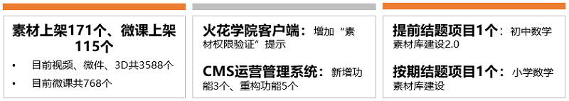
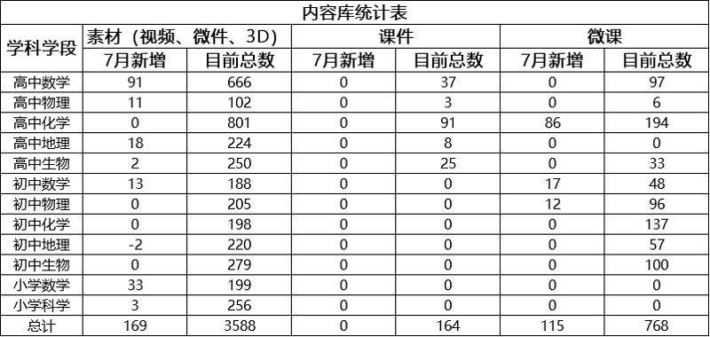
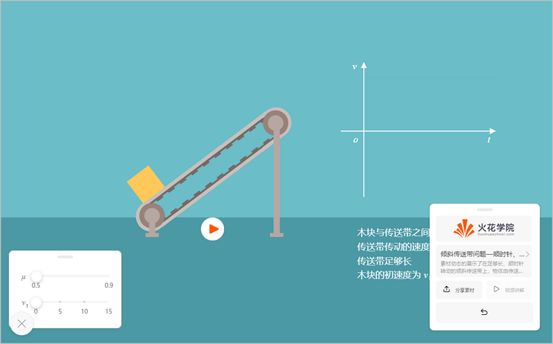
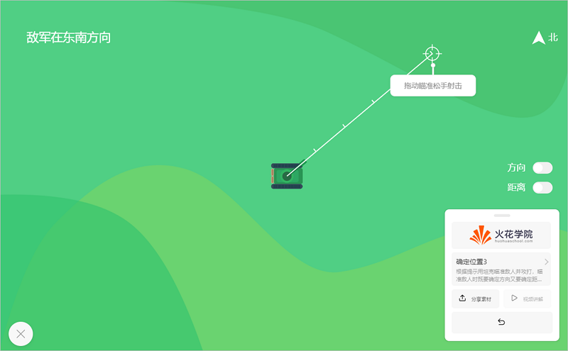
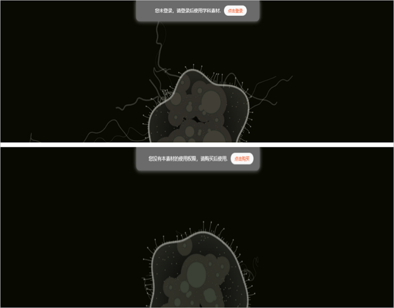
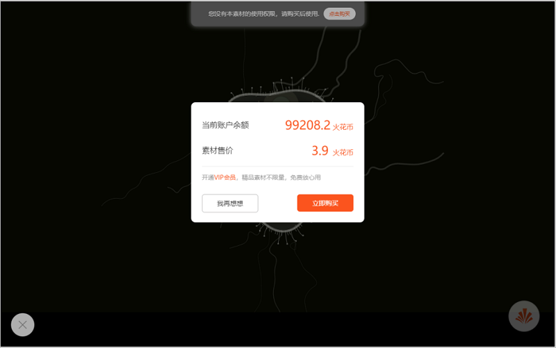
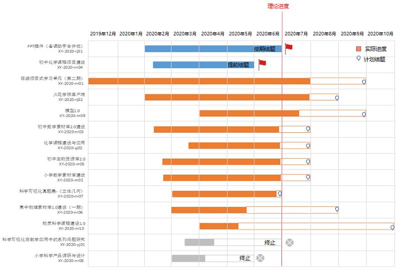

<bro/><bro/>

# 一、内容制作

## 1.1 新增内容

- 7月新上架素材171个、微课115个。

部分素材展示

# 二、软件开发

## 2.1 “火花学院客户端”VIP权限重构

- 预计8月5日正式发布；

- 增加“素材权限验证”提示，便于对用户管理；

## 2.2 OMS机构看板系统V2.0

- 预计8月7日正式上线；

## 2.3 “CMS运营管理系统”功能新增及重构

- 新增会员管理、内购项目管理、新闻管理等功能；

- 机构管理、用户管理功能重构；

- 教学案例管理、专题管理功能重构，新增图文编辑及排版功能；

# 三、运营支撑

## 3.1 公开课支撑

常规公开课支撑5次。

## 3.2 品牌运营

- 火花学院服务号“火花学院”关注总人数3304人，7月新增53人，发表文章4篇，总阅读量6782次，总转发量572次。

| 推文名称 |  阅读人数  | 
|-------------|:------:|
[雨҈雨҈雨҈雨҈我҈被҈淹҈了҈雨҈雨҈雨҈雨҈](https://mp.weixin.qq.com/s/RpPWjrYvbobpx-xBwkH7zw)|	819|
[科普进校园 火花学院公开课亮相合肥七中首届校园科技节](https://mp.weixin.qq.com/s/ro1PN5L9p3hHut_f4H5PCg)|	482|
[高考日记 为了“赢”，你不知道他们有多拼](https://mp.weixin.qq.com/s/FIp_s_2z_jXRuArxtrvp9Q)|	407|
[【火花专题】每周上新 先睹为快](https://mp.weixin.qq.com/s/fc5ldzcAP1VTYKMOpabQmw)|	202|

- 火花学院订阅号“火花名师汇”关注总人数212人，发表文章5篇，阅读量3348次，阅读人数2150人。

- 火花微博“火花官方”发表微博20篇，阅读总数1.1w。

- 截至本月底，腾讯、爱奇艺、b站、优酷四大网站视频播放总量达100w。

# 四、项目进展

## 2020年已立项项目

- 7月结题项目2个（PPT插件-备课助手合并版），终止项目1个（科学可视化在教学应用中的系列问题研究），截至目前，在建项目共10个。

- 项目进程见下，详情请点击[2020年已立项项目进展](https://github.com/Xiyue-team/doc_monthlyreport/blob/master/project/2020/Jun.md)。
 

