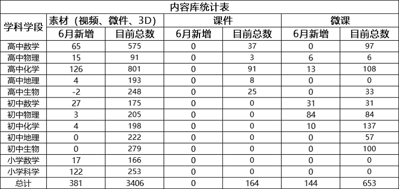
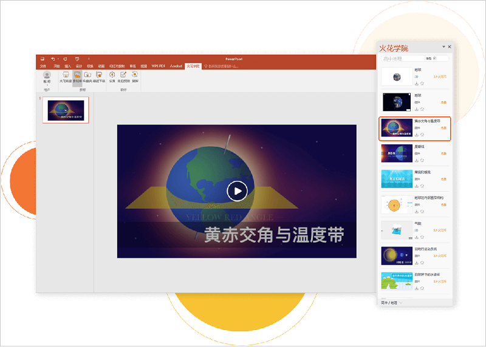

<bro/><bro/>

# 一、内容制作

## 1.1 新增内容

- 6月新上架素材383个、微课144个。

部分素材展示

# 二、软件开发

## 2.1 “火花学院”官网改版上线

## 2.2 “沐坤”官网2.0首页改版上线

## 2.3 火花学院PPT插件新版本发布

- 火花学院PPT插件v2.0.1正式发布；

- 戴特渠道灰度发布“火花学院与备课助手合并版PPT插件”；

# 三、运营支撑

## 3.1 公开课支撑

常规公开课支撑1次。

## 3.2 品牌运营

- 火花学院服务号“火花学院”关注总人数3250人，6月新增100人，发表文章4篇，总阅读量9676次，总转发量503次。

| 推文名称 |  阅读人数  | 
|-------------|:------:|
[焕新！火花学院3.0正式发布](https://mp.weixin.qq.com/s/vGPv50HNoCbi-EoDst7nYw|	796|
[写给大朋友们的儿童节](https://mp.weixin.qq.com/s/h8JqDxDqmKibc3dbtzRxfQ)|	494|
[复课后，他们选择自杀。](https://mp.weixin.qq.com/s/yljMO7-EggoHltuQA3yPkg)|	1346|
[父亲节扎心之问：孩子为什么更喜欢妈妈](https://mp.weixin.qq.com/s/tjqEIoBWbhHAX9pSiu0Qew)|	694|

- 火花学院订阅号“火花名师汇”关注总人数203人，发表文章6篇，阅读量7254次，阅读人数2642人。

- 火花微博“火花官方”发表微博11篇，阅读总数12233。

- 截至本月底，腾讯、爱奇艺、b站、优酷四大网站视频播放总量达86w。

# 四、项目进展

## 2020年已立项项目

- 6月结题项目1个（PPT插件-备课助手合并版），截至目前，在建项目共11个。

- 项目进程见下，详情请点击[2020年已立项项目进展](https://github.com/Xiyue-team/doc_monthlyreport/blob/master/project/2020/May.md)。
 

