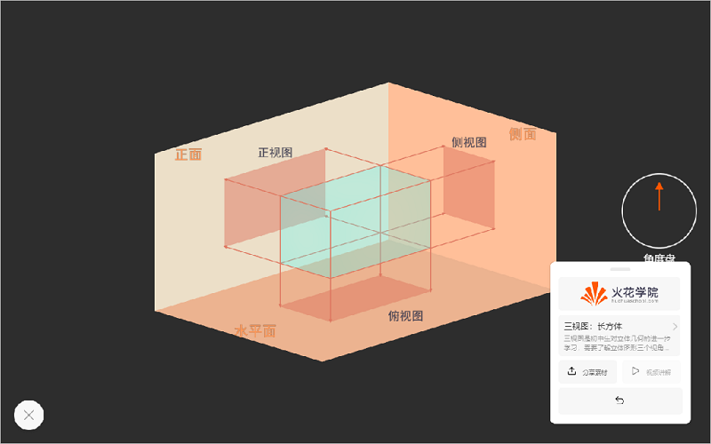
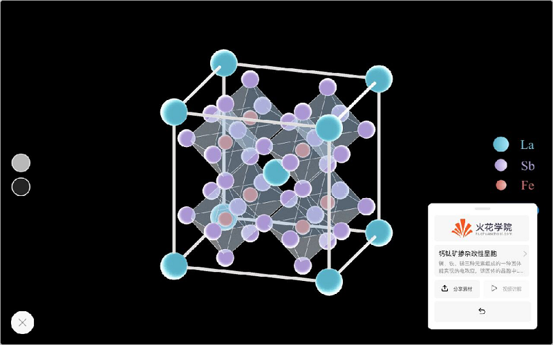
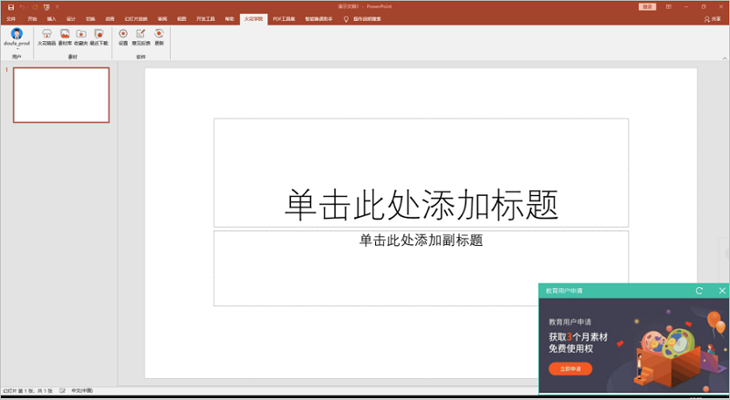
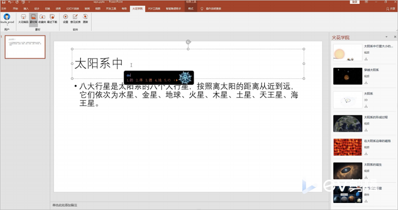
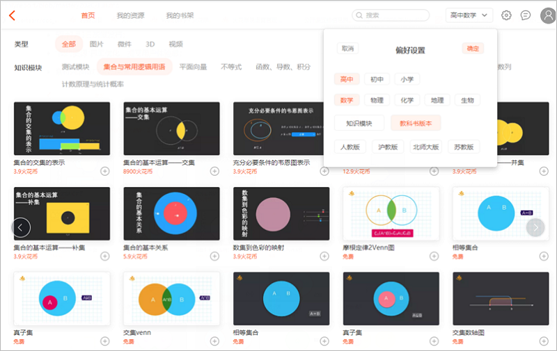
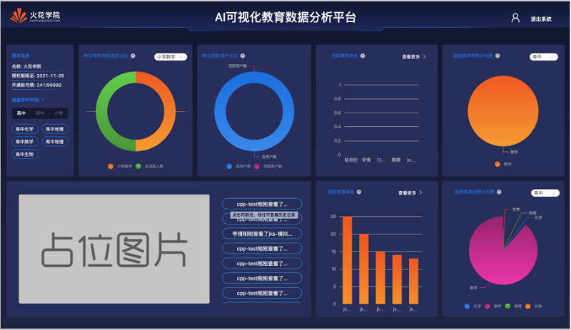
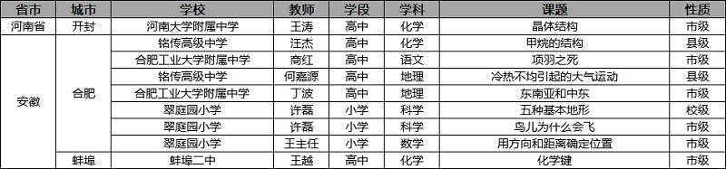
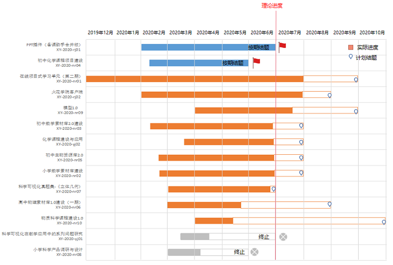

<bro/><bro/>

# 一、内容制作

## 1.1 新增内容

- 6月新上架素材396个、微课144个。

部分素材展示

# 二、软件开发

## 2.1 “火花学院”PPT插件新版本内部发布

- 预计7月10日（由戴特）正式发布；

- 新增运营活动小弹窗，方便用户及时了解火花运营活动；

- 新增“根据⽤⼾在编辑页面输⼊的内容，推荐关联素材”功能，使用户更加快速找到适合使用的素材；

- 第三⽅⻚⾯新增账号类型区分功能，并完成对应的收费逻辑；

- 新增素材库跨学科搜索功能，用户查找素材更高效；

- 新增验证码登录功能，登录方式多样化；

## 2.2 ⽕花学院客⼾端3.0改版

- 预计7月3日灰度发布；

- 素材列表增加“偏好设置”快捷⼊⼝；

- “我的资源”界⾯优化，提高用户体验感；

## 2.3 DMS数据营销系统

- 优化新增机构、活跃机构、新增⽤⼾等模块；

- 增加⽤⼾数据下钻，提高查询速度；

## 2.4 OMS机构看板系统

- 新增机构中教师与资源活跃度情况的统计看板及排名数据下钻功能；

# 三、运营支撑

## 3.1 公开课支撑

常规公开课支撑9次。

## 3.2 品牌运营

- 火花学院服务号“火花学院”关注总人数3250人，6月新增100人，发表文章4篇，总阅读量9676次，总转发量503次。

| 推文名称 |  阅读人数  | 
|-------------|:------:|
[复课后，他们选择自杀。](https://mp.weixin.qq.com/s/yljMO7-EggoHltuQA3yPkg)|	1346|
[焕新！火花学院3.0正式发布](https://mp.weixin.qq.com/s/vGPv50HNoCbi-EoDst7nYw)|	796|
[父亲节扎心之问：孩子为什么更喜欢妈妈](https://mp.weixin.qq.com/s/tjqEIoBWbhHAX9pSiu0Qew)|	694|
[写给大朋友们的儿童节](https://mp.weixin.qq.com/s/h8JqDxDqmKibc3dbtzRxfQ)|	494|

- 火花学院订阅号“火花名师汇”关注总人数203人，发表文章6篇，阅读量7254次，阅读人数2642人。

- 火花微博“火花官方”发表微博11篇，阅读总数12233。

- 截至本月底，腾讯、爱奇艺、b站、优酷四大网站视频播放总量达86w。

# 四、项目进展

## 2020年已立项项目

- 6月结题项目1个（PPT插件-备课助手合并版），终止项目1个（科学可视化在教学应用中的系列问题研究）截至目前，在建项目共10个。

- 项目进程见下，详情请点击[2020年已立项项目进展](https://github.com/Xiyue-team/doc_monthlyreport/blob/master/project/2020/Jun.md)。
 

