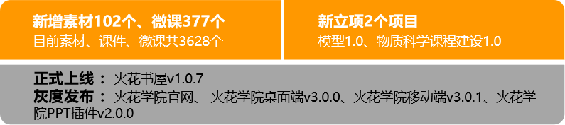
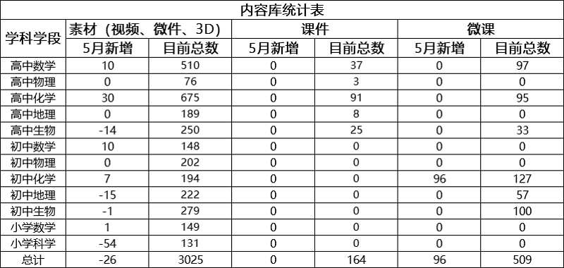
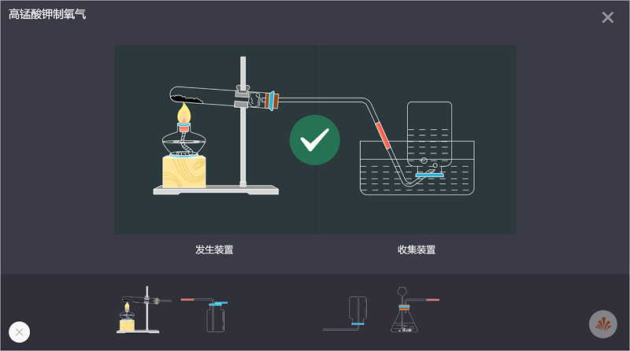
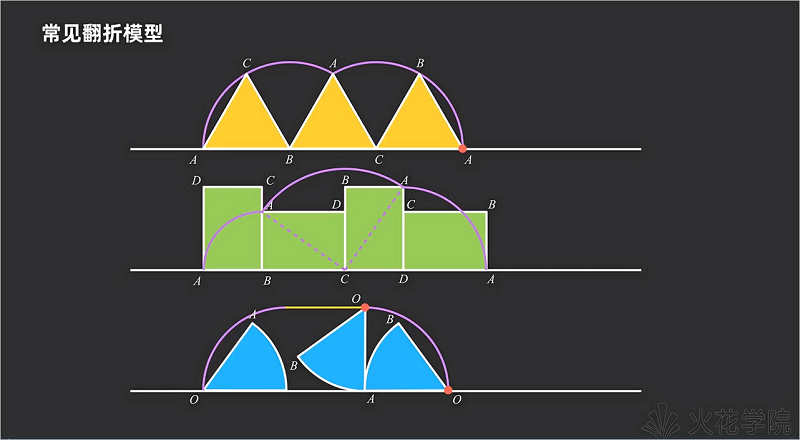
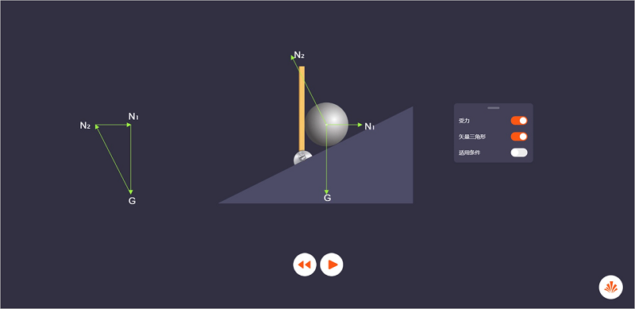
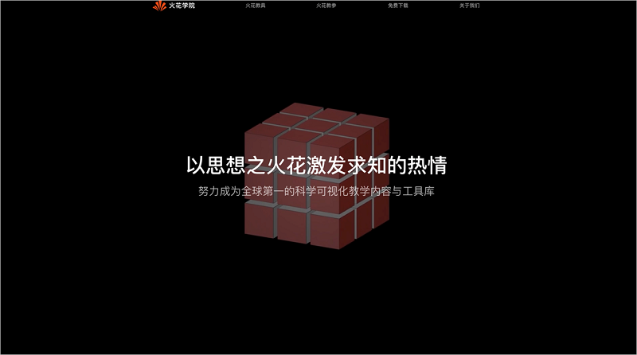
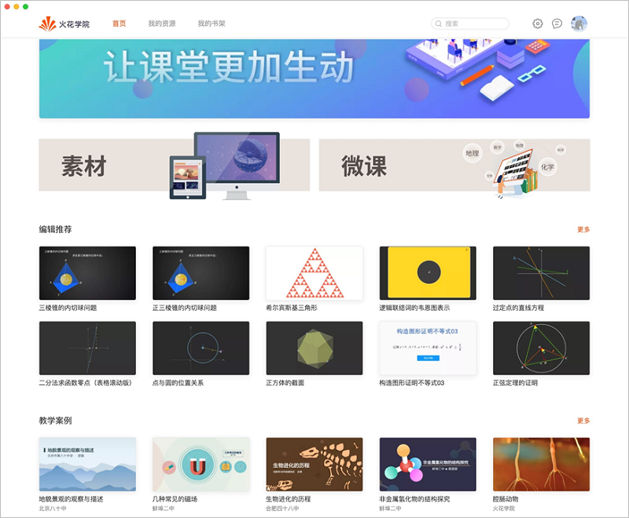
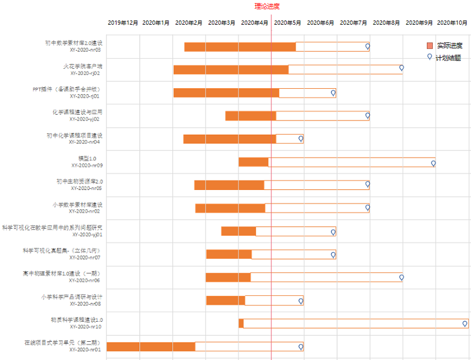

<bro/><bro/>

# 一、内容制作

## 1.1 新增内容

- 5月新上架素材58个、微课96个。

- 根据市场需求和精品内容标准，5月下架84个有版权争议的视频素材。

部分素材展示

# 二、软件开发

## 2.1 “火花学院”官网首页改版灰度发布

- 预计5月20日正式上线；

- 新增“个人中心”模块；

- 展示内容及展示内容顺序的调整，火花资源将得到更加全面的展示。

## 2.2 火花学院桌面端 v3.0.0 版本灰度发布

- 预计5月10日正式上线；

- 应⽤打包大小的优化及在线安装器的增加，用户的初步体验也将得到提升；

- 增加内部模块⾃动更新功能，使用户可及时了解并使用火花最新模块及内容；

- 完成Mac应用程序安全签名认证，并解决10.15版本系统无法安装问题；

- 新增离线播放器：可通过双击打开并播放本地素材⽂件，可更加便利的使用火花素材；

- ⽕花精品⻚⾯改版：

&ensp;&ensp;&ensp;&ensp; 1）新增编辑推荐、教学案例、微课专题模块； 

&ensp;&ensp;&ensp;&ensp; 2）新增资源管理功能：支持教师将零散的素材添加到“我的资源”进行管理，并支持资源的在线预览、下载，可多端同步、多端并用，大大节省了教师备课时间，提高教师备课效率。

## 2.3 火花学院移动端v3.0.1版本灰度发布

- 预计5月10日正式上线；

- 将android与ios两端的界面调整统一；

- 调整购买中⽀付流程，避免⽀付过程中出现丢单情况。

## 2.4 火花学院PPT插件v2.0.0版本灰度发布

- 预计5月10日正式上线；

- 完成与戴特智能备课助⼿的合并；

- ⽕花素材库及精品⻚⾯增加⽤⼾⾏为统计。

# 三、运营支撑

## 3.1 公开课支撑

常规公开课支撑1次。

## 3.2 品牌运营

- 火花学院服务号“火花学院”关注总人数3150人，5月新增142人，发表文章3篇，总阅读量7558次，总转发量558次。

| 推文名称 |  阅读人数  | 
|-------------|:------:|
[不骗你！爱劳动的孩子就业率提高15倍，收入高出20%](https://mp.weixin.qq.com/s/gYcDGVtv-GT3quI7-F2_3Q)|	1130|
[母亲节|全天下的妈都是一样的！](https://mp.weixin.qq.com/s/IX7nunHpPC-JeGNP4vBJRQ)|	1154|
[光阴“4”箭，我还是从前那个少年！](https://mp.weixin.qq.com/s/NPJFGLJwh4BbT4BMMfJVXA)|	422|

- 火花学院订阅号“火花名师汇”关注总人数190人，发表文章10篇，阅读量7168次，阅读人数2466人。

- 火花微博“火花官方”发表微博18篇，阅读总数3080。

# 五、项目进展

## 2020年已立项项目

4月新立项2个内容产品类项目，分别为“模型1.0”项目、“物质科学课程建设1.0”项目，截至目前，在建项目共14个。

项目进程见下。
 

