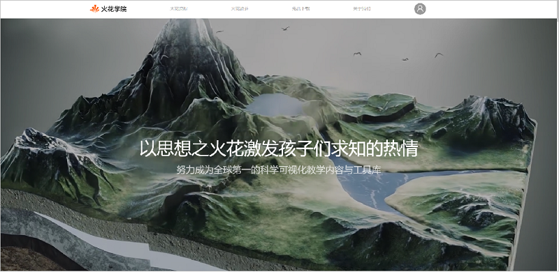
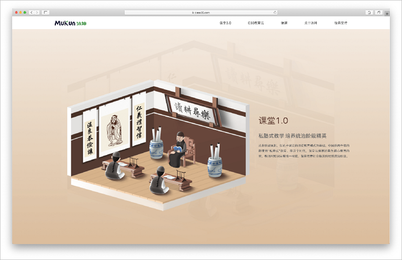

<bro/><bro/>

# 一、内容制作

## 1.1 新增内容

- 5月新上架素材58个、微课96个。

- 根据市场需求和精品内容标准，5月下架84个有版权争议的视频素材。

部分素材展示

# 二、软件开发

## 2.1 “火花学院”官网改版上线

## 2.2 “沐坤”官网2.0首页改版上线

## 2.3 火花学院PPT插件v2.0.1

- 火花学院PPT插件v2.0.1正式发布；

- 戴特渠道灰度发布⽕花学院与备课助⼿合并版插件；

# 三、运营支撑

## 3.1 公开课支撑

常规公开课支撑1次。

## 3.2 品牌运营

- 火花学院服务号“火花学院”关注总人数3150人，5月新增142人，发表文章3篇，总阅读量7558次，总转发量558次。

| 推文名称 |  阅读人数  | 
|-------------|:------:|
[不骗你！爱劳动的孩子就业率提高15倍，收入高出20%](https://mp.weixin.qq.com/s/gYcDGVtv-GT3quI7-F2_3Q)|	1130|
[母亲节 全天下的妈都是一样的！](https://mp.weixin.qq.com/s/IX7nunHpPC-JeGNP4vBJRQ)|	1154|
[光阴“4”箭，我还是从前那个少年！](https://mp.weixin.qq.com/s/NPJFGLJwh4BbT4BMMfJVXA)|	422|

- 火花学院订阅号“火花名师汇”关注总人数190人，发表文章10篇，阅读量7168次，阅读人数2466人。

- 火花微博“火花官方”发表微博18篇，阅读总数3080。

# 五、项目进展

## 2020年已立项项目

4月新立项2个内容产品类项目，分别为“模型1.0”项目、“物质科学课程建设1.0”项目，截至目前，在建项目共14个。

项目进程见下。
 

