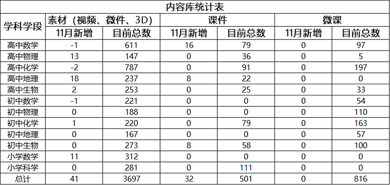
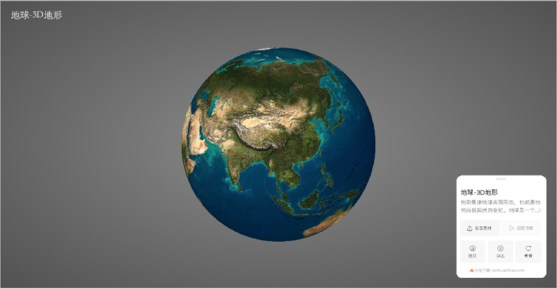
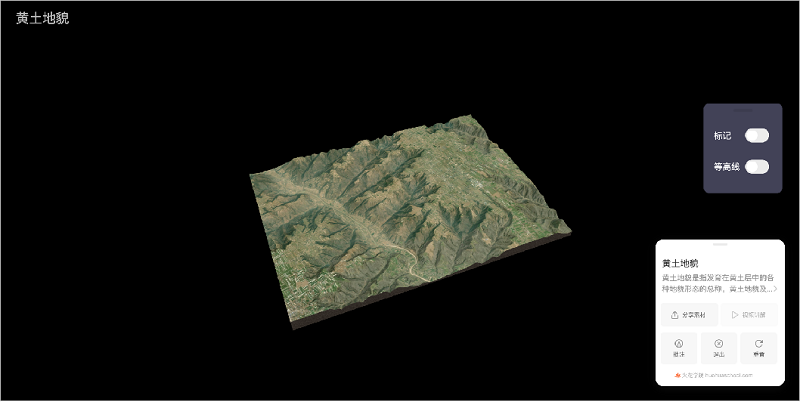
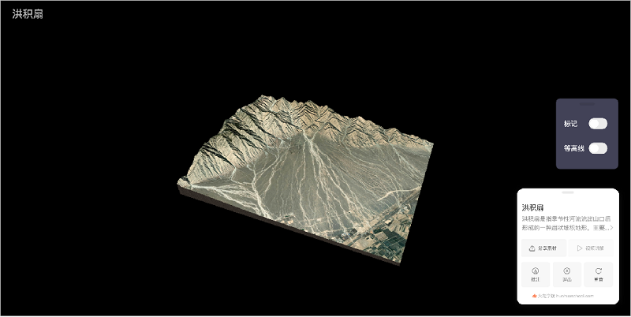
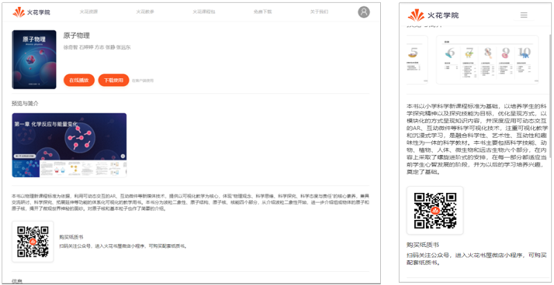
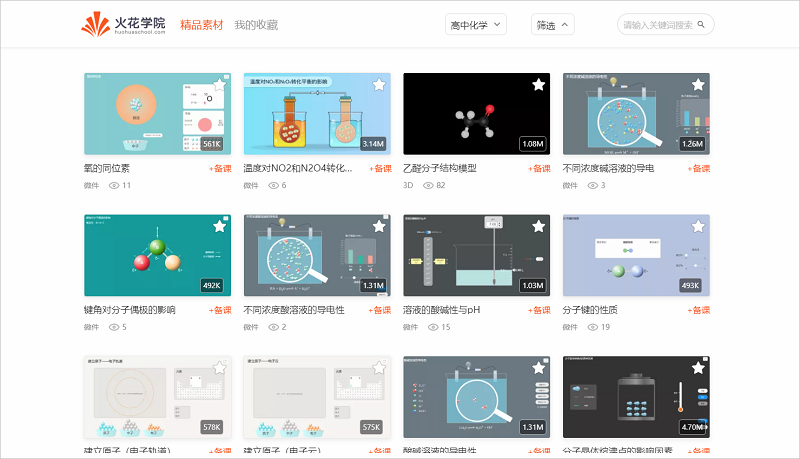
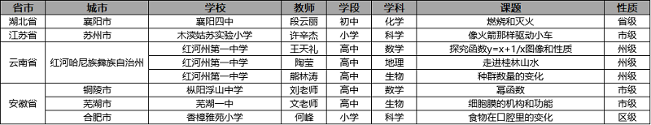
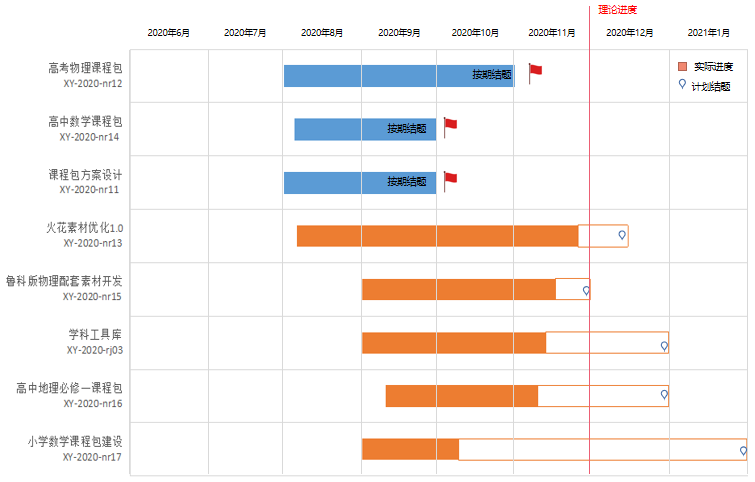

<bro/><bro/>

# 一、内容制作

## 1.1 新增内容

- 11月新上架素材41个。

部分素材展示

# 二、软件开发

## 2.1 “火花教参”重新定价、新增功能

- 《人体》、《生命科学》、《原子物理》上架火花书屋，截至目前，火花书屋已上架教参11本、各端已上架教参12本（包括“立体几何真题集”）；

- 各端教参详情页新增“火花学院”公众号二维码，引导用户扫码关注公众号、购买纸质书；

## 2.2 火花学院桌面端、移动端VIP功能上线

- 新增运营活动：点击活动banner进入“VIP会员页”，即可购买并开通会员服务；

## 2.3“火花学院”新功能开发
  
- “人体微课专题”导流至火花学院公众号页面已开发完成，预计12月开通“火花学院”公众号入口；

## 2.4 教师派（pc端桌面）页面升级
  
- 页面屏蔽下载入口，新增“+备课” 功能；

## 2.5 “CMS数据营销系统”功能新增及优化

- 新增编辑“推荐管理、发布管理”功能；

- Banner管理增加端版本限制、增加类型，支持客户端内打开；

## 2.6 “DMS运营管理系统”功能新增

- 新增“素材统计”、“充值分析”、“消费分析”3大功能；

# 三、运营支撑

## 3.1 公开课支撑

常规公开课支撑8次。

## 3.2 品牌运营

- 火花学院服务号“火花学院”关注总人数4025人，11月新增187人，发表文章2篇，总阅读量4006次，总转发量206次。

| 推文名称 |  阅读人数  | 
|-------------|:------:|
[充了会员的人可以有多凡尔赛？](https://mp.weixin.qq.com/s/BRLbmWkFekDwl6mnYe5dHw)|	417|
[双十一买买买图鉴](https://mp.weixin.qq.com/s/IxpUz3iSpMU2V1t2bAL_uA)|	297|

- 火花学院订阅号“火花名师汇”关注总人数242人。

- 火花微博“火花官方”发表微博11篇，阅读总数1.7w。

- 截至本月底，腾讯、爱奇艺、b站、优酷四大网站视频播放总量达171w。

# 四、项目进展

## 2020年上半年已立项项目

- 本月结题项目：物质科学课程建设1.0、化学课程建设与应用，截至目前，在建项目共4个。

- 项目进程见下，详情请点击[2020年上半年已立项项目进展](https://github.com/Xiyue-team/doc_monthlyreport/blob/master/project/2020/Nov.md)。
 

## 2020年下半年已立项项目

- 本月结题项目：高考物理课程包，截至目前，在建项目共5个。

- 项目进程见下，详情请点击[2020年下半年已立项项目进展](https://github.com/Xiyue-team/doc_monthlyreport/blob/master/project/2020/Nov.md)。
 

