<bro/><bro/>

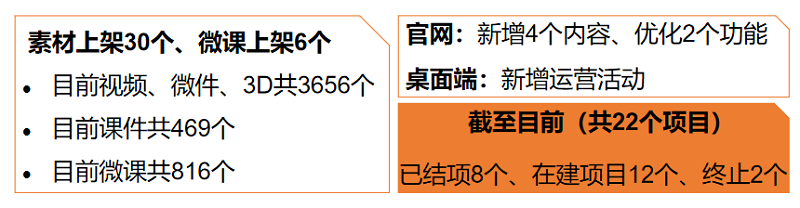

# 一、内容制作

## 1.1 新增内容

- 10月新上架素材30个、微课6个。

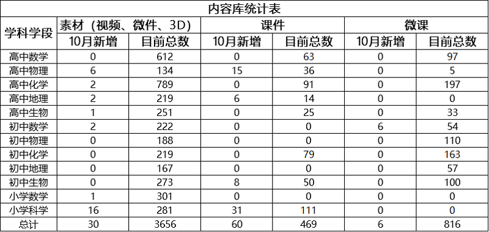

部分素材展示

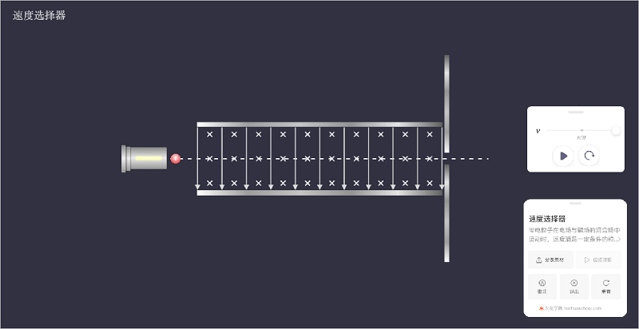

# 二、软件开发

## 2.1 “火花学院官网”改版上线

- 新增“课程包”列表页，提供系列课程包资源；

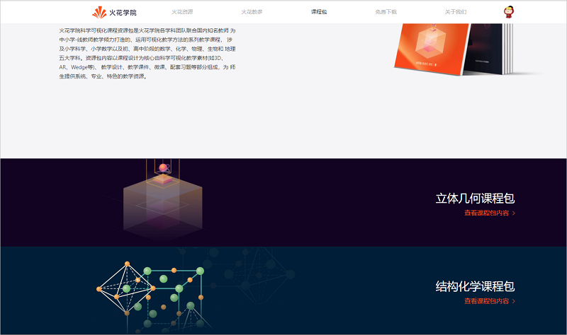

- 素材列表栏增加“教科书版本筛选”，方便用户使用；

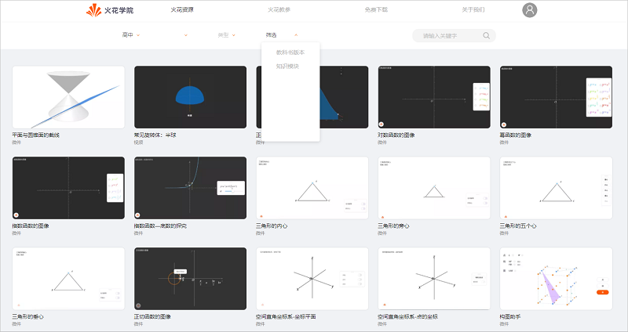

- 素材详情页增加“客户端下载”引导入口；

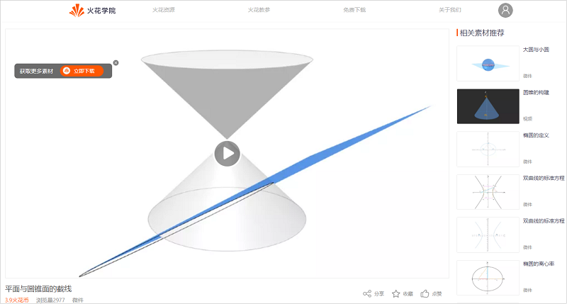

- 完善“专题资源”，新增学科学段筛选功能，方便用户定位所需资源范围；

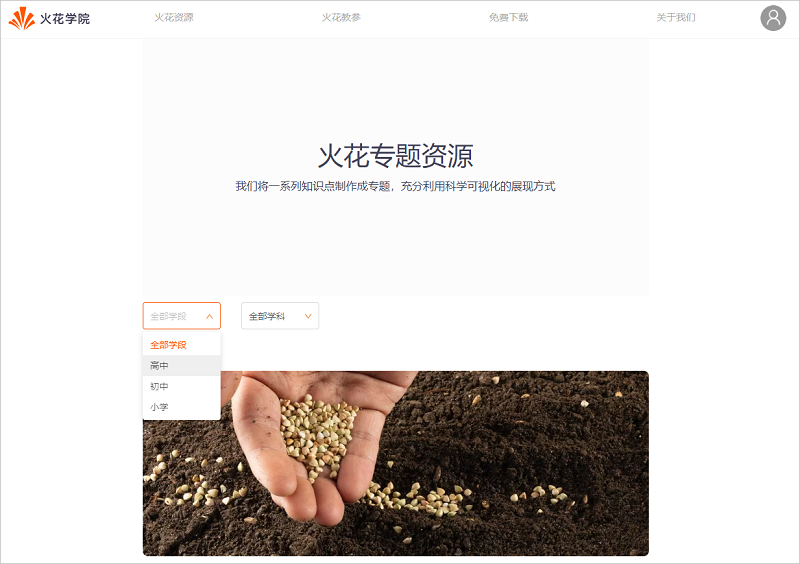

-  双十一运营活动上线：《立体几何真题集》限时折扣；

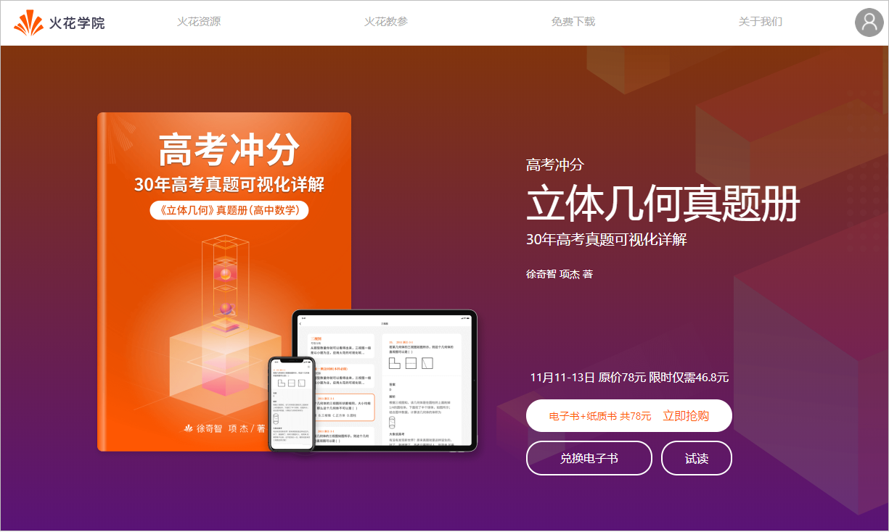

- 《立体几何真题集》新增“客户端下载”引导入口（仅移动端显示）；

- 新增数据埋点：新增微课行为、我的资源行为操作的数据统计（同桌面端、移动端）；

## 2.2 火花学院桌面端

- 新增运营活动：可直接于桌面端完善全部资料并领取10个火花币；

## 2.3 “CMS数据营销系统”功能新增及优化

- 增加课程包管理、第三方资源文件管理、banner管理、运营活动管理

- 用户管理中邮箱改为非必填；

- 账户管理：支持按名称/手机号搜索、按状态筛选；

- SPM管理：增加按CODE搜索并支持按创建时间筛选；

- 评论管理：增加过滤条件，支持评论过滤审核状态为已删除；

- 导出数据：默认导出全部数据，若带过滤条件，导出满足过滤条件的所有数据；

- 用户消费：增加订单类型、时间段、支付状态筛选；

- 教育用户申请：增加回访功能、列表支持按是否回访过滤条件；

## 2.4 “DMS运营管理系统”功能新增

- 增加活跃用户统计；

# 三、运营支撑

## 3.1 公开课支撑

常规公开课支撑5次。

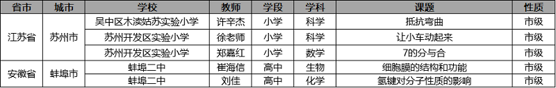

## 3.2 品牌运营

- 火花学院服务号“火花学院”关注总人数3838人，10月新增195人，发表文章2篇，总阅读量5510次，总转发量350次。

| 推文名称 |  阅读人数  | 
|-------------|:------:|
[国庆带特产指南，转给你在外浪的朋友们](https://mp.weixin.qq.com/s/S5OTZ-LLbwq5dMXrENegyA)|	1194|
[真·名媛速成班，一起拼单吗？](https://mp.weixin.qq.com/s/2tglqIWu8t0_k2by8SNIlw)|	412|

- 火花学院订阅号“火花名师汇”关注总人数239人。

- 火花微博“火花官方”发表微博10篇，阅读总数1.6w。

- 截至本月底，腾讯、爱奇艺、b站、优酷四大网站视频播放总量达140w。

# 四、项目进展

## 2020年上半年已立项项目

- 截至目前，在建项目共6个。

- 项目进程见下，详情请点击[2020年上半年已立项项目进展](https://github.com/Xiyue-team/doc_monthlyreport/blob/master/project/2020/Oct.md)。
 
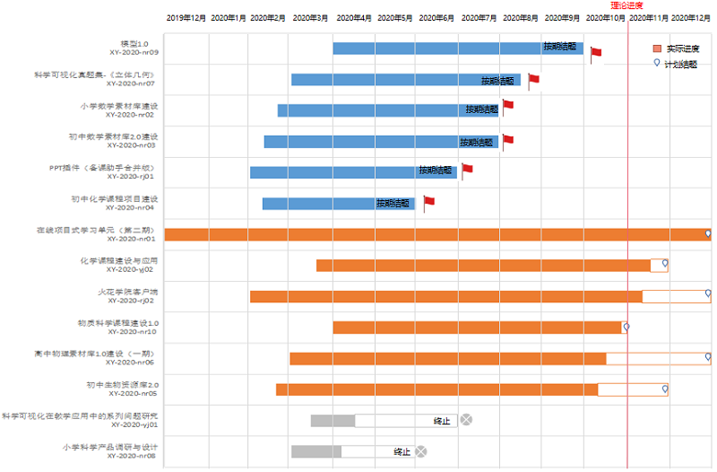

## 2020年下半年已立项项目

- 截至目前，在建项目共6个。

- 项目进程见下，详情请点击[2020年下半年已立项项目进展](https://github.com/Xiyue-team/doc_monthlyreport/blob/master/project/2020/Oct.md)。
 
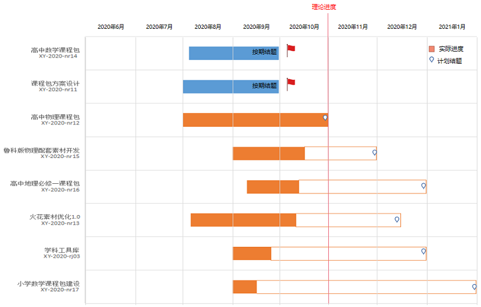

