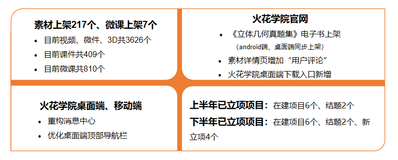
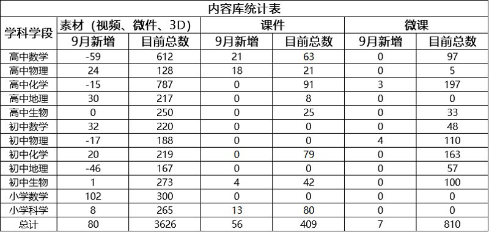
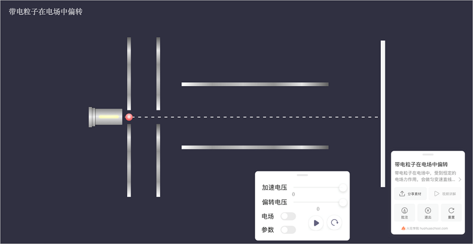
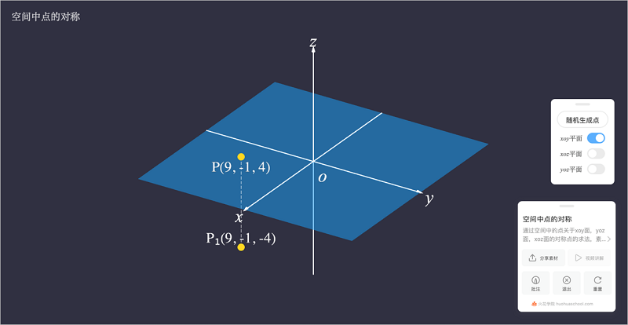
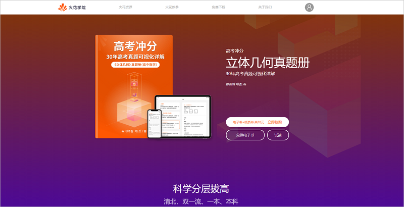
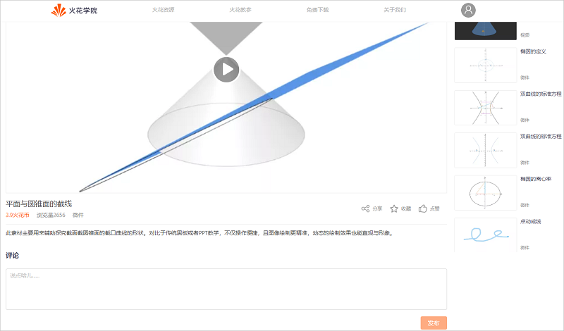
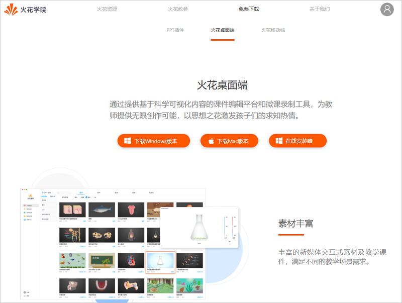
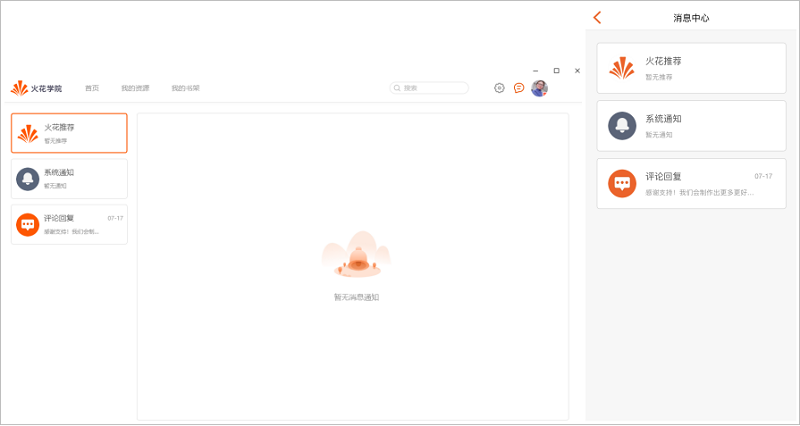
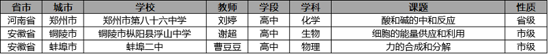
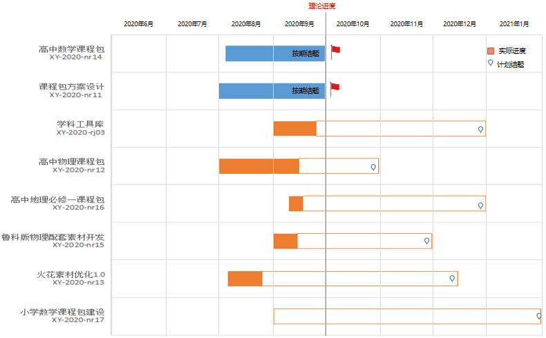

<bro/><bro/>

# 一、内容制作

## 1.1 新增内容

- 9月新上架素材217个(因版权问题及素材替换下架137个)、微课7个。

部分素材展示

# 二、软件开发

## 2.1 “火花学院官网”新功能上线

- 《立体几何真题集》电子书上架；（桌面端、android端已同步更新）

&nbsp; 1）详情页可打包抢购“纸质书+电子书”；

&nbsp; 2）上线“兑换电子书”功能，可通过纸质书中兑换码进行兑换；

- 素材详情页底部增加“用户评论”功能；

- 火花学院桌面端下载入口新增：新增“在线安装器”入口，用户下载更快捷；

## 2.2 火花学院桌面端、移动端功能优化

- 重构消息中心：新增系统通知、火花推荐、评论回复等系统消息；

- 取消顶部导航栏火花logo处的返回主页按钮，新增可返回上级页面的按钮；

## 2.3 “CMS数据营销系统”功能新增及优化

- 增加“消息推送管理、查看消息日志”功能 ；

- 增加“教参兑换码”管理，支持教材的兑换和申领；

- 优化“微课管理”：增加“微课专题名称”搜索条件，查询等操作更方便；

- 优化“交易管理”，变更用户充值、用户消费；

- 优化“机构管理”，新增机构类型（包括：学校、代理商、教育局）；

## 2.4 “DMS运营管理系统”功能新增

- 增加“活动分析”，即完善个人资料送定额火花币活动的数据分析；

- 增加活跃机构类型分布及活跃机构分布；

- Spm统计优化：新增排序与搜索条件；

# 三、运营支撑

## 3.1 公开课支撑

常规公开课支撑3次。

## 3.2 品牌运营

- 火花学院服务号“火花学院”关注总人数3643人，9月新增252人，发表文章3篇，总阅读量8680次，总转发量920次。

| 推文名称 |  阅读人数  | 
|-------------|:------:|
[教师节｜送给老师的100分](https://mp.weixin.qq.com/s/8BpyMxnKZc_6OQxzBq02rg)|	718|
[新书首发｜用技术让思维看得见](https://mp.weixin.qq.com/s/MwXJEAfyE2Sje9NROEIEmA)|	681|
[军训迷惑行为大赏](https://mp.weixin.qq.com/s/_BVoK0TzDX4SgsJLW5FZgQ)|	319|

- 火花学院订阅号“火花名师汇”关注总人数238人，发表文章1篇，阅读量758次，阅读人数478人。

- 火花微博“火花官方”发表微博10篇，阅读总数2.21w。

- 截至本月底，腾讯、爱奇艺、b站、优酷四大网站视频播放总量达140w。

# 四、项目进展

## 2020年上半年已立项项目

- 9月共结题2个项目：其中按期结题项目1个（模型1.0）、延期结题项目1个（科学可视化真题集-《立体几何》），截至目前，在建项目共6个。

- 项目进程见下，详情请点击[2020年上半年已立项项目进展](https://github.com/Xiyue-team/doc_monthlyreport/blob/master/project/2020/Sep.md)。
 

## 2020年下半年已立项项目

- 9月新立项4个项目：鲁科版物理配套素材开发、高中地理必修一课程包项目、小学数学课程包建设、学科工具库；

- 9月按期结题2个项目：火花课程包方案设计、高中数学课程包，截至目前，在建项目共6个。

- 项目进程见下，详情请点击[2020年下半年已立项项目进展](https://github.com/Xiyue-team/doc_monthlyreport/blob/master/project/2020/Sep.md)。
 

