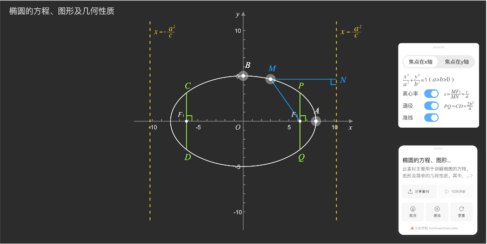
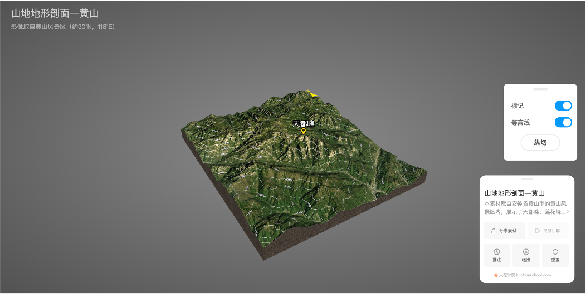
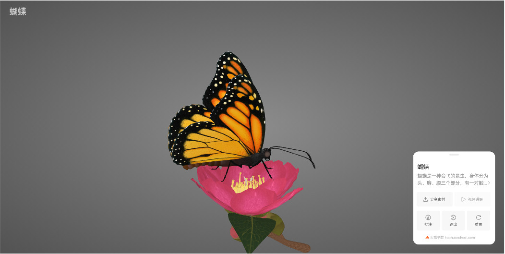
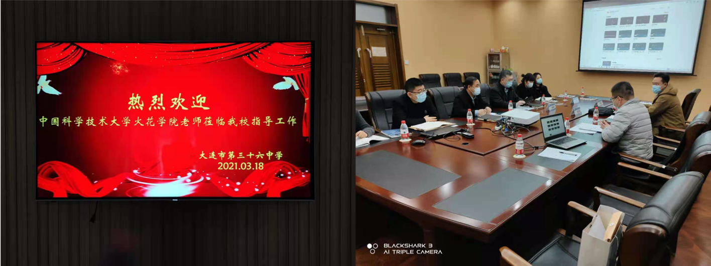
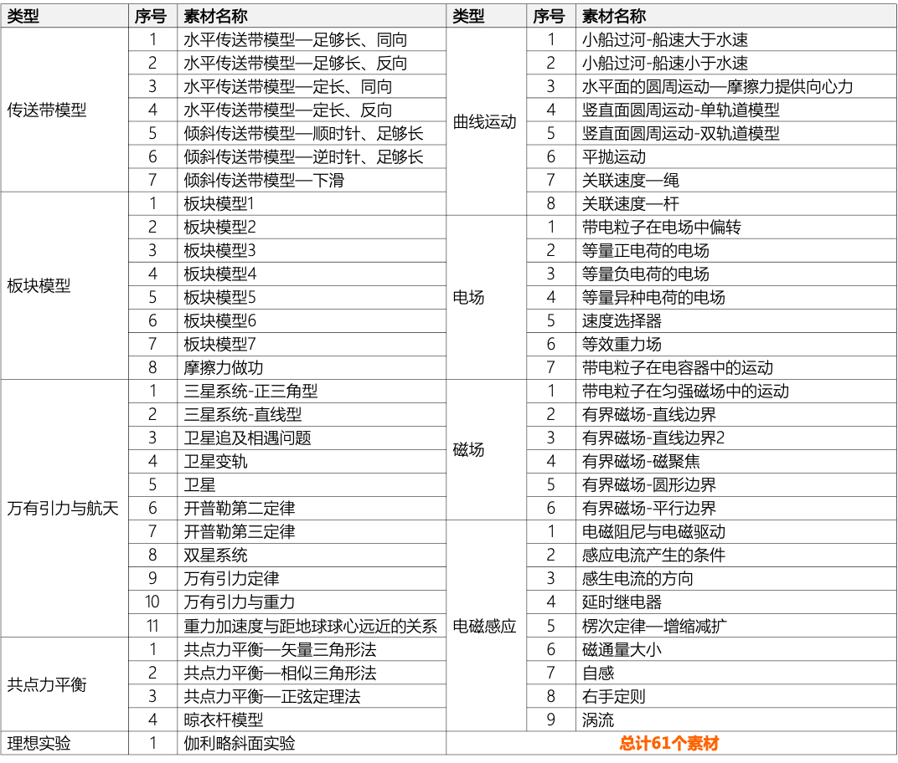
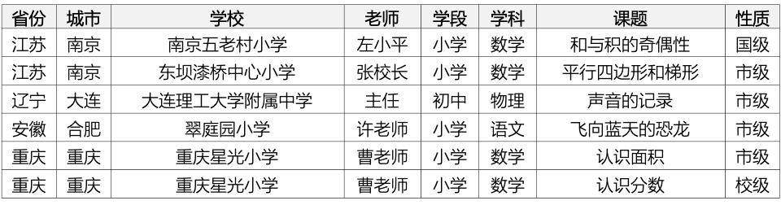
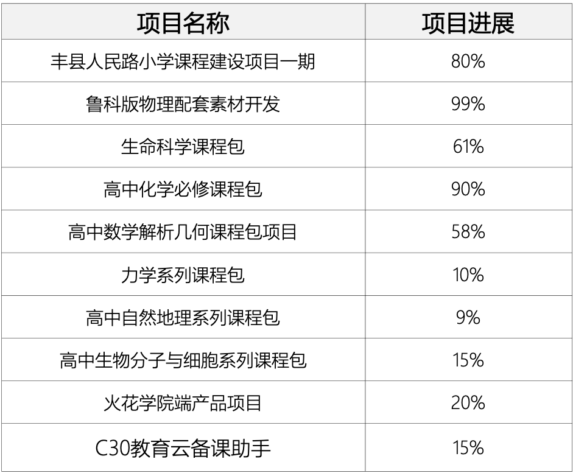

<bro/><bro/>

# 一、内容制作

## 1.1 新增内容

1月-3月共上架素材207个，课件164个，微课112个。

部分素材展示

# 二、软件开发

## 2.1 移动端“火花微课”H5上线

- 可由“火花学院”微信公众号中“火花微课”⼊⼝进⼊页面。

## 2.2 “火花学院”官网调整上线

- 下载页面调整：火花学院PPT插件、火花学院桌⾯端、火花学院移动端分为3个独立页面介绍，同时提供对应的下载功能。

- 新增模块：官网页脚增加友情链接；教具页面增加筛选模块，为用户使用过程中的查找素材过程提供便利。

## 2.3 《化学反应原理》上架appstore，新增其他教参引导入口

- 《化学反应原理》新书上架，现独立火花教参共8本。

- 各独立APP章列表页新增“更多书籍”入口，点击该入口后可查看所有火花教参获取列表、“⽕花学院”客⼾端下载⼊⼝、 常见问题及反馈入口，更好的满足用户使用需求。

- 进入书页后，可通过双指滑动放⼤阅读内容。

- 优化安装包的大小，提升用户体验。

## 2.3 火花学院APP3.0灰度发布

# 三、运营支撑

- 大连36中合作一期工作完成，校长高度认可火花的工作，并洽谈下一步合作计划。

- 1～3月B站新增播放量20万、新增粉丝4233个，截至目前总播放量101万、粉丝21395个。

- 常规公开课支撑6次。

- “火花学院”关注总人数4777人，“火花名师汇”关注总人数240人。

# 四、项目进展
 

