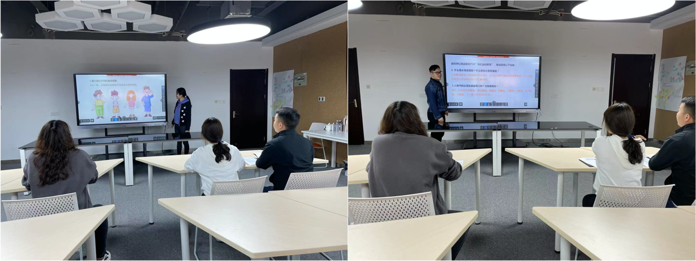
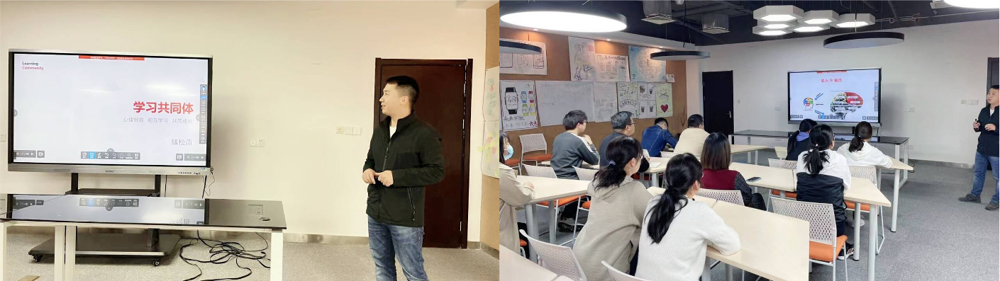

<bro/><bro/>

# 一、内容制作

## 1.1 新增内容

1月-3月共上架素材20个，课件80个。

部分素材展示

# 二、产品开发

## 2.1 设立课程包质量评审体系，提升课程包的整体质量

## 2.2 建设内容产品部培训体系，提升内容生产专业水平

# 三、运营支撑

## 3.1 大连36中合作一期工作完成
  
- 校长高度认可火花工作，下一步合作计划目前洽谈中。

## 3.2 1～3月B站新增播放量20万、新增粉丝4233个

- 截至目前总播放量101万、粉丝21395个。

## 3.3 常规公开课支撑6次

## 3.4 “火花学院”关注总人数4777人

## 3.5 “火花名师汇”关注总人数240人

# 四、项目进展
 
| 项目名称 |  项目进展  | 
|-------------|:------:|
|火花学院工具库 |	20%|
|火花学院端产品软件项目	|30%|
|丰县人民路小学课程建设项目一期	|85%|
|鲁科版物理配套素材开发	|100%|
|生命科学课程包	81%|
|高中化学必修课程包|	100%|
|高中数学解析几何课程包项目	|100%|
|力学系列课程包	|15%|
|高中自然地理系列课程包	|24%|
|高中生物分子与细胞系列课程包	|38%!|

