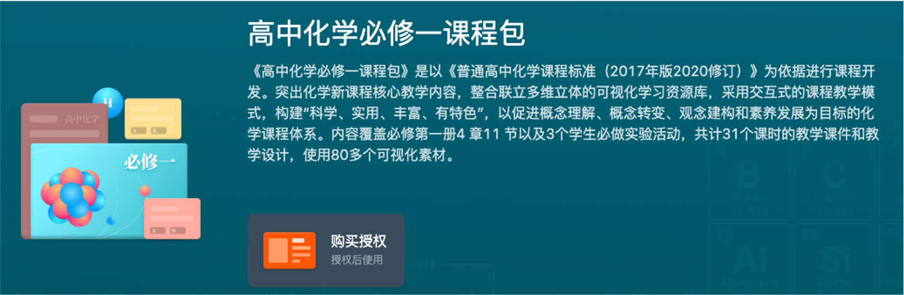
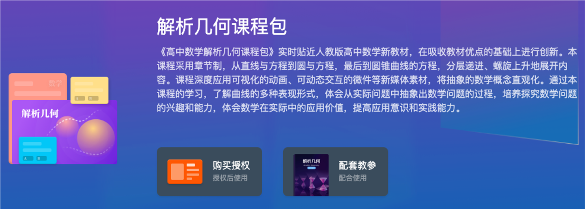
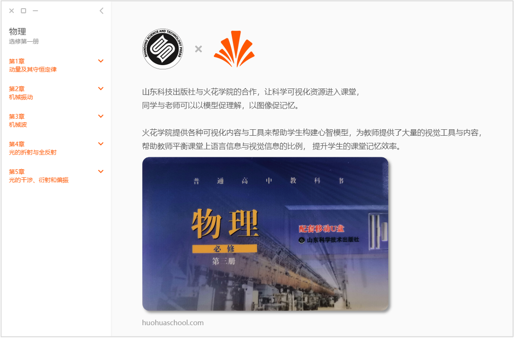
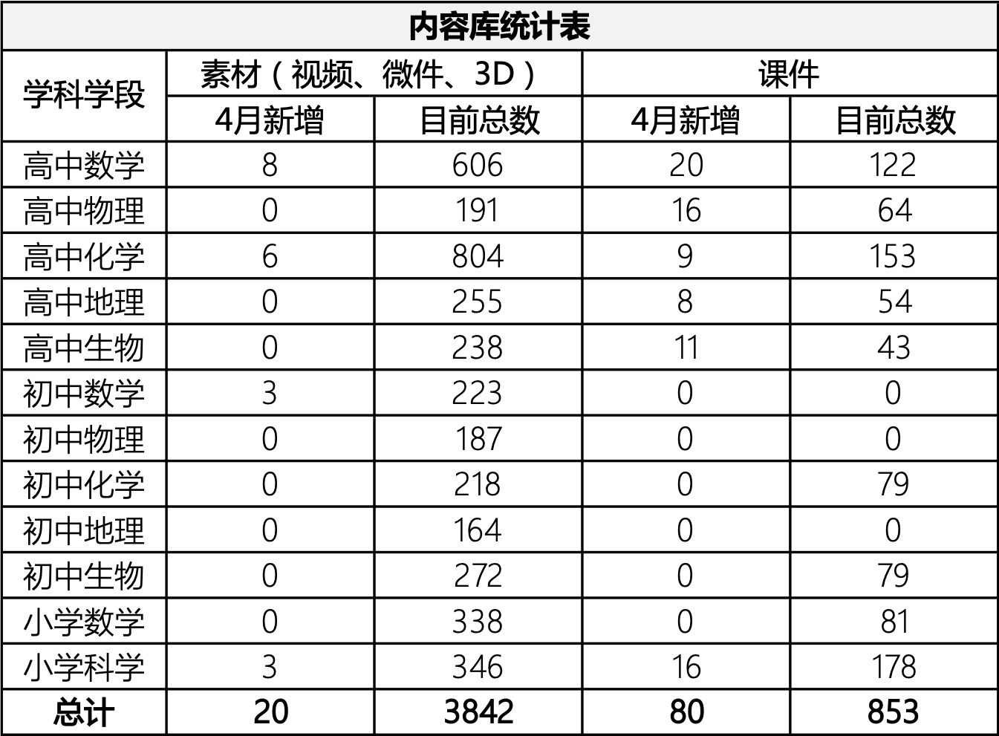
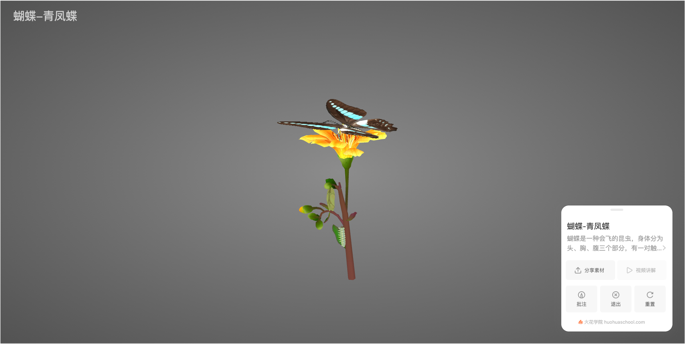
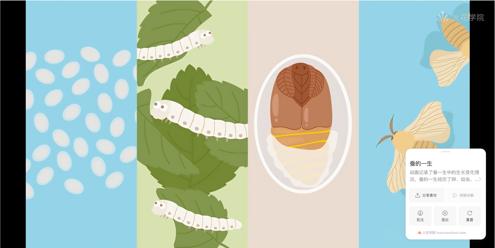
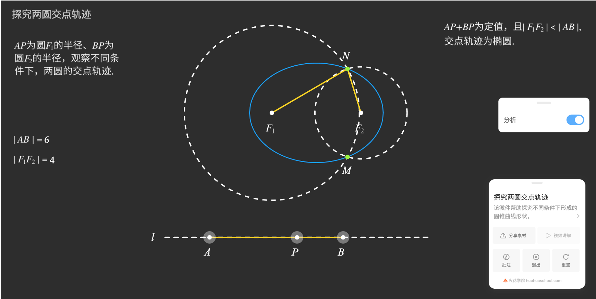

<bro/><bro/>

# 一、内容制作

## 1.1 高中化学必修一、必修二课程包上架

## 1.2 高中解析几何课程包、复习课程包上架

## 1.3 鲁科版物理验收通过

## 1.4 新增内容

1月-3月共上架素材20个，课件80个。

部分素材展示

# 二、运营支撑

## 2.1 截至目前四大网站播放量336万

其中B站播放量112万，粉丝23440。

## 2.2 “火花学院”关注总人数5012人

# 三、项目进展

| 项目名称 |  项目进展  | 
|:-------------:|:------:|
|火花学院工具库 |	20%|
|火花学院端产品软件项目	|30%|
|丰县人民路小学课程建设项目一期	|85%|
|鲁科版物理配套素材开发	|完结|
|生命科学课程包	|81%|
|高中化学必修课程包|	完结|
|高中数学解析几何课程包项目	|完结|
|力学系列课程包	|15%|
|高中自然地理系列课程包	|24%|
|高中生物分子与细胞系列课程包	|38%|

