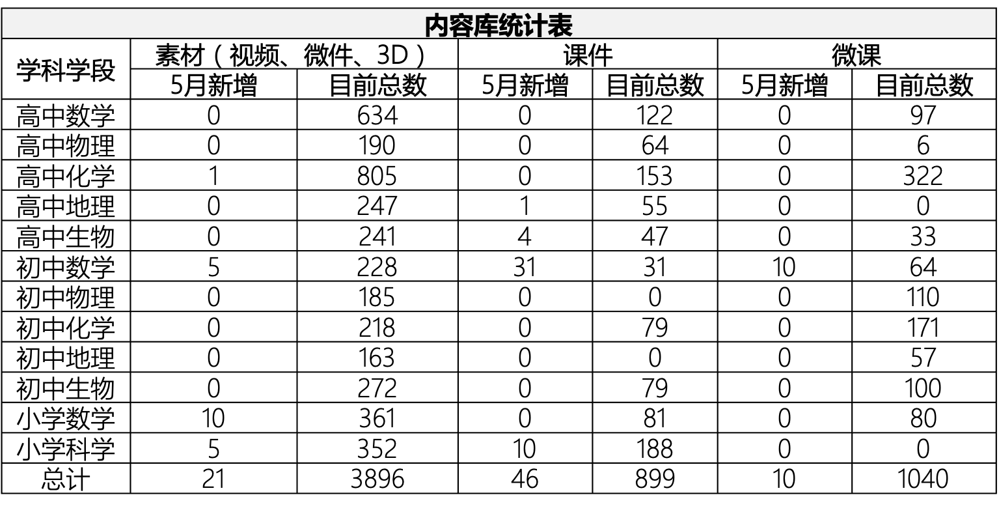
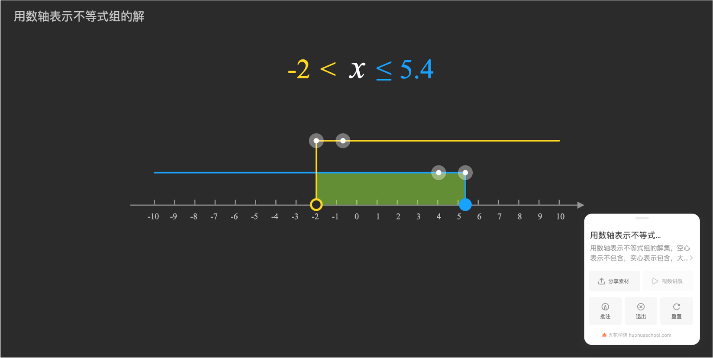
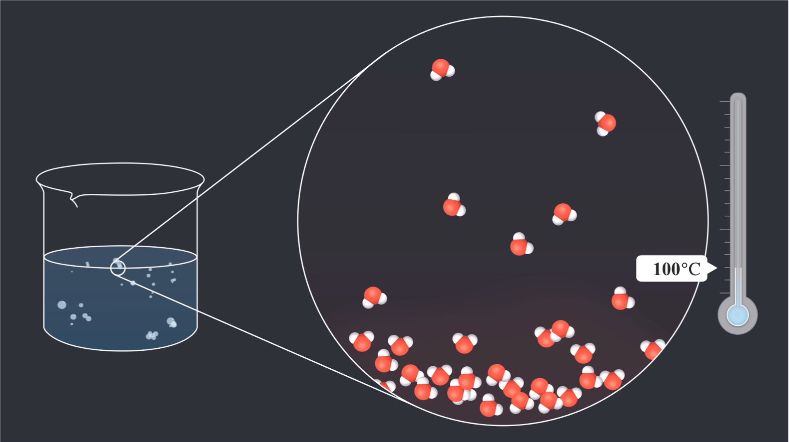
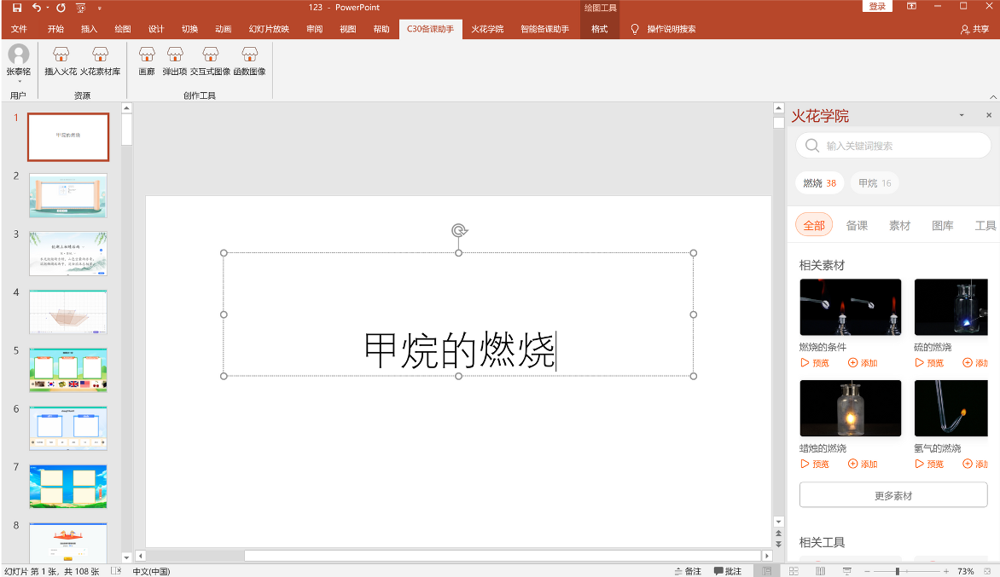
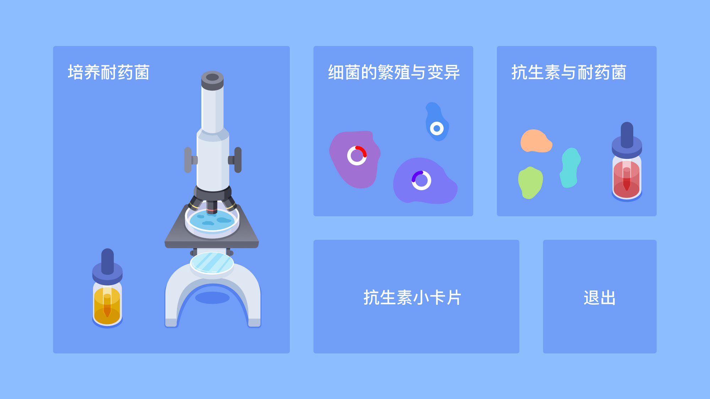
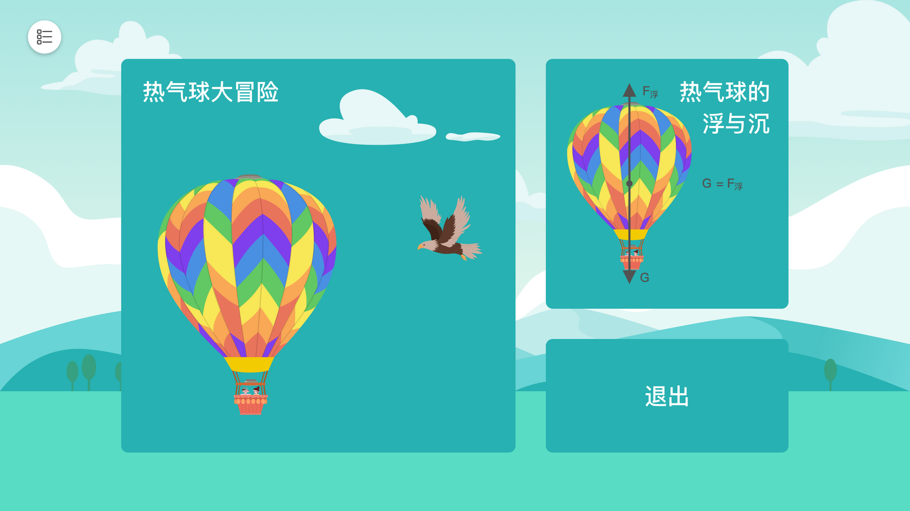
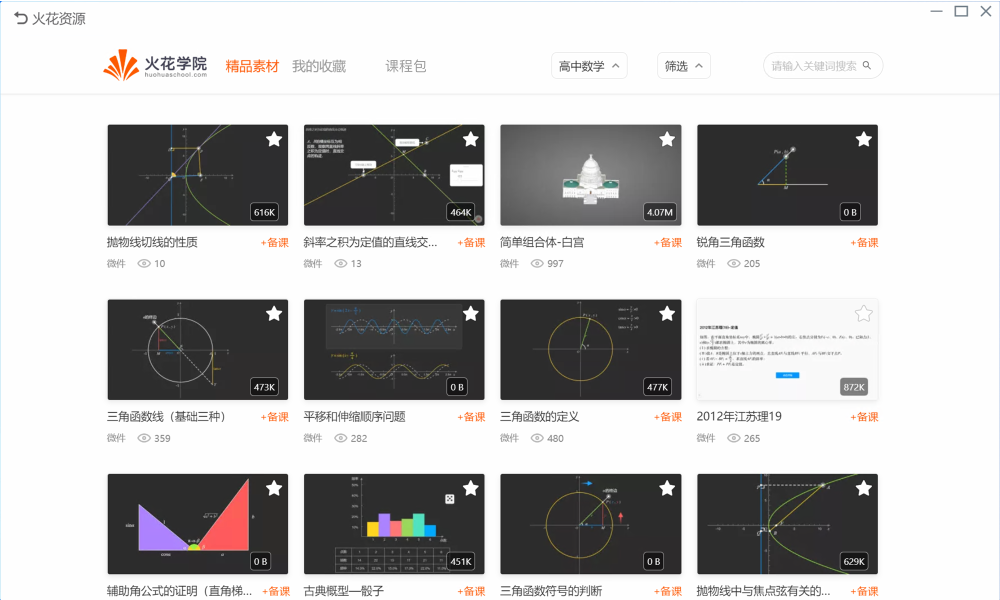
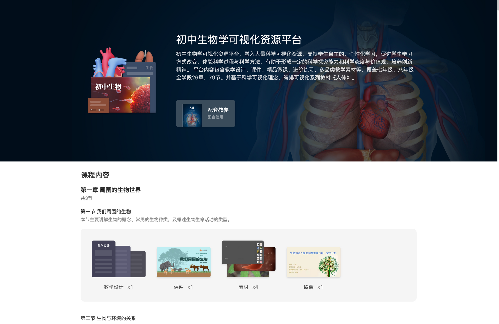

<bro/><bro/>

# 一、内容制作

## 1.1 生命科学课程包上架

## 1.2 新增内容

5月共上架素材21个，课件46个，微课10个。

部分素材展示

# 二、产品开发

## 2.1 C30备课助手分词搜索功能上线

## 2.2 丰县人民路小学项目一期部分PBL展示

培养超级细菌

小船的奇幻漂流

飞行的热气球

## 2.3 金陵微校课程包展示

## 2.4 包河区教学成果页展示

# 三、运营支撑

## 3.1 截至目前四大网站播放量383万

其中B站播放量131万，粉丝26629。

## 3.2 “火花学院”关注总人数5278人

# 四、项目进展
 
| 项目名称 |  4月项目进展  |5 月项目进展  | 
|:-------------:|:------:|:------:|
|火花学院工具库 |	20%|30%|
|火花学院端产品软件项目	|30%|40%|
|丰县人民路小学课程建设项目一期	|85%|95%|
|生命科学课程包	|81%|完结|
|力学系列课程包	|15%|20%|
|高中自然地理系列课程包	|24%|35%|
|高中生物分子与细胞系列课程包	|38%|45%|

