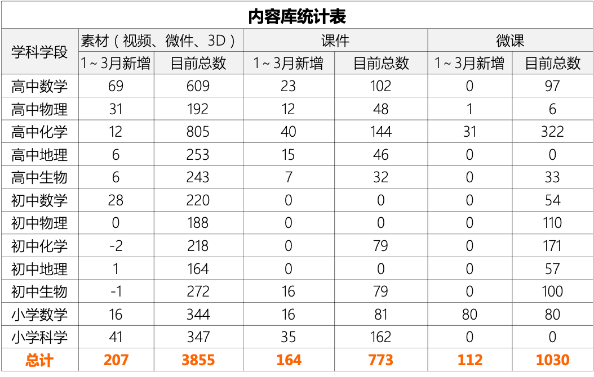

<bro/><bro/>

# 一、内容制作

## 1.1 新增内容

1月-3月共上架素材207个，课件164个，微课112个。

部分素材展示

# 二、产品开发

## 2.1 设立课程包质量评审体系，提升课程包的整体质量

## 2.2 建设内容产品部培训体系，提升内容生产专业水平

# 三、运营支撑

## 3.1 大连36中合作一期工作完成
  
- 校长高度认可火花工作，下一步合作计划目前洽谈中。

## 3.2 1～3月B站新增播放量20万、新增粉丝4233个

- 截至目前总播放量101万、粉丝21395个。

## 3.3 常规公开课支撑6次

## 3.4 “火花学院”关注总人数4777人

## 3.5 “火花名师汇”关注总人数240人

# 四、项目进展
 

