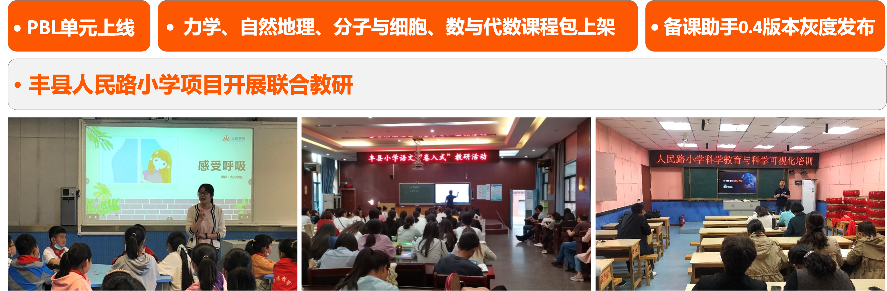
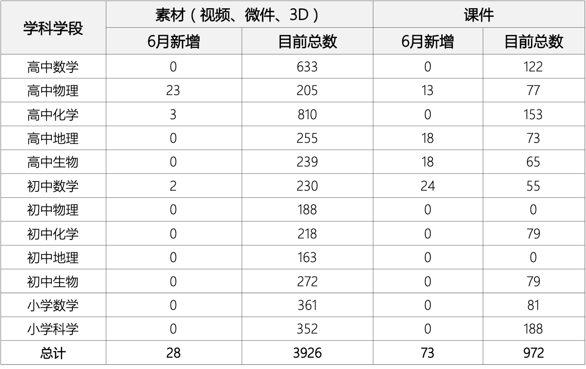
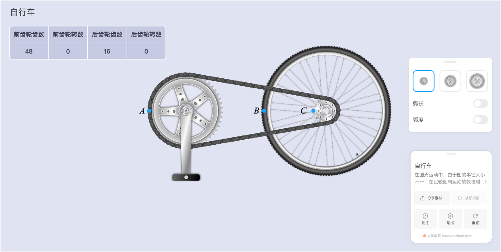
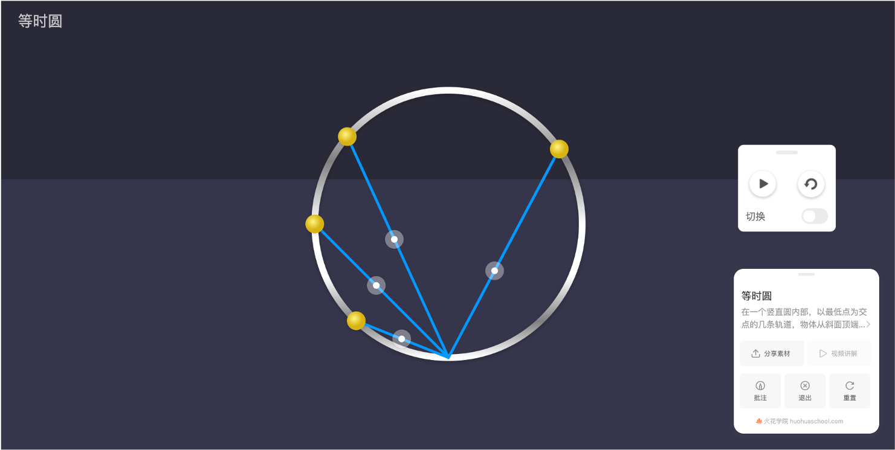
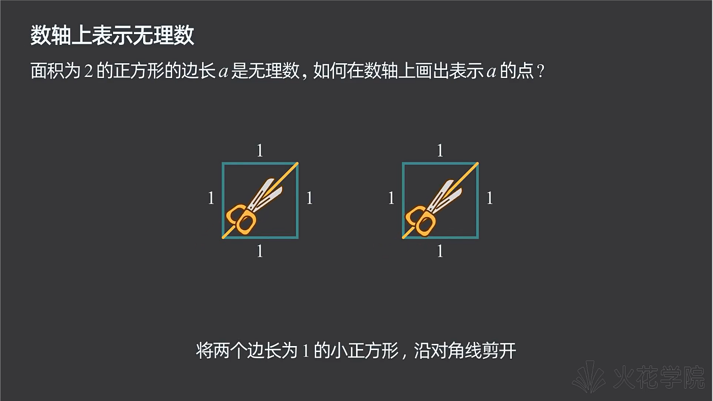
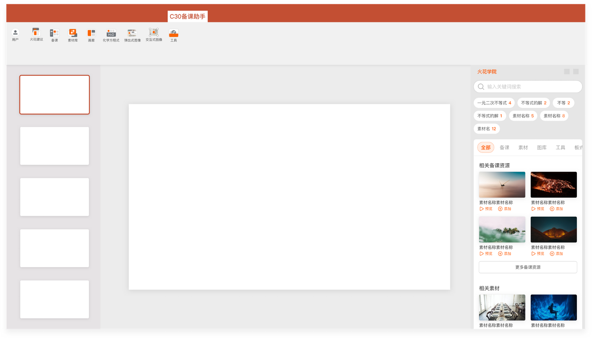

<bro/><bro/>

# 一、内容制作

## 1.1 Pbl单元上线

7个单元（含教学设计、客户端、培训文件）制作完成。

- 修理厂的磁铁
- 过山车
- 草原生态系统
- 超级细菌
- 小船的奇幻漂流
- 热气球大冒险
- 设计发电厂

## 1.2 力学、自然地理、分子与细胞、数与代数课程包上架

## 1.3 新增内容

6月共上架素材28个，课件73个。

部分素材展示

# 二、产品开发

## 2.1 备课助手0.4版本灰度

# 三、运营支撑

## 3.1 截至目前四大网站播放量383万

其中B站播放量131万，粉丝26629。

## 3.2 “火花学院”关注总人数5278人

# 四、项目进展
 
| 项目名称 |  6月项目进展  |
|:-------------:|:------:|
|火花学院工具库 |	40%|
|火花学院端产品软件项目	|40%|
|丰县人民路小学课程建设项目一期	|完结|
|力学系列课程包	|完结|
|高中自然地理系列课程包	|完结|
|高中生物分子与细胞系列课程包	|完结|
|初中数学数与代数课程包	|完结|

